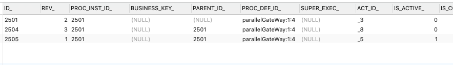
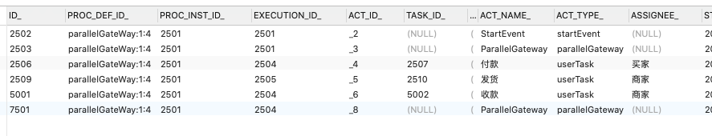

## 01 Activiti介绍

- 下载activiti-5.22.0文件 
- 解压activiti-5.22.0/wars 下的 activiti-rest.war包 
- 拷贝WEB-INF下的lib架包 放到项目中 
- 添加数据库驱动包 `mysql-connector-java-8.0.13.jar `


### 01 操作表的服务

由流程引擎创建各个service，这些service是调用23张表的服务

* **`RepositoryService`管理流程定义**
* **`RuntimeService`    执行管理，包括启动，推进，删除流程实例等操作**
* **`TaskService`   任务的管理**
* `HistoryService`  历史管理(执行完的数据的管理)
* `IdentityService`  组织机构的管理
* `FormService`  一个可选服务，任务表单的管理
* `ManagementService`   服务管理和维护操作流程引擎
* `IdentityService`  身份识别服务


### 02 表头信息

* `ACT_RE_*` ：'RE'表示repository。 这个前缀的表包含了流程定义和流程静态资源(图片，规则等等)
* `ACT_RU_*` ：'RU'表示runtime. 这些运行时的表，包含流程实例，任务，变量，异步任务，等运行中的服务。只在流程实例执行过程中保存这些数据，在流程结束时会删除这些数据。这样运行时的表可以一直很小速度很快
* `ACT_ID_*` ：'ID'表示identity。这些表包含身份信息，比如用户，组等
* `ACT_HI_* `：'HI'表示history。 这些表包含历史数据，比如历史流程实例、变量、任务等
* `ACT_GE_*` ：通用数据，用于不同场景下， 如存放资源文件。


## 02 初始化数据库

**注意：** mysql8+ 需要再url后面加上  nullCatalogMeansCurrent=true


### 01  方法一 （执行sq|脚本文件)

执行sq|脚本文件activiti-5.22.0/database/create/activiti.mssql.create.*.sql


### 02 方法二 （使用Java代码）

`DatabaseSchemaUpdate`的值

```java
// 不能创建表 前提表存在
public static final String DB_SCHEMA_UPDATE_FALSE = "false"; 

// 先删除表 再创建表
public static final String DB_SCHEMA_UPDATE_CREATE_DROP = "create-drop";   

// 如果表不存在 自动创建表
public static final String DB_SCHEMA_UPDATE_TRUE = "true";  
 
```

```java
package com.max.test;

import org.activiti.engine.ProcessEngine;
import org.activiti.engine.ProcessEngineConfiguration;
import org.junit.Test;

public class MyActivitiTest {


 /**
     * 创建工作流23张表
  */
 @Test
 public void createTableByCode() {

     ProcessEngineConfiguration configuration = ProcessEngineConfiguration.createStandaloneProcessEngineConfiguration();
     // 数据库配置
     configuration.setJdbcDriver("com.mysql.cj.jdbc.Driver");
     configuration.setJdbcUrl("jdbc:mysql://localhost:3306/activiti?characterEncoding=utf-8&nullCatalogMeansCurrent=true");
     configuration.setJdbcUsername("root");
     configuration.setJdbcPassword("1234567");
     configuration.setDatabaseSchemaUpdate(ProcessEngineConfiguration.DB_SCHEMA_UPDATE_TRUE);

     // 流程引擎对象
     ProcessEngine engine = configuration.buildProcessEngine();
     System.out.println(engine);

 }

}

```


### 03 方法三 （通过配置文件）

- 在resources目录下创建`activiti.cfg.xml`文件

```xmL
<?xml version="1.0" encoding="UTF-8"?>
<beans xmlns="http://www.springframework.org/schema/beans" xmlns:xsi="http://www.w3.org/2001/XMLSchema-instance"
xmlns:context="http://www.springframework.org/schema/context" xmlns:tx="http://www.springframework.org/schema/tx"
xmlns:jee="http://www.springframework.org/schema/jee" xmlns:aop="http://www.springframework.org/schema/aop"
xsi:schemaLocation="http://www.springframework.org/schema/beans http://www.springframework.org/schema/beans/spring-beans-3.0.xsd
    http://www.springframework.org/schema/context http://www.springframework.org/schema/context/spring-context-3.0.xsd
    http://www.springframework.org/schema/tx http://www.springframework.org/schema/tx/spring-tx-3.0.xsd
    http://www.springframework.org/schema/jee http://www.springframework.org/schema/jee/spring-jee-3.0.xsd
    http://www.springframework.org/schema/aop http://www.springframework.org/schema/aop/spring-aop-3.0.xsd">

	<bean id="processEngineConfiguration" class="org.activiti.engine.impl.cfg.StandaloneProcessEngineConfiguration">
		<property name="jdbcDriver" value="com.mysql.cj.jdbc.Driver"/>
		<property name="jdbcUrl" value="jdbc:mysql://localhost:3306/activiti?characterEncoding=utf-8&amp;nullCatalogMeansCurrent=true"/>
		<property name="jdbcUsername" value="root"/>
		<property name="jdbcPassword" value="12345"/>
		<!--没有表创建表-->
		<property name="databaseSchemaUpdate" value="true"/>
	</bean>

</beans>
```

   - 获取流程引擎对象

```java
// 默认加载的是activiti.cfg.xml文件
ProcessEngine processEngine = ProcessEngines.getDefaultProcessEngine();

//执行配置文件路径
/*ProcessEngine processEngine = ProcessEngineConfiguration.createProcessEngineConfigurationFromResource("activiti.cfg.xml").buildProcessEngine();*/
```


## 03 入门程序 

资源文件：[helloworld.bpmn](activiti.assets/helloworld.bpmn)
后面查询个人任务，拿到任务ID再办理任务，依此执行 直到流程结束  改变的只有 assignee 和 taskId 

```java
// 获取流程引擎对象
private ProcessEngine processEngine = ProcessEngines.getDefaultProcessEngine(); 
```


### 01 流程定义：

**从classpath加载 一次只能加载一个文件**

```java
 /**
     * 部署流程定义
     */
    @Test
    public void deploymentProcessDefinition() {
        Deployment deployment = processEngine.getRepositoryService() // 与流程部署相关的service
                .createDeployment() // 创建一个部署对象
                .name("helloworld入门程序") // 添加部署的名称
                .addClasspathResource("diagrams/helloworld.bpmn")  
                .deploy();
        System.out.println("部署ID：" + deployment.getId()); // 1
        System.out.println("部署名称：" + deployment.getName()); // helloworld入门程序

    }
```


### 02 启动流程实例：

**当使用key有多个 部署时 启动的是版本最新的**

```java
/**
     * 启动流程实例  当使用key有多个 部署时 启动的是版本最新的
     */
    @Test
    public void startProcessInstance() {
      // 通过流程定义的key启动实例 key就是helloworld.bpmn文件中的id属性
        String processDefinitionKey = "helloworld";
      
      // 与正在执行的流程实例和执行对象相关的service
        ProcessInstance pi = processEngine.getRuntimeService() 
                .startProcessInstanceByKey(processDefinitionKey);
      
        System.out.println("流程实例ID:" + pi.getId()); // 2501
        System.out.println("流程定义的ID:" + pi.getProcessDefinitionId()); // helloworld:1:4

    }
```


### 03 查询当前的个人任务：

```java
/**
     * 查询当前的个人任务
     */
    @Test
    public void findMyPersonalTask() {
			//张三 -> 李四 -> 王五
        String assignee = "王五";
        List<Task> list = processEngine.getTaskService() // 与正在执行的任务管理相关的service
                .createTaskQuery() //创建查询对象
                .taskAssignee(assignee) // 指定个人任务的查询 指定办理人
                .list();
        if (list != null && list.size() > 0) {
            for (Task task : list) {
                System.out.println("任务ID:" + task.getId());
                System.out.println("任务名称:" + task.getName());
                System.out.println("任务创建时间:" + task.getCreateTime());
                System.out.println("任务的办理人:" + task.getAssignee());
                System.out.println("流程实例ID:" + task.getProcessInstanceId());
                System.out.println("执行对象ID:" + task.getExecutionId());
                System.out.println("流程定义ID:" + task.getProcessDefinitionId());
                System.out.println("#########################");
            }

        }
    }
```


### 04 完成我的任务:

```java
/**
     * 完成我的任务
     */
    @Test
    public void completeMyPersonalTask() {
        String taskId = "7502"; // 任务ID
        processEngine.getTaskService() // 与正在执行的任务管理相关的service
            .complete(taskId);
        System.out.println("完成任务 任务ID是"+taskId);

    }
```


## 04 流程定义管理

**服务：** `RepositoryService`  管理流程的定义


**对象**:

*  **`Definition` 部署对象 ：**  一次部署的多个文件的信息。对于不需要的流程可以删除和修改  （流程的修改 不是真的修改 而是 在Key的基础上版本升级 再启动流程实例时会按照最新版本启动）
*  **`ProcessDefinition` 流程定义对象：** 解析.jpdl.xml后得到的流程定义规则的信息，工作流系统就是按照流程定义的规则执行的

  

**操作的表**：

* `ACT_RE_DEPLOYMENT` #部署对象表 
* `ACT_RE_PROCDEF` #流程定义表 
* `ACT_GE_BYTEARRAY` #资源文件表 
* `ACT_GE_PROPERTY` # 主键生成策略表 


### 01 部署流程定义

部署流程定义 可以从classpath、zip、InputsSteam、获取定义的流程文件


#### classpath：

```java
/**
     * 部署流程定义(从classpath)
     */
    @Test
    public void deploymentProcessDefinition_classpath() {
        Deployment deployment = processEngine.getRepositoryService() // 与流程部署相关的service
                .createDeployment() // 创建一个部署对象
                .name("流程定义") // 添加部署的名称
                .addClasspathResource("diagrams/helloworld.bpmn")  // 从classpath加载 一次只能加载一个文件
                .deploy();
        System.out.println("部署ID：" + deployment.getId());
        System.out.println("部署名称：" + deployment.getName());
    }
```


####  zip：

```java
/**
     * 部署流程定义(从zip文件)
     */
    @Test
    public void deploymentProcessDefinition_zip() {

        InputStream in = this.getClass().getClassLoader().getResourceAsStream("diagrams/helloworld.bpmn.zip"); // 从当前classpath下获取输入流
        ZipInputStream zipInputStream = new ZipInputStream(in);

        Deployment deployment = processEngine.getRepositoryService() // 与流程部署相关的service
                .createDeployment() // 创建一个部署对象
                .name("ZIP流程定义") // 添加部署的名称
                .addZipInputStream(zipInputStream)
                .deploy();
        System.out.println("部署ID：" + deployment.getId());
        System.out.println("部署名称：" + deployment.getName());
    }
```


####  InputsSteam：

```java
/**
     * 部署流程定义(从InputsSteam文件)
     */
    @Test
    public void deploymentProcessDefinition_inputsSteam() {
        InputStream inputStream = this.getClass().getResourceAsStream("/diagrams/processVariables.bpmn"); // 多加个（/）表示从classpath根目录下加载文件
        Deployment deployment = processEngine.getRepositoryService()
                .createDeployment()
                .name("InputsSteam流程定义")
                .addInputStream("processVariables.bpmn", inputStream)  // 注意resourceName名称要与资源名称一致
                .deploy();
        System.out.println("部署ID：" + deployment.getId());
        System.out.println("部署名称：" + deployment.getName());
    }
```


### 02 查询流程定义


**指定查询条件：  where条件**

* `.deploymentId(deploymentId)`   通过部署对象ID
* `.processDefinitionId(processDefinitionId) `  通过流程定义ID
* `.processDefinitionKey(processDefinitionKey)`   通过流程定义Key
* `.processDefinitionNameLike(processDefinitionNameLike) `  通过流程定义的名称模糊查询


**排序：**

* `.orderByProcessDefinitionVersion().asc()`   通过版本升序
* `.orderByProcessDefinitionName().desc()`   通过流程定义名称降序


**结果集：**

* `.list();`   返回集合 封装流程定义
* `.singleResult()`   返回唯一结果集
* `.count() ` 返回结果集数量
* `.listPage(firstResult,maxResults)`  分页查询


```java
/**
     * 查询流程定义
     * 主要查询的是  ACT_RE_PROCDEF  流程定义表
     */
    @Test
    public void findProcessDefinition() {

      // 与流程部署相关的service
        List<ProcessDefinition> list = processEngine.getRepositoryService() 
                .createProcessDefinitionQuery() // 创建一个流程定义查询

          .list();// 返回集合 封装流程定义
     
        if (list != null && list.size() > 0) {
            for (ProcessDefinition pd : list) {
              // 流程定义的Key + 版本 + 随机数
                System.out.println("流程定义ID:" + pd.getId());
              
              // helloworld.bpmn 文件中name的属性值
                System.out.println("流程定义名称:" + pd.getName());
              
              // helloworld.bpmn 文件中id的属性值
                System.out.println("流程定义的Key:" + pd.getKey()); 
              
              // 当流程定义的key相同下 版本升级 默认1
                System.out.println("流程定义的版本:" + pd.getVersion()); 
              
                System.out.println("流程定义的bpmn文件名:" + pd.getResourceName());
                System.out.println("流程定义的png文件名:" + pd.getDiagramResourceName());
              
              // ID 对应的 ACT_RE_DEPLOYMENT 部署对象表
                System.out.println("部署对象的ID:" + pd.getDeploymentId());   
                System.out.println("########################");

            }
        }

    }
```


### 03 流程定义的删除

#### 通过部署流程定义ID

`.deleteDeployment(deploymentId); ` 普通删除 如果当前规则下有正在执行的流程，则抛出异常  case:主键约束

`.deleteDeployment(deploymentId, true);`  级联删除 会删除和当前规则相关的所有信息，正在指定的信息，也包括历史信息

```java
 /**
     * 流程定义的删除 （通过部署流程定义ID）
     */
    @Test
    public void deleteProcessDefinition() {
        // 使用部署ID
        String deploymentId = "37501";
        processEngine.getRepositoryService()
                .deleteDeployment(deploymentId, true);
        System.out.println("删除成功! : " + deploymentId);

    }
```


#### 指定流程定义的Key删除

```java
 /**
     * 删除同版本流程定义
     */
    @Test
    public void deleteByKey() {
        // 查询指定Key的所有版本流程定义
        List<ProcessDefinition> list = processEngine.getRepositoryService()
                .createProcessDefinitionQuery() // 创建一个流程定义查询
                .processDefinitionKey("helloworld") // 指定流程定义的Key查询
                .list();
        // 循环删除
        for (ProcessDefinition pd : list) {
            processEngine.getRepositoryService()
                    .deleteDeployment(pd.getDeploymentId(),true); //通过部署ID 级联删除
        }
        System.out.println("删除成功！");


    }
```


### 04 获取流程定义流程图 

**通过部署ID**

```java
/**
     * 查看流程图
     */
    @Test
    public void viewProcessDefinition() throws IOException {
        //部署ID
        String deploymentId = "42501";

        //通过部署ID去 ACT_GE_BYTEARRAY 资源文件表查询流程名称
        String resourceName = "";
        List<String> list = processEngine.getRepositoryService()
                .getDeploymentResourceNames(deploymentId);
        if (list != null && list.size() > 0) {
            for (String name : list) {
                if (name.indexOf(".png") > 0) {
                    resourceName = name;
                }

            }
        }

        // 获取输入流
        InputStream inputStream = processEngine.getRepositoryService()
                .getResourceAsStream(deploymentId, resourceName);

        // 写到桌面
        File file = new File("/Users/lilei/Desktop/" + resourceName);
        FileUtils.copyInputStreamToFile(inputStream, file);

    }
```


### 05 查询最新的流程定义

```java
/**
     * 查询最新的流程定义 操作的 ACT_RE_PROCDEF 表
     */
    @Test
    public void queryAllLatestVersions() {
        List<ProcessDefinition> list = processEngine.getRepositoryService()
                .createProcessDefinitionQuery() // 创建一个流程定义查询
                .orderByProcessDefinitionVersion().asc() //降序
                .list();
        // 过滤最新版本 map特点如果已有Key value值会被覆盖
        Map<String, ProcessDefinition> map = new LinkedHashMap<>();
        for (ProcessDefinition pd : list) {
            map.put(pd.getKey(), pd);
        }

        for (ProcessDefinition pd : map.values()) {
            System.out.println("流程定义ID:" + pd.getId()); 
            System.out.println("流程定义名称:" + pd.getName()); 
            System.out.println("流程定义的Key:" + pd.getKey()); 
            System.out.println("流程定义的版本:" + pd.getVersion());
            System.out.println("流程定义的bpmn文件名:" + pd.getResourceName());
            System.out.println("流程定义的png文件名:" + pd.getDiagramResourceName());
            System.out.println("部署对象的ID:" + pd.getDeploymentId());  
            System.out.println("########################");
        }

    }
```


## 05 流程实例的管理

**服务:** 

- `RuntimeService`  执行管理 
- `TaskService`  任务管理 


**对象：**

-  **执行对象`Execution` ：** 按照流程定义的规则执行一次的过程
  - 对应的表
    - `ACT_RU_EXECUTION`  #正在执行的执行对象表 
    - `ACT_HI_PROCINST`    #流程实例的历史表 
    - `ACT_HI_ACTINST`     #所有活动节点历史表 
-  **流程实例`ProcessDefinition`:** 特指流程从开始到结束的最大的分支。**一个执行的流程中，流程实例只能有一个** 


**注意：** 

-  如果是单例流程(没有分支),执行对象ID就是流程实例ID
-  如果一个流程有分支和聚合,那么流程实例ID和执行对象ID就不同
-  一个流程中，流程实例只能有一个，执行对象可以存在多个


### 01 启动流程实例

**操作的表 ：**

* `ACT_RU_EXECUTION` 正在执行的执行对象表
* `ACT_HI_PROCINST`  #流程实例的历史表
* `ACT_RU_TASK`  #正在执行的任务表（只有节点是UserTask的时候表中存在数据）
* `ACT_HI_TASKINST` #任务历史表（只有节点UserTask的时候表中存在数据）
* `ACT_HI_ACTINST` #所有活动节点历史表


#### 01 按照流程定义ID启动

```java
/**
     * 启动流程实例	
     */
    @Test
    public void startProcessInstance() {
      //helloworld:1:47504 按照流程定义ID启动
        ProcessInstance pi = processEngine.getRuntimeService()
                .startProcessInstanceById(processDefinitionId);  
        System.out.println("流程实例ID:" + pi.getId());
        System.out.println("流程定义的ID:" + pi.getProcessDefinitionId()); // helloworld:1:4

    }
```


#### 02 按照流程定义Key启动

```java
/**
     * 启动流程实例
     */
    @Test
    public void startProcessInstance() {
        ProcessInstance pi = processEngine.getRuntimeService()
                .startProcessInstanceByKey("helloworld"); // 通过流程定义Key启动 默认启动最新的
        System.out.println("流程实例ID:" + pi.getId());
        System.out.println("流程定义的ID:" + pi.getProcessDefinitionId()); // helloworld:1:4

    }
```


### 02 查询个人任务

**指定查询条件 where条件:**

* `.taskAssignee(assignee)`   指定个人任务的查询 指定办理人
* `.taskCandidateUser(candidateUser)`   组任务的办理人查询
* `.processDefinitionId(processDefinitionId)`  流程定义ID查询
* `.processInstanceId(processInstanceId)`  流程实例ID查询
* `.executionId(executionId)`    执行对象ID查询


**排序**

* `.orderByTaskCreateTime().asc() `// 按照任务创建时间升序


```java
/**
     * 查看个人任务
     * ACT_RU_TASK  #正在执行的任务表（只有节点是UserTask的时候表中存在数据）
     */
    @Test
    public void findMyPersonalTask() {
//        张三 -> 李四 -> 王五
        String assignee = "李四";
        List<Task> list = processEngine.getTaskService() // 与正在执行的任务管理相关的service
                .createTaskQuery() //创建查询对象
          			.taskAssignee(assignee) // 指定个人任务的查询 指定办理人
                .orderByTaskCreateTime().asc() // 按照任务创建时间升序
                .list();
        if (list != null && list.size() > 0) {
            for (Task task : list) {
                System.out.println("############" + assignee + "的个人任务列表########");
                System.out.println("任务ID:" + task.getId());
                System.out.println("任务名称:" + task.getName());
                System.out.println("任务创建时间:" + task.getCreateTime());
                System.out.println("任务的办理人:" + task.getAssignee());
                System.out.println("流程实例ID:" + task.getProcessInstanceId());
                System.out.println("执行对象ID:" + task.getExecutionId());
                System.out.println("流程定义ID:" + task.getProcessDefinitionId());
                System.out.println("#########################");
            }

        }
    }
```


### 03 任务的办理

**通过任务ID办理**

表的变化：
* `ACT_RU_EXECUTION` #正在执行的 执行对象表** 
  * 唯一变化的流程活动ID ACT_ID_ 下一个节点  But 如果是最后一个节点 空 
* `ACT_HI_PROCINST` #流程实例的历史表**  
  * 没有变化（前提不是最后一个执行对象）    But 如果是最后一个节点  END_TIME_ 记录最后结束时间 
* `ACT_RU_TASK` #正在执行的任务表** 
  *  因为流程走的下个流程 导致办理人变化  ->  ID_(任务ID) NAME_(执行对象名称) ASSIGNEE_(办理人名称) But 如果是最后一个节点 空 
* `ACT_HI_TASKINST`#任务历史表** 
  * 发生变化 任务历史表 （记录UserTask节点）   But 如果是最后一个节点  记录总共走过所有的UserTask节点
* `ACT_HI_ACTINST `#所有活动节点历史表** 
  *  发生变化 记录每一个节点    But 如果是最后一个节点 记录所有走过的节点（包括开始和结束节点）

```java
	/**
     * 办理任务  指定任务ID
     */
    @Test
    public void completeMyPersonalTask() {
        String taskId = "52502"; // 任务ID
        processEngine.getTaskService() // 与正在执行的任务管理相关的service
                .complete(taskId);
        System.out.println("完成任务 任务ID是" + taskId);

    }
```


### 04 查询流程是否结束

```java
/**
     * 查看流程执行状态  （一个流程中流程实例只有一个 执行对象有多个）
     * 通过流程实例ID查询
     * 查询的是 ACT_RU_EXECUTION  #正在执行的执行对象表 如果存在则流程未结束 否则 结束
     */
    @Test
    public void queryPersonalStarts() {
        String processInstanceId = "50001";
        ProcessInstance pi = processEngine.getRuntimeService()
                .createProcessInstanceQuery()
                .processInstanceId(processInstanceId)
                .singleResult();//返回唯一结果集
        if (pi != null) {
            System.out.println("当前流程在:" + pi.getActivityId());  //执行对象流程节点
        } else {
            System.out.println("流程已结束!");
        }
    }
```


### 05 查询已办理的任务

```java

  /**
     * 查询历史任务
     * 查询的是 ACT_HI_TASKINST #任务历史表（只有节点UserTask的时候表中存在数据）
     */
    @Test
    public void queryHistoryTask() {
        String assignee = "张三";
        List<HistoricTaskInstance> list = processEngine.getHistoryService() // 历史管理服务
                .createHistoricTaskInstanceQuery() // 创建历史任务查询
                .taskAssignee(assignee)
                .list();
        if (list != null && list.size() > 0) {
            for (HistoricTaskInstance hti : list) {
                System.out.println("任务ID：" + hti.getId());
                System.out.println("流程实例ID：" + hti.getProcessInstanceId());
                System.out.println("任务办理人：" + hti.getAssignee());
                System.out.println("执行对象ID" + hti.getExecutionId()); // 最后指向节点ID
                System.out.println("开始时间 结束时间 耗时多长" + hti.getCreateTime() + "  " + hti.getEndTime() + " " + hti.getDurationInMillis());
            }
        }

    }
```


### 06 查询历史流程实例ID

**注意：**一个流程中流程实例只有一个 执行对象有多个

```java
/**
     * 查询历史流程实例ID
     * 查询的是 ACT_HI_PROCINST  #流程实例的历史表
     * 可以通过流程实例ID 查询 （END_TIME_ 流程实例结束时间）来判断当前流程是否结束
     */
    @Test
    public void queryProcessInstance() {

        String processInstanceId = "2501";
      // 历史管理服务
        HistoricProcessInstance processInstance = processEngine.getHistoryService() 
                .createHistoricProcessInstanceQuery() // 创建历史流程实例查询
                .processInstanceId(processInstanceId)
                .singleResult();
        System.out.println("流程定义ID："+processInstance.getProcessDefinitionId());
        System.out.println("流程实例ID："+processInstance.getId());
        System.out.println("流程实例开始 结束 耗时 时间"+processInstance.getStartTime() +"  "+processInstance.getEndTime() +"  "+ processInstance.getDurationInMillis());
    }	
```


## 06 流程变量

**概念：** 流程变量在整个工作流中扮演很重要的作用。例如:请假流程中有请假天数、请假原因等一些参数都为流程变量的范围。流程变量的作用域范围是流程实例。也就是说各个流程实例的流程变量是不相互影响的。

**资源：**[processVariables.bpmn](activiti.assets/processVariables.bpmn)

**作用：**在流程执行或者任务执行的过程中，用于设置和获取变量，使用流程变量在流程传递的过程中传递业务参数

**服务：**

* `RuntimeService`  执行管理 
* `TaskService`  任务管理 

**对应的表：**

* `ACT_RU_VARIABLE` #表示正在执行的流程变量表
* `ACT_HI_VARINST` #表示历史流程变量表

**类型：**

* 基本数据类型
* JavaBean  
  * 需要实现序列号接口 `Serializable`
  *  还需要生成序列号版本号


### 01 设置流程变量

**setVariable和setVariableLocal的区别:**

- `setVariable`:设置流程变量的时候，流程变量名称相同的时候，后一次的值替换前一次的值
- `setVariableLocal`:设置流程变量的时候，针对当前活动的节点设置流程变量，如果一个流程中存在2个活动节点，对每个活动节点都设置流程变量，即使流程变量的名称相同，后一次的版本的值也不会替换前一次版本的值，它会使用不同的任务ID作为标识，存放2个流程变量值。
例如act_ hi_ varinst 表的数据:不同的任务节点，即使流程变量名称相同，存放的值也是不同的。


**执行对象执行之前设置流程变量** 

```java
  // 参数： 执行对象ID、流程变量Key、流程变量值
  runtimeService.setVariable(executionId, variableName, value); 
  // 参数：执行对象ID、Map<流程变量Key,流程变量值>
  runtimeService.setVariables(executionId,  variables); 
```


**任务执行之前设置流程变量**

```java
  // 参数：任务ID、流程变量Key、流程变量值
  taskService.setVariable(taskId, variableName, value); 
  // 参数：任务ID、Map<流程变量Key,流程变量值>
  runtimeService.setVariables(taskId,  variables); 
```

**启动流程实例同时设置流程变量**

```java
//参数：流程定义Key、Map<流程变量Key,流程变量值>
runtimeService.startProcessInstanceByKey(processDefinitionKey, variables) 
```


**完成任务同时 设置流程变量**

```java
// 参数：任务Id Map<流程变量Key,流程变量值>
taskService.complete(taskId, variables);
```


### 02 获取流程变量


**通过执行对象ID获取流程变量 `runtimeService`**

```java
// 通过执行对象ID 和 流程变量Key获取值  return Object
 runtimeService.getVariable(executionId, variableName) 
```


```java
// 获取所有的流程变量 返回所有的流程对象 return Map
runtimeService.getVariables(executionId)
```


```java
// 执行对象ID  Collection<流程变量Key>集合对象 用来获取指定的流程对象值
runtimeService.getVariables(executionId, variableNames)
```


**通过任务ID获取流程变量 (taskService)**

```java
 // 通过任务ID 和 流程变量Key获取值  return Object
 taskService.getVariable(taskId, variableName) 
```

```java
// 获取所有的流程变量 返回所有的流程对象 return Map
taskService.getVariables(taskId)
```

```java
// 通过任务ID  Collection<流程变量Key>集合对象 用来获取指定的流程对象值
taskService.getVariables(taskId, variableNames)
```


### 03 获取流程变量历史

操作的表： `ACT_HI_VARINST` #表示历史流程变量表

```java
 /**
     * 获取历史流程变量
     */
    @Test
    public void getHisVariables() {
        List<HistoricVariableInstance> variableInstances = processEngine.getHistoryService()
                .createHistoricVariableInstanceQuery()
                .variableName("JavaBeanKey") // 指定流程变量名称
                .list(); // 多个版本
        for (HistoricVariableInstance variableInstance : variableInstances) {
            System.out.println(variableInstance);
        }

    }
```


## 07 历史记录的查询

**服务：** ` HistoryService()` 历史管理

```
由于数据库中保存着历史信息以及正在运行的流程实例信息，在实际项目中对已完成任务的查看频率远不及对办和可接任务的查看，所以在activiti采用分开管理，把正在运行的交给RuntimeService管理，而历史数据交给
HistoryService来管理。
```


**对应的表** 

- `ACT_HI_PROCINST` #流程实例的历史表 
- `ACT_HI_ACTINST` #所有活动节点历史表 
- `ACT_HI_TASKINST` #任务历史表（只有节点UserTask的时候表中存在数据） 
- `ACT_HI_VARINST` #表示历史流程变量表 


### 01 查询历史流程实例

**通过流程实例ID查询**

```java
/**
     * 查询历史流程实例
     * ACT_HI_PROCINST  #流程实例的历史表
     */
    @Test
    public void queryHistoryProcessInstance() {

        String processInstanceId = "60001"; // 流程实例ID
        HistoricProcessInstance processInstance = processEngine.getHistoryService()
                .createHistoricProcessInstanceQuery() //创建历史流程实例查询
                .processInstanceId(processInstanceId)// 按照流程实例的ID查询
                .orderByProcessInstanceStartTime().asc()
                .singleResult(); // 流程实例只有一个
        System.out.println("流程定义ID：" + processInstance.getProcessDefinitionId());
        System.out.println("流程实例ID：" + processInstance.getId());
        System.out.println("流程实例开始 结束 耗时 时间" + processInstance.getStartTime() + "  "
                + processInstance.getEndTime() + "  " + processInstance.getDurationInMillis());
      
    }
```


### 02 查询历史流程活动

**通过流程实例ID查询  (一个流程实例走了多少步) 所有节点**

```java
 /**
     * 查询流程历史活动  (一个流程实例走了多少步) 所有节点
     *          ACT_HI_ACTINST #所有活动节点历史表
     */
    @Test
    public void queryHistoryActivitiInstance() {
        String processInstanceId = "2501"; // 流程实例ID
        List<HistoricActivityInstance> list = processEngine.getHistoryService()
                .createHistoricActivityInstanceQuery()
                .processInstanceId(processInstanceId)
                .list();
        for (HistoricActivityInstance hai : list) {
            System.out.println(hai.getActivityId());
            System.out.println(hai.getActivityName());
            System.out.println(hai.getActivityType());
            System.out.println(hai.getProcessInstanceId());
            System.out.println(hai.getAssignee());
            System.out.println(hai.getStartTime());
            System.out.println(hai.getEndTime());
            System.out.println(hai.getDurationInMillis());
            System.out.println("##############");
        }
    }
```


###  03 查询历史流程任务

**通过流程实例ID查询**

```java
/**
     * 查询 历史任务
     * 查询的是 ACT_HI_TASKINST #任务历史表（只有节点UserTask的时候表中存在数据）
     */
    @Test
    public void queryHistoryTask() {
        String processInstanceId = "2501"; // 流程实例ID
        List<HistoricTaskInstance> list = processEngine.getHistoryService() // 历史管理服务
                .createHistoricTaskInstanceQuery() // 创建历史任务查询
                .processInstanceId(processInstanceId)
                .list();
        if (list != null && list.size() > 0) {
            for (HistoricTaskInstance hti : list) {
                System.out.println("任务ID：" + hti.getId());
                System.out.println("流程实例ID：" + hti.getProcessInstanceId());
                System.out.println("任务办理人：" + hti.getAssignee());
                System.out.println("执行对象ID" + hti.getExecutionId()); // 最后指向节点ID
                System.out.println("开始时间 结束时间 耗时多长" + hti.getCreateTime() + "  " + hti.getEndTime() + " " + hti.getDurationInMillis());
                System.out.println("##############");
            }
        }

    }
```


### 04 查询历史流程变量

**通过流程实例ID查询**

```java
 /**
     * 获取历史流程变量
     *      ACT_HI_VARINST #表示历史流程变量表
     */
    @Test
    public void getHisVariables() {
        String processInstanceId = "60001"; // 流程实例ID
        List<HistoricVariableInstance> variableInstances = processEngine.getHistoryService()
                .createHistoricVariableInstanceQuery()
                .processInstanceId(processInstanceId)
                .list(); // 多个版本
        for (HistoricVariableInstance variableInstance : variableInstances) {
            System.out.println(variableInstance);
        }

    }
```


## 08 连线 SequenceFlow

**流程图：**


**设置连线的条件：**


**连线特点：**

* 一个活动中可以指定一个或多个连线`SequenceFlow`  （Start只有一个  End没有） 
* 如果只有一个，则可以不使用Condition(条件) 
* 如果有多个，通过在Condition设置boolean类型的表达式，来控制走向 (**${} 或 #{}**) 


**资源：**[sequenceFlow.bpmn](activiti.assets/sequenceFlow.bpmn)


**在完成任务时候设置流程变量控制分支走向**

```java
@Test
 public void completeMyPersonalTask() {
     Map<String, Object> variables = new HashMap<>();
     variables.put("message","重要");
     String taskId = "80003"; // 任务ID
     processEngine.getTaskService()
             .complete(taskId,variables);
     System.out.println("完成任务 任务ID是" + taskId);

 }
```


## 09 排他网关  ExclusiveGateWay

**流程图**


**设置条件：**  (如果其他条件不成立 若有 没有设置Condition那条连线则走该条连线 若没有则抛出异常)


**资源：** [exclusiveGateWay.bpmn](activiti.assets/exclusiveGateWay.bpmn)

```java
@Test
 public void completeMyPersonalTask() {

     Map<String, Object> variables = new HashMap<>();
     variables.put("money",200);  // 都不成立的话走默认的那条
     String taskId = "105003"; // 任务ID
     processEngine.getTaskService() // 与正在执行的任务管理相关的service
             .complete(taskId,variables);
     System.out.println("完成任务 任务ID是" + taskId);

 }
```


## 10 并行网关  ParallelGateWay

**流程图：**


**资源:** [parallelGateWay.bpmn](activiti.assets/parallelGateWay.bpmn)

注意区分执行对象ID和流程实例ID 


**表变化：**


* **启动流程实例时**

**`ACT_RU_EXECUTION` #正在执行的执行对象表  有三个**  


**`ACT_HI_PROCINST` #流程实例的历史表  只有一个流程实例**


**`ACT_RU_TASK` #正在执行的任务表 （会发现执行对象ID不一样了 流程实例ID一样）  执行对象ID对应上面执行对象表的数据**  


**`ACT_HI_TASKINST` #任务历史表**


**`ACT_HI_ACTINST` #所有活动节点历史表 四个**


* **完成一项任务后**

**`ACT_RU_EXECUTION` #正在执行的执行对象表  有三个  改变只有执行的执行对象的活动ID**


**`ACT_HI_PROCINST` #流程实例的历史表  只有一个流程实例**

没有变化


**`ACT_RU_TASK` #正在执行的任务表**


**`ACT_HI_TASKINST` #任务历史表  多了个任务记录 一个**


**`ACT_HI_ACTINST` #所有活动节点历史表 多了一个节点的记录 五个**


* **其中一条分支执行完毕**

**`ACT_RU_EXECUTION` #正在执行的执行对象表  三个**


**`ACT_HI_PROCINST` #流程实例的历史表  只有一个流程实例**

没有变化


**`ACT_RU_TASK` #正在执行的任务表  剩下一个**


**`ACT_HI_TASKINST` #任务历史表  三个** 


**`ACT_HI_ACTINST` #所有活动节点历史表  多了一个节点的记录 六个**


* **并行全部执行完毕**

**`ACT_RU_EXECUTION` #正在执行的执行对象表  三个**
空


**`ACT_HI_PROCINST` #流程实例的历史表  END_TIME记录**


**`ACT_RU_TASK` #正在执行的任务表**  
空


**`ACT_HI_TASKINST` #任务历史表  四个**


**`ACT_HI_ACTINST` #所有活动节点历史表  九个 当并行执行到最后一个任务时 聚合的时候记录了两次**


## 11 开始和活动节点 startEvent 和 endEvent

**流程图：**


**资源：** [start.bpmn](activiti.assets/start.bpmn)

**总结：**

* 结束节点没有出口
* 其他节点有一个或多个出口。
* 如果有一个出口，则代表是一个单线流程;
* 如果有多个出口，则代表是开启并发流程。


**查询流程是否结束：**

```java
/**
     * 启动流程实例
  */
 @Test
 public void startProcessInstance() {
     ProcessInstance pi = processEngine.getRuntimeService()
             .startProcessInstanceByKey("start"); // 通过流程定义Key启动 默认启动最新的
     System.out.println("流程实例ID:" + pi.getId());
     System.out.println("流程定义的ID:" + pi.getProcessDefinitionId());

     /**判断流程是否结束，查询 ACT_RU_EXECUTION  #正在执行的执行对象表*/
     ProcessInstance rpi = processEngine.getRuntimeService()
             .createProcessInstanceQuery()
             .processInstanceId(pi.getId())
             .singleResult();
     if (rpi == null) { //说明流程结束了
         /**查询历史，获取流程的相关信息*/
         HistoricProcessInstance hpi = processEngine.getHistoryService()
                 .createHistoricProcessInstanceQuery()
                 .processInstanceId(pi.getId()) // 通过实例ID查询
                 .singleResult();
         System.out.println(hpi.getId() + "  " + hpi.getStartTime() + "  " + hpi.getEndTime() + "  " + hpi.getDurationInMillis());
     }


 }
```


## 12 接收任务活动  ReceiveTask<等待活动>

**流程图：**


**服务：**

`RuntimeService() `历史管理    （`ReceiveTask`并不是个任务）

**概念：**

接收任务是一个简单任务，它会等待对应消息的到达。当前， 官方只实现了这个任务的java语义。当流程达到接收任务， 流程状态会保存到数据库中。在任务创建后，意味着**流程会进入等待状态**，直到引擎接收了**一个特定的消息，**这会触发流程穿过接收任务继续执行。。

**资源：** [receiveTask.bpmn](activiti.assets/receiveTask.bpmn)


**启动流程实例+设置流程变量+获取流程变量+向后执行一步**

```java
/**
     * 启动流程实例+设置流程变量+获取流程变量+向后执行一步
  */
 @Test
 public void startProcessInstance() {
     ProcessInstance pi = processEngine.getRuntimeService()
             .startProcessInstanceByKey("receiveTask"); 
     System.out.println("流程实例ID:" + pi.getId());
     System.out.println("流程定义的ID:" + pi.getProcessDefinitionId());


    /**查询执行对象ID*/
     Execution execution = processEngine.getRuntimeService()
             .createExecutionQuery() // 创建执行对象查询
             .processInstanceId(pi.getId()) // 使用当前流程实例ID查询
             .activityId("_3") // 当前活动的ID 即receiveTask.bpmn中活动节点ID属性值  该查询条件为可选项
             .singleResult();
     /**使用流程变量设置当日销售额，用来传递业务参数*/
     processEngine.getRuntimeService()
             .setVariable(execution.getId(),"汇总当日销售额",21000);
     /**向后执行一步，如果流程处于等待状态，使得流程继续执行*/
     processEngine.getRuntimeService()
                 .signal(execution.getId());

     /**查询执行对象ID  再查一遍Case:流程实例ID有一个 执行对象有多个*/
     Execution execution2 = processEngine.getRuntimeService()
             .createExecutionQuery() // 创建执行对象查询
             .processInstanceId(pi.getId()) // 使用当前流程实例ID查询
             .activityId("_4") //  第二个receiveTask活动节点 当前活动的ID 即receiveTask.bpmn中活动节点ID属性值
             .singleResult();
     /**从流程变量中获取 汇总当日销售额 的值*/
     Integer value = (Integer) processEngine.getRuntimeService()
             .getVariable(execution2.getId(), "汇总当日销售额");

     System.out.println("给老板发送短信:汇总当日销售额为："+value);

     /**向后执行一步，如果流程处于等待状态，使得流程继续执行  使得流程走完(走向End活动节点)*/
     processEngine.getRuntimeService()
             .signal(execution2.getId()); // 第二个执行对象ID

 }
```


 

## 13 个人任务分配


### 01 .bpmn文件上的Assignee='任务人'字段指定

**流程图：**


**资源：**

[processTask.bpmn](activiti.assets/processTask.bpmn)


### 02 .bpmn文件上的Assignee='#{}' 逻辑表达式指定

**流程图：**


**资源：** [processTask2.bpmn](activiti.assets/processTask2.bpmn)


**在启动流程实例时 通过流程变量指定办理人**

```java
/**
     * 启动流程实例
  */
 @Test
 public void startProcessInstance() {
     Map<String, Object> variables = new HashMap<>();
     variables.put("userID","梅超风");

     ProcessInstance pi = processEngine.getRuntimeService()
             .startProcessInstanceByKey("processTask2",variables); // 在启动流程实例时通过流程变量指定办理人
     System.out.println("流程实例ID:" + pi.getId());
     System.out.println("流程定义的ID:" + pi.getProcessDefinitionId());

 }
```


### 03 使用TaskListener接口

**流程图：**


**应用场景：**

通过一张关系表 某一个字段指定上属的办理人


在监听的实例类的notify 方法里查询 上属办理人 再设置上去


**扩展：**将个人任务分配给另一个审批

```java
/**
     * 将审批人分配给另一个人
     * 就是修改 ACT_RU_TASK  #正在执行的任务表 的Assignee字段
  */
 @Test
 public void setAssigneeTask(){
     //任务ID
     String taskId = "70004";

     //指定任务办理者
     String userId = "段誉";
     processEngine.getTaskService()
             .setAssignee(taskId,userId);

 }
```


## 14 组任务分配


### 01 在.bpmn文件字段为 Candidate Users指定


**流程图：**


#### 01 查询当前人的组任务

```java
 /**
     * 查询当前人的组任务
     * 其本质就是查询 ACT_RU_IDENTITYLINK  #任务办理人表  TYPE_ 为 candidateUser 的办理人
     */
    @Test
    public void findMyGroupTask() {
        String candidateUser = "大H";
        List<Task> list = processEngine.getTaskService() // 与正在执行的任务管理相关的service
                .createTaskQuery() //创建查询对象
                .taskCandidateUser(candidateUser)
                .list();
        if (list != null && list.size() > 0) {
            for (Task task : list) {
                System.out.println("任务ID:" + task.getId());
                System.out.println("任务名称:" + task.getName());
                System.out.println("任务创建时间:" + task.getCreateTime());
                System.out.println("任务的办理人:" + task.getAssignee());
                System.out.println("流程实例ID:" + task.getProcessInstanceId());
                System.out.println("执行对象ID:" + task.getExecutionId());
                System.out.println("流程定义ID:" + task.getProcessDefinitionId());
                System.out.println("#########################");
            }

        }
    }
```


#### 02 查询当前人的个人任务

```java
/**
     * 查询当前人的个人任务
     */
    @Test
    public void findMyProcessTask() {
        String assignee = "大F";
        List<Task> list = processEngine.getTaskService() // 与正在执行的任务管理相关的service
                .createTaskQuery() //创建查询对象
                .taskAssignee(assignee)
                .list();
        if (list != null && list.size() > 0) {
            for (Task task : list) {
                System.out.println("任务ID:" + task.getId());
                System.out.println("任务名称:" + task.getName());
                System.out.println("任务创建时间:" + task.getCreateTime());
                System.out.println("任务的办理人:" + task.getAssignee());
                System.out.println("流程实例ID:" + task.getProcessInstanceId());
                System.out.println("执行对象ID:" + task.getExecutionId());
                System.out.println("流程定义ID:" + task.getProcessDefinitionId());
                System.out.println("#########################");
            }

        }
    }
```


#### 03 查询组任务成员

```java
/**
     * 查询正在执行的办理人表
     * candidate 候选者类型  流程实例ID为空 任务ID有值
     */
    @Test
    public void findRunProcessTask() {
        String taskId = "77504";
        List<IdentityLink> list = processEngine.getTaskService()
                .getIdentityLinksForTask(taskId);

        if (list != null && list.size() > 0) {
            for (IdentityLink il : list) {
                System.out.println("任务ID：" + il.getTaskId());
                System.out.println("类型：" + il.getType());
                System.out.println("流程实例：" + il.getProcessInstanceId());
                System.out.println("用户ID：" + il.getUserId());
                System.out.println("################");
            }

        }

    }
```


#### 04 查询组任务历史成员

```java
/**
     * 查询历史任务办理人表
     * participant 参与者  流程实例ID有值 任务ID为空
     */
    @Test
    public void findHistoryProcessTask() {
        String processInstanceId = "77501";
        List<HistoricIdentityLink> list = processEngine.getHistoryService()
//                .getHistoricIdentityLinksForTask() // 任务ID去查则流程ID为空
                .getHistoricIdentityLinksForProcessInstance(processInstanceId);// 流程实例ID去查 任务ID为空

        if (list != null && list.size() > 0) {
            for (HistoricIdentityLink il : list) {
                System.out.println("任务ID：" + il.getTaskId());
                System.out.println("类型：" + il.getType());
                System.out.println("流程实例：" + il.getProcessInstanceId());
                System.out.println("用户ID：" + il.getUserId());
                System.out.println("################");
            }

        }

    }
```


### 02 通过流程变量指定

**流程图：**


**启动流程实例 的同时指定办理人**

```java
/**
     * 启动流程实例 的同时指定办理人
  */
 @Test
 public void startProcessInstance() {
     Map<String,Object> variables = new HashMap<String,Object>();

     variables.put("userIDs","大大,中中,小小"); // 注意中英文的逗号
     ProcessInstance pi = processEngine.getRuntimeService()
             .startProcessInstanceByKey("group2",variables);
     System.out.println("流程实例ID:" + pi.getId());
     System.out.println("流程定义的ID:" + pi.getProcessDefinitionId());
 }
```


### 03 使用TaskListener接口

**流程图:** 


**指定组任务办理人**

```java
public class GroupTaskListenerImpl implements TaskListener {

 /**指定个人任务和组任务的办理人*/
 @Override
 public void notify(DelegateTask delegateTask) {
//        delegateTask.addCandidateUser("孙悟空");
//        delegateTask.addCandidateUser("猪八戒");
//        delegateTask.addCandidateUser("唐僧");

     List<String> list = Arrays.asList("孙悟空", "猪八戒", "唐僧");
     delegateTask.addCandidateUsers(list);
 }
}
```


### 04  组任务API


#### 01 拾取任务

组任务执行时 首先要拾取任务 case: 保证 `ACT_HI_TASKINST` #任务历史表 有数据

```java
 /**
     * 拾取任务 (将组任务分给个人任务，指定任务办理人字段)
     * 组任务执行时 首先要拾取任务 case: 保证 ACT_HI_TASKINST #任务历史表 有数据
     * 一旦拾取 其他组成员将不能查看组任务
     */
    @Test
    public void claim(){
        String taskId = "77504";
        String userId = "大F";   // 可以是组任务的成员 也可以是是非组任务成员
        processEngine.getTaskService()
                .claim(taskId,userId);
    }
```


#### 02 个人任务回退到组任务

```java
/**
     * 将个人任务回退到组任务 之前一定是组任务
     * 组任务成员又可以查组任务了
     */
    @Test
    public void setAssignee(){
        String taskId = "77504";
        processEngine.getTaskService()
                .setAssignee(taskId,null);
    }
```


#### 03 向组任务中添加成员

```java
/**
     * 向组任务中添加成员
     */
    @Test
    public void addGroup(){
        String taskId = "77504";
        String userId = "大H"; // 添加的成员
        processEngine.getTaskService()
                .addCandidateUser(taskId,userId);

    }
```


#### 04 向组任务中删除成员

```java
 /**
     * 向组任务中删除成员
     * 本质将 ACT_RU_IDENTITYLINK  #任务办理人表 中该userId成员 TYPE_ 为 candidate(候选者)的该行删除
     */
    @Test
    public void deleteGroup(){
        String taskId = "77504";
        String userId = "小B"; // 添加的成员
        processEngine.getTaskService()
                .deleteCandidateUser(taskId,userId);

    }
```


## 15 其他

### 01 TaskListener接口注入Spring容器

由原来的包路径写出 `${类名(首字母小写)}`

```xml
<!-- 原来的 -->
<userTask activiti:exclusive="true" id="_4" name="经纪人审批" activiti:formKey="workflow/editor">
   <extensionElements>
     <activiti:taskListener delegateExpression="com.max.listener.ManagerTaskHandler" event="create"/>
   </extensionElements>
 </userTask>


<!-- 改后的 -->
<userTask activiti:exclusive="true" id="_4" name="经纪人审批" activiti:formKey="workflow/editor">
   <extensionElements>
     <activiti:taskListener delegateExpression="${managerTaskHandler}" event="create"/>
   </extensionElements>
 </userTask>

```


### 02 流程启动时候绑定业务

`ACT_RU_EXECUTION`  #正在执行的执行对象表中 `BUSINESS_KEY_`字段关联业务 
**注意：**在domain设计中类名最好和  .bpmn文件定义的Key一样 目的是方便启动流程

```java

/**
     * 启动流程实例
     * 1.更新状态  2.启动流程  3.使流程实例关联业务
     * @return
     */
			@Override
    public void saveStartProcess(Long id, Employee employee) {
        // 1.通过ID查询请假单的信息
        LeaveBill leaveBill = leaveBillMapper.selectByPrimaryKey(id);
      
        // 2.更改请假单的状态 从0 -> 1 (初始录入 -> 审核中)
        leaveBill.setState(1);
        leaveBillMapper.updateByPrimaryKey(leaveBill);
      
        // 3.使用当前对象获取流程定义的Key （对象名称就是流程定义的Key）
        String key = leaveBill.getClass().getSimpleName();
      
        // 4.从Session中获取当前任务的办理人 (由Controller层传递过来)
        Map<String, Object> variables = new HashMap<>();
        variables.put("inputUser", employee.getName());  //使用流程变量设置下个任务办理人
      
        /** 5.让流程实例关联业务*/
        //  1.使用流程变量设置字符串(格式:LeaveBill.id形式) 启动时候通过 流程变量 绑定业务
        String objId = key + "." + id;
        variables.put("objId", objId);
      
        //  2.使用  ACT_RU_EXECUTION  #正在执行的执行对象表中 BUSINESS_KEY_字段关联业务 startProcessInstanceByKey(String processDefinitionKey, String businessKey, Map<String, Object> variables);
      //  key = 类名
        runtimeService.startProcessInstanceByKey(key, objId, variables);
    }
```


**根据上面绑定的ID查询数据**

```java
 /**
     * 请假单ID 查询批注
     *
     * @param id
     * @return
     */
    @Override
    public List<Comment> findCommentListByLeaveBillID(Long id) {
        // 查询请假单对象
        LeaveBill leaveBill = leaveBillMapper.selectByPrimaryKey(id);
        // 获取对象名称
        String simpleName = leaveBill.getClass().getSimpleName();
        // 拼接流程表中的字段
        String objId = simpleName + "." + leaveBill.getId();

        /**
         * i:使用历史的流程实例查询 返回历史的流程实例对象 获取流程实例Id
         */
//        HistoricProcessInstance historicProcessInstance = historyService.createHistoricProcessInstanceQuery()
//                .processInstanceBusinessKey(objId)
//                .singleResult();
//        String processInstanceId = historicProcessInstance.getId();  // 流程实例Id


        /**
         * ii:使用历史流程变量查询 返回历史流程变量对象  获取流程实例ID
         */
        HistoricVariableInstance historicVariableInstance = historyService.createHistoricVariableInstanceQuery()
                .variableValueEquals("objId", objId) // 使用流程变量名称 和 流程变量的值
                .singleResult();
        String processInstanceId = historicVariableInstance.getProcessInstanceId(); // 流程实例ID

        return taskService.getProcessInstanceComments(processInstanceId);
    }
```


### 03 办理任务巧用FormKey跳转回显页面

**在办理该任务时候可以通过获取该活动节点FormKey在跳转页面**
**通过任务ID**

```xml
	<userTask activiti:exclusive="true" id="_4" name="经纪人审批" activiti:formKey="workflow/editor">
      <extensionElements>
        <activiti:taskListener delegateExpression="${managerTaskHandler}" event="create"/>
      </extensionElements>
    </userTask>
```

```java
@Override
    public String findTaskFormKeyByTaskId(String id) { // 这里的ID是任务ID
        TaskFormData taskFormData = formService.getTaskFormData(id);
        return taskFormData.getFormKey();   // formKey="workflow/editor"
    }
```


### 04 获取.bpmn文件中的标签信息

**获取连线是否有分支  （通过 或 驳回）**

```java
@Override
    public List<String> findOutcomeListByTaskID(String taskId) {

        List<String> list = new ArrayList<>();

        //1.使用任务ID查询任务对象
        Task task = taskService.createTaskQuery()
                .taskId(taskId)
                .singleResult();
        //2. 获取流程定义Id
        String processDefinitionId = task.getProcessDefinitionId();
        //3.查询ProcessDefinitionEntity对象 强转一下 ProcessDefinitionEntity extends ProcessDefinitionImpl
        ProcessDefinitionEntity processDefinitionEntity = (ProcessDefinitionEntity) repositoryService.getProcessDefinition(processDefinitionId);

        //4.获取当前的活动节点
        String processInstanceId = task.getProcessInstanceId(); // 通过任务对象获取流程实例ID

        ProcessInstance processInstance = runtimeService.createProcessInstanceQuery()   // 通过流程实例ID查询正在执行对象表，返回流程实例对象
                .processInstanceId(processInstanceId)
                .singleResult();
        String activityId = processInstance.getActivityId(); // 获取活动Id

        ActivityImpl activity = processDefinitionEntity.findActivity(activityId);

        //5.获取当前活动节点的连线名称
        List<PvmTransition> pvmList = activity.getOutgoingTransitions();
        for (PvmTransition pvm : pvmList) {
            String name = (String) pvm.getProperty("name");
            if (StringUtils.isNotBlank(name)) {
                list.add(name);
            } else {
                list.add("默认提交");
            }

        }

        return list;
    }
```

```xml
   <sequenceFlow id="_9" name="批准" sourceRef="_4" targetRef="_5">
      <conditionExpression xsi:type="tFormalExpression"><![CDATA[${outcome == '批准'}]]></conditionExpression>
    </sequenceFlow>
```


### 05 办理任务

```java
@Override
    public void saveSubmitTask(WorkflowBean workflowBean, String name) {  // name：从session中获取的
        // 任务ID
        String taskId = workflowBean.getTaskId();
        // 获取连线名称
        String outcome = workflowBean.getOutcome();
        // 批注
        String comment = workflowBean.getComment();
        // 请假单ID
        Long id = workflowBean.getId();


        // 1.在完成之前，添加一个批注信息，向ACT_HI_COMMENT表添加审批意见信息
        Task task = taskService.createTaskQuery()//  使用任务ID查询任务对象
                .taskId(taskId)
                .singleResult();
        String processInstanceId = task.getProcessInstanceId(); //获取任务实例ID
        /**
         * 由于 底层 String userId = Authentication.getAuthenticatedUserId();
         * 需要从session获取当前登录人，做为该任务的办理人（审核人） 若未指定则为Null
         * 对应ACT_HI_COMMENT表中USER_ID_字段
         * */

        Authentication.setAuthenticatedUserId(name); // 记录审批人
        taskService.addComment(taskId, processInstanceId, comment);

        // 2.如果连线名称为'默认提交'就不需要设置流程变量 否则需设置
        Map<String, Object> variables = new HashMap<>();

        if (outcome != null && !"默认提交".equals(outcome)) {
            variables.put("outcome", outcome);
        }
        // 3.使用任务ID完成当前任务 同时设置流程变量
        taskService.complete(taskId, variables);

        // 4.指定下个任务办理人 -> 通过类监听 com.max.listener.ManagerTaskHandler

        // 5.判断流程是否结束 (true:设置请假单状态 1 -> 2 审核中 审核完成)
        ProcessInstance pi = runtimeService.createProcessInstanceQuery()
                .processInstanceId(processInstanceId)
                .singleResult();
        // 流程是否结束
        if (pi == null) {
            LeaveBill leaveBill = leaveBillMapper.selectByPrimaryKey(id);
            leaveBill.setState(2); // 更新状态
            leaveBillMapper.updateByPrimaryKey(leaveBill);

        }


    }
```


### 05 记录批注信息

**操作的表：** `ACT_HI_COMMENT` 

```java
/**
         * 由于 底层 String userId = Authentication.getAuthenticatedUserId();
         * 需要从session获取当前登录人，做为该任务的办理人（审核人） 若未指定则为Null
         * 对应ACT_HI_COMMENT表中USER_ID_字段
         * */

     Authentication.setAuthenticatedUserId(name); // 记录审批人
     taskService.addComment(taskId, processInstanceId, comment);  // ##############记录批注信息
```

```java
@Override
    public void saveSubmitTask(WorkflowBean workflowBean, String name) {  // name：从session中获取的
        // 任务ID
        String taskId = workflowBean.getTaskId();
        // 获取连线名称
        String outcome = workflowBean.getOutcome();
        // 批注
        String comment = workflowBean.getComment();
        // 请假单ID
        Long id = workflowBean.getId();


        // 1.在完成之前，添加一个批注信息，向ACT_HI_COMMENT表添加审批意见信息
        Task task = taskService.createTaskQuery()//  使用任务ID查询任务对象
                .taskId(taskId)
                .singleResult();
        String processInstanceId = task.getProcessInstanceId(); //获取任务实例ID
        /**
         * 由于 底层 String userId = Authentication.getAuthenticatedUserId();
         * 需要从session获取当前登录人，做为该任务的办理人（审核人） 若未指定则为Null
         * 对应ACT_HI_COMMENT表中USER_ID_字段
         * */

        Authentication.setAuthenticatedUserId(name); // 记录审批人
        taskService.addComment(taskId, processInstanceId, comment);  // ##############记录批注信息

        // 2.如果连线名称为'默认提交'就不需要设置流程变量 否则需设置
        Map<String, Object> variables = new HashMap<>();

        if (outcome != null && !"默认提交".equals(outcome)) {
            variables.put("outcome", outcome);
        }
        // 3.使用任务ID完成当前任务 同时设置流程变量
        taskService.complete(taskId, variables);

        // 4.指定下个任务办理人 -> 通过类监听 com.max.listener.ManagerTaskHandler

        // 5.判断流程是否结束 (true:设置请假单状态 1 -> 2 审核中 审核完成)
        ProcessInstance pi = runtimeService.createProcessInstanceQuery()
                .processInstanceId(processInstanceId)
                .singleResult();
        // 流程是否结束
        if (pi == null) {
            LeaveBill leaveBill = leaveBillMapper.selectByPrimaryKey(id);
            leaveBill.setState(2); // 更新状态
            leaveBillMapper.updateByPrimaryKey(leaveBill);

        }


    }
```


### 06 查询批注信息 

**通过业务关联ID  `（类名.对象ID）`**

```java
/**
     * 请假单ID 查询批注
     *
     * @param id
     * @return
     */
    @Override
    public List<Comment> findCommentListByLeaveBillID(Long id) {
        // 查询请假单对象
        LeaveBill leaveBill = leaveBillMapper.selectByPrimaryKey(id);
        // 获取对象名称
        String simpleName = leaveBill.getClass().getSimpleName();
        // 拼接流程表中的字段
        String objId = simpleName + "." + leaveBill.getId();

        /**
         * i:使用历史的流程实例查询 返回历史的流程实例对象 获取流程实例Id
         */
//        HistoricProcessInstance historicProcessInstance = historyService.createHistoricProcessInstanceQuery()
//                .processInstanceBusinessKey(objId)
//                .singleResult();
//        String processInstanceId = historicProcessInstance.getId();  // 流程实例Id


        /**
         * ii:使用历史流程变量查询 返回历史流程变量对象  获取流程实例ID
         */
        HistoricVariableInstance historicVariableInstance = historyService.createHistoricVariableInstanceQuery()
                .variableValueEquals("objId", objId) // 使用流程变量名称 和 流程变量的值
                .singleResult();
        String processInstanceId = historicVariableInstance.getProcessInstanceId(); // 流程实例ID

        return taskService.getProcessInstanceComments(processInstanceId);
    }
```


### 07 查询历史批注信息

**通过任务ID**

```java
 /**
     * 获取历史批注信息 By任务ID
     *
     * @param taskId
     * @return
     */
    @Override
    public List<Comment> findCommentListByTaskID(String taskId) {

        List<Comment> comments = new ArrayList<>();

        // 通过当前任务ID获取流程实例Id
        Task task = taskService.createTaskQuery()
                .taskId(taskId)
                .singleResult();
        String processInstanceId = task.getProcessInstanceId();

        /** // 通过流程实例ID查询历史任务   // <1>
         List<HistoricTaskInstance> list = historyService.createHistoricTaskInstanceQuery() //历史任务表中查询
         .processInstanceId(processInstanceId)
         .list();
         // 遍历历史任务 获取每个历史任务Id
         for (HistoricTaskInstance historicTaskInstance : list) {
         String id = historicTaskInstance.getId(); // 任务ID
         List<Comment> commentList = taskService.getTaskComments(id);//通过任务ID查询批注信息 List
         comments.addAll(commentList); // 添加

         }*/

        comments = taskService.getProcessInstanceComments(processInstanceId); // <2>直接通过流程实例ID去查询


        return comments;
    }
```


**通过业务主键ID**

```java
@Override
    public List<Comment> findCommentListByLeaveBillID(Long id) {  // 业务主键ID 23
        // 查询请假单对象
        LeaveBill leaveBill = leaveBillMapper.selectByPrimaryKey(id);
        // 获取对象名称
        String simpleName = leaveBill.getClass().getSimpleName();
        // 拼接流程表中的字段
        String objId = simpleName + "." + leaveBill.getId();  // 业务关联ID

        /**
         * i:使用历史的流程实例查询 返回历史的流程实例对象 获取流程实例Id
         */
//        HistoricProcessInstance historicProcessInstance = historyService.createHistoricProcessInstanceQuery()
//                .processInstanceBusinessKey(objId)
//                .singleResult();
//        String processInstanceId = historicProcessInstance.getId();  // 流程实例Id


        /**
         * ii:使用历史流程变量查询 返回历史流程变量对象  获取流程实例ID
         */
        HistoricVariableInstance historicVariableInstance = historyService.createHistoricVariableInstanceQuery()
                .variableValueEquals("objId", objId) // 使用流程变量名称 和 流程变量的值
                .singleResult();
        String processInstanceId = historicVariableInstance.getProcessInstanceId(); // 流程实例ID

        return taskService.getProcessInstanceComments(processInstanceId);
    }

```


### 08 查看流程部署流程图

**服务层**

```java
 @Override
    public InputStream findImageInputStream(String deploymentId, String imageName) {
        return repositoryService.getResourceAsStream(deploymentId, imageName);
    }
```


**控制层传递二进制数据**

```java
/**
     * 查看流程图
     *
     * @param workflowBean
     * @param rp
     * @return
     */
    @RequestMapping("/viewImage")
    @ResponseBody
    public String viewImage(WorkflowBean workflowBean, HttpServletResponse rp) {

        // 通过部署对象ID 和 资源图片名称获取 图片输入流
        InputStream inputStream = workflowService.findImageInputStream(workflowBean.getDeploymentId(), workflowBean.getImageName());
        OutputStream outputStream = null;
        try {
            outputStream = rp.getOutputStream();
            int count = 0;
            byte[] buffer = new byte[1024 * 8];
            while ((count = inputStream.read(buffer)) != -1) {
                outputStream.write(buffer, 0, count);
                outputStream.flush();
            }
        } catch (IOException e) {
            e.printStackTrace();
        } finally {
            try {
                if (outputStream != null) {
                    outputStream.close();
                }
                if (inputStream != null) {
                    inputStream.close();
                }
            } catch (IOException e) {
                e.printStackTrace();
            }
        }

        return "ok";
    }
```


### 09 查看当前活动节点流程图

**通过div动态绘制**

```html
<%--获取到规则的流程图--%>


<%--根据当前活动的坐标,动态绘制DIV--%>
<div style="position: absolute;border: 1px solid red;  top: ${map.y}px;left: ${map.x}px;width: ${map.width}px; height: ${map.height}px"></div>

```

**服务层**  

获取div绘制坐标

```java
@Override
    public Map<String, Object> findCoordingByTaskId(String taskId) {

        Map<String, Object> map = new HashMap<>();

        Task task = taskService.createTaskQuery()
                .taskId(taskId)
                .singleResult();
        // 获取流程定义ID
        String processDefinitionId = task.getProcessDefinitionId();

        // 获取流程定义实体对象 (bpmn对象)
        ProcessDefinitionEntity processDefinitionEntity = (ProcessDefinitionEntity) repositoryService.getProcessDefinition(processDefinitionId);


        String processInstanceId = task.getProcessInstanceId(); // 流程实例ID
        //获取活动对象
        ProcessInstance processInstance = runtimeService.createProcessInstanceQuery()
                .processInstanceId(processInstanceId)
                .singleResult();
        String activityId = processInstance.getActivityId(); //获取活动ID


        // 获取坐标
        ActivityImpl activity = processDefinitionEntity.findActivity(activityId);
        map.put("x", activity.getX());
        map.put("y", activity.getY());
        map.put("width", activity.getWidth());
        map.put("height", activity.getHeight());
        return map;
    }
```

