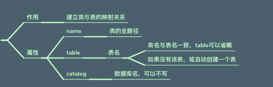
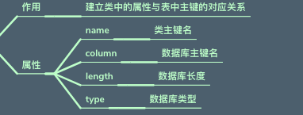
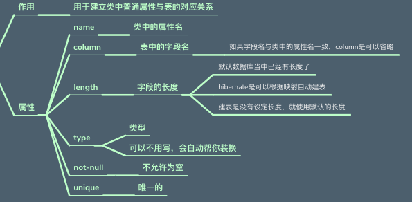
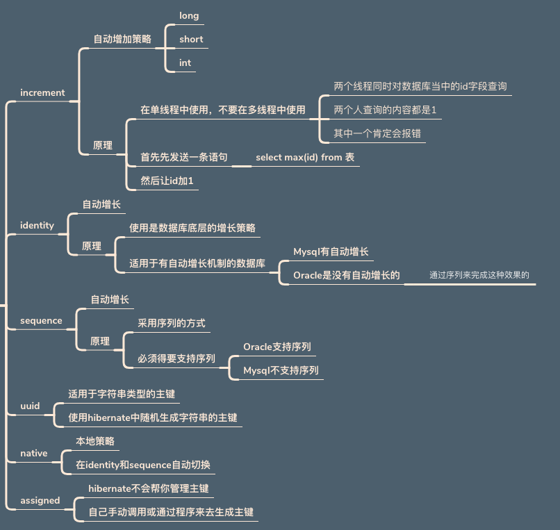
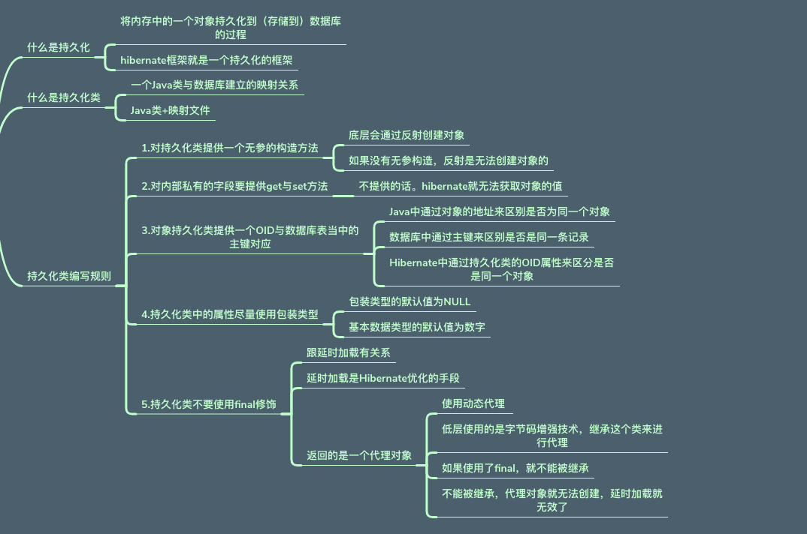
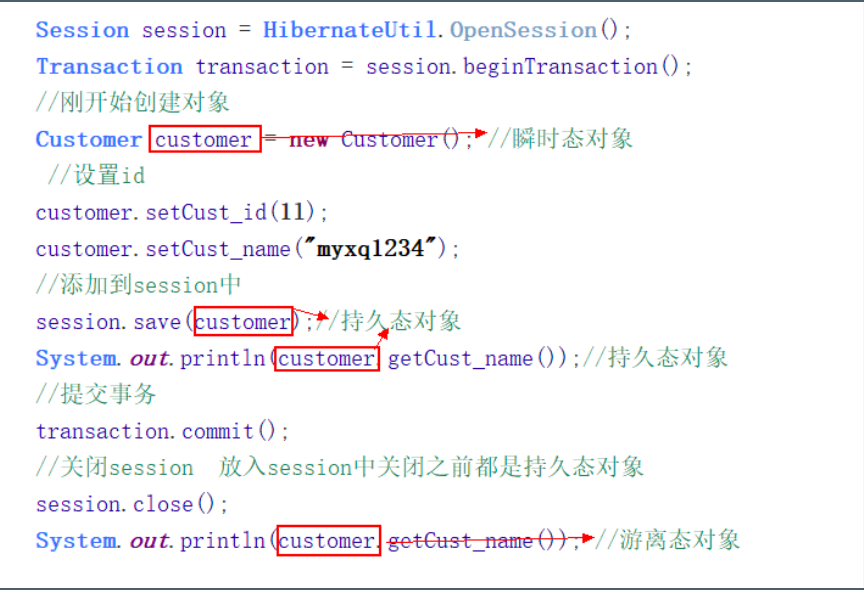
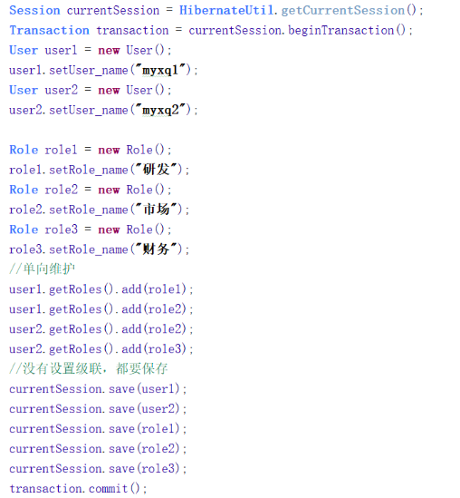
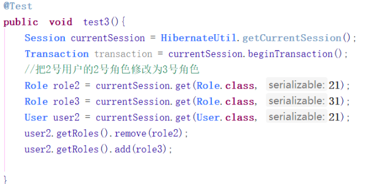
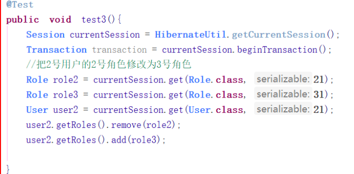
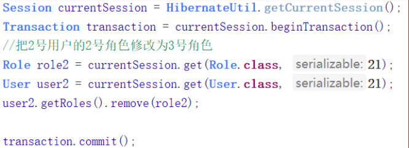

## 01 项目搭建

### 创建配置文件

创建`hibernate.cfg.xml`文件，配置数据库连接信息 

> 数据库账号 密码 连接池

```xml
<!DOCTYPE hibernate-configuration PUBLIC
	"-//Hibernate/Hibernate Configuration DTD 3.0//EN"
	"http://www.hibernate.org/dtd/hibernate-configuration-3.0.dtd">

<hibernate-configuration>
	<session-factory>
		<!-- 连接数据库的基本参数 -->
		<property name="hibernate.connection.driver_class">com.mysql.jdbc.Driver</property>
		<property name="hibernate.connection.url">jdbc:mysql:///hibernate</property>
		<property name="hibernate.connection.username">root</property>
		<property name="hibernate.connection.password">li767787498</property>
		<!-- 配置Hibernate的方言 -->
		<property name="hibernate.dialect">org.hibernate.dialect.MySQL5Dialect</property>
		<!-- 打印SQL -->
		<property name="hibernate.show_sql">true</property>
		<!-- 格式化SQL -->
		<property name="hibernate.format_sql">true</property>
		<!-- 自动创建表 -->
		<property name="hibernate.hbm2ddl.auto">update</property>

		 <!--c3p0配置信息-->
		<property name="connection.provider_class">org.hibernate.c3p0.internal.C3P0ConnectionProvider</property>
		<!--在连接池中可用的数据库连接的最少数目 -->
		<property name="c3p0.min_size">5</property>
		<!--在连接池中所有数据库连接的最大数目  -->
		<property name="c3p0.max_size">20</property>
		<!--设定数据库连接的过期时间,以秒为单位,
        如果连接池中的某个数据库连接处于空闲状态的时间超过了timeout时间,就会从连接池中清除 -->
		<property name="c3p0.timeout">120</property>
		<!--每3000秒检查所有连接池中的空闲连接 以秒为单位-->
		<property name="c3p0.idle_test_period">3000</property>
		<!--通过数字来代表不同的隔离级别-->
		<property name="hibernate.connection.isolation">4</property>
		<!--创建一个session绑定到当前线程-->
		<property name="current_session_context_class">thread</property>

		<!--加载映射文件-->
		<mapping resource="com/max/domain/customer.hbm.xml"/>

	</session-factory>
</hibernate-configuration>
```

### 类与表的映射

创建与表相映射的类 提供get set方法

创建映射文件 `表名.hbm.xml`

```xml
<?xml version="1.0" encoding="UTF-8" ?>
<!DOCTYPE hibernate-mapping PUBLIC
        "-//Hibernate/Hibernate Mapping DTD 3.0//EN"
        "http://www.hibernate.org/dtd/hibernate-mapping-3.0.dtd">
<hibernate-mapping>
    <class name="com.max.domain.Article" table="article">
        <!--建立类中的属性与表中的主键对应-->
        <id name="article_id" column="article_id" >
            <generator class="native"/>
        </id>
        <!--建立类中的普通的属性和表的字段的对应-->
        <property name="article_title" column="article_title" />
        <property name="article_time" column="article_time"/>
        <property name="article_content" column="article_content"/>
        <property name="article_pic" column="article_pic"/>
        <property name="article_desc" column="article_desc"/>
        <many-to-one name="categony" class="com.max.domain.Categony" column="article_cid"/>
    </class>
</hibernate-mapping>
```


### 获取连接对象

封装 `HibernateUtils` 获取连接对象、调用 `session.get(类.class, 主键值);  2L`

```java
package com.max.utils;

import org.hibernate.Session;
import org.hibernate.SessionFactory;
import org.hibernate.cfg.Configuration;

public class HibernateUtils {

    private static final SessionFactory sessionFactory;

    static {
        //1.加载配置文件   （该方法自动调用 this.configure("hibernate.cfg.xml") ）
        Configuration configure = new Configuration().configure();
        //2.创建sessionFactory  ---jdbc中的连接池
        sessionFactory = configure.buildSessionFactory();
    }

    //获取连接对象
    public static Session openSession(){

        return sessionFactory.openSession();
    }

    //获取线程里的连接对象
    public static Session getCurrentSession(){

        return sessionFactory.getCurrentSession();
    }
}
```


## 02 映射配置

### class标签

 

### ID标签




### property标签



## 03 核心配置

```xml
<property name="hibernate.hbm2ddl.auto">????</property> 
```

* **create** :   如果数据库中已经有表，删除原有表，重新创建，如果没有表，新建表
* **create-drop** :    如果数据库中已经有表，删除原有表，执行操作，删除这个表。如果没有表，新建一个，使用完了删除该表。  最后数据库中一个表没有，为了做测试用    把sessionFactory也close掉时才有效果
* **update**:   如果数据库中有表，使用原有表，如果有表，创建新表更新表结构，如果column没有时会创建新的一列
* **validate**:  如果数据库中有表，使用原有表，如果有表，创建新表更新表结构，如果column没有时会创建新的一列


**可选配置 ：** 显示SQL ` hibernate.show_sql` 、 格式化SQL `hibernate.format_sql`


## 04 Session的API


| 操作       | 方法                                                         |
| ---------- | ------------------------------------------------------------ |
| 保存       | `save(Object obj)`                                           |
| 查询       | `get（T.class,id）` 查询之后，返回的是真实对象本身   没有查询到指定的id,返回的是一个空值。<br />`load（T.class,id）`  查询之后返回的是一个代理对象，使用的是第三方的代理机制，javassist.jar  没有查询到结果直接报一个异常`ObjectNotFoundException` |
| 修改       | `void update(Object obj)`   <br />1. 直接创建对象修改  如果没有指定其它的字段，会把其它的字段设置为null  ***不建议使用***<br />2. 查询之后再修改  修改了某一个字段，不会把其它的字段设置为null |
| 删除       | `void delete(Object obj)`<br />1. 直接创建对象删除  不支持级联删除<br />2. 查询之后再删除  支持级联删除 |
| 保存或更新 | `void saveOrUpdate(Object obj)`<br />1. 没有设置id，是保存的操作<br />2. 设置了id是修改的操作，如果设置的id没有，就会报错 |


## 05 主键的生成策略

开发要使用代理主键

在使用代理主键的过程当中，尽量要做到自动生成主键，不能让用户手动设置主键



## 06 持久化类的编写

1.  提供无参构造方法
2. 提供get set 方法 
3. 尽量使用包装类型 
4. 可继承 


**OID：**
Hibernate使用对象标识符（Object Identifier, OID）来建立内存中的对象和数据库表中记录的对应关系，对象的OID和数据库表的主键（通常为代理主键，即不具备业务含义的字段，该字段一般取名为ID）对应。




## 07 持久化类的划分


**持久化类：**Java类+映射文件	

 **将持久化类对象分为三种状态：**

### 瞬时态:

> 没有唯一的OID
> 没有被session管理
> 这种对象我们称为瞬时态对象
> *刚new出对象时，还没有设置id，还没有被session所管理*

### 持久态:

> 有唯一的OID
> 有被session管理
> 这种对象我们称为持久态对象
> 已经有了id
> 调用session方法，把对象给session,才被session所管理
> 添加到session之后， 对象一直处理持久态
> 当对象处理持久态时， 可以自动更新数据库  （原理：依赖了hibernate当中的一级缓存）

### 游离态/托管态/离线态:

>  有唯一的OID
>  没有被session管理
>  把session关闭掉时close时
>  对象处理游离态



## 08 事务的隔离级别

*  `Read uncommitted`所有问题都会发生
*  `Read committed`解决脏读问题
*  `Repeatable read  ` 解决脏读和不可重复读
*  `Serializable` 解决所有问题，效率较低

**Hibernate设置事务的隔离级别：**

在核心配置文件`hibernate.cfg.xml`当中   通过数字来代表不同的隔离级别
  ```xml
 <property name="hibernate.connection.isolation">4</property>
  ```

**事务的使用:**

```java
// currentSession  - 连接对象
Transaction transaction = currentSession.beginTransaction();
。。。
。。。
transaction.commit();
```


## 09 一对多

### 实体类的创建:

在多的一方创建一个外键，指向一的一方的主键
在一的一方采用` Set<T>`集合保存多的一方的数据  （放置多的一方集合hibernate默认使用的是Set集合） 
**原因**： 一般使用的都是Set集合现在是双向关联。 一的地方 能查， 多的地方 也能查 

###  配置：

* **放弃外键维护：**一方放弃维护权  true为放弃外键维护权，false为不放弃外键维护权` inverse="false/true"`

* **级联 ：**一方 设置 级联保存或更新 且删除  `cascade="save-update,delete"`
  多方 设置 级联保存或更新 `cascade="save-update"` 
  解决的问题：`org.hibernate.TransientObjectException` 瞬时对象异常 

* **懒加载：**一半在一对多的是 在多的一方使用 ` lazy="false"` 取消懒加载特性，即在加载对象的同时，就发出第二条查询语句加载其关联集合的数据

  
  

### 一的一方：

 ```xml
 <!--一对多的配置-->

 <set name="《属性名》" cascade="save-update,delete" inverse="true">   <!--set集合属性名称 -->
     <key column="《外键》"></key>    //双方都是同一个值
     <one-to-many class="com.max.domain.Linkman"></one-to-many>  // Set<T> T 对象路径
 </set>
 
 ```

 **具体:**

 ```xml
 <?xml version="1.0" encoding="UTF-8" ?>
 <!DOCTYPE hibernate-mapping PUBLIC
         "-//Hibernate/Hibernate Mapping DTD 3.0//EN"
         "http://www.hibernate.org/dtd/hibernate-mapping-3.0.dtd">
 <hibernate-mapping>
     <class name="com.max.domain.Customer" table="customer">
         <!--建立类中的属性与表中的主键对应-->
         <id name="cust_id" column="cust_id" >
             <generator class="native"/>
         </id>
         <!--建立类中的普通的属性和表的字段的对应-->
         <property name="cust_name" column="cust_name" />
         <property name="cust_source" column="cust_source"/>
         <property name="cust_industry" column="cust_industry"/>
         <property name="cust_level" column="cust_level"/>
         <property name="cust_phone" column="cust_phone"/>
         <property name="cust_mobile" column="cust_mobile"/>
 
         <!--一对多的配置-->
         <set name="linkmens" cascade="save-update,delete" inverse="true">  <!--set集合属性名称 -->
             <key column="link_cust_id"></key>  <!-- 外键-->
             <one-to-many class="com.max.domain.Linkman"></one-to-many>
         </set>
 
     </class>
 </hibernate-mapping>
 ```

###  多的一方

```xml
<!--多对一的配置-->
<many-to-one name="《属性名》">
             class=“com.max.domain.Customer”  //属性类型路径
             column="《外键》"
             lazy=“false”  
             cascade="save-update”> //级联保存更新
</many-to-one>
```

**具体**

```xml
<?xml version="1.0" encoding="UTF-8" ?>
<!DOCTYPE hibernate-mapping PUBLIC
        "-//Hibernate/Hibernate Mapping DTD 3.0//EN"
        "http://www.hibernate.org/dtd/hibernate-mapping-3.0.dtd">
<hibernate-mapping>
    <class name="com.max.domain.Linkman" table="linkman">
        <!--建立类中的属性与表中的主键对应-->
        <id name="link_id" column="link_id" >
            <generator class="native"/>
        </id>
        <!--建立类中的普通的属性和表的字段的对应-->
        <property name="link_name" column="link_name" />
        <property name="link_gender" column="link_gender"/>
        <property name="link_phone" column="link_phone"/>
        <property name="link_mobile" column="link_mobile"/>
        <property name="link_email" column="link_email"/>
        <property name="link_qq" column="link_qq"/>
        <property name="link_position" column="link_position"/>
        <property name="link_memo" column="link_memo"/>

        <!--多对一的配置-->
        <many-to-one name="customer"
                     class="com.max.domain.Customer"
                     column="link_cust_id"
                     lazy="false"
                     cascade="save-update">
        </many-to-one>
    </class>
</hibernate-mapping>
```


## 10 多对多

### 实体类的创建:

创建一个中间表，中间表至少有两个字段，分别作为外键指向多对多双方的主键
双方都采用`Set<T>` 集合存放外键对象

### 配置：

* **放弃外键维护：`inverse="true"`    通常都是让被动方放弃，用户选角色，角色为被动方 
*  **级联：**只需一方级联就行  `cascade="save-update" `
 ```xml
 <set name=“《属性名》" table=“《中间表》" cascade="save-update">
     <key column=“《外键》"> </key>  
     <many-to-many class="com.max.domain.Role" column=“《集合中对象的外键》/>
 </set>
 ```

 ```xml
 <set name="《属性名》" table="《中间表》" inverse="true”> //放弃外键维护
     <key column=《外键》></key>
     <many-to-many class="com.max.domain.User" column="《集合中对象的外键》"/>
 </set>
 
 ```

 **具体：**

 ```xml
 <?xml version="1.0" encoding="UTF-8" ?>
 <!DOCTYPE hibernate-mapping PUBLIC
         "-//Hibernate/Hibernate Mapping DTD 3.0//EN"
         "http://www.hibernate.org/dtd/hibernate-mapping-3.0.dtd">
 <hibernate-mapping>
     <class name="com.max.domain.User" table="user">
         <!--建立类中的属性与表中的主键对应-->
         <id name="user_id" column="user_id" >
             <generator class="native"/>
         </id>
         <!--建立类中的普通的属性和表的字段的对应-->
         <property name="user_code" column="user_code" />
         <property name="user_name" column="user_name" />
         <property name="user_password" column="user_password" />
         <property name="user_state" column="user_state" />
 
         <!--多对多关系配置
         name:当前集合的属性名称
         table：多对多中间表 表名
          <key column=""> </key>：当前表的外键
          <many-to-many class="" column=""/>
          class：集合中对象的全路径
          column：集合中对象的外键
         -->
         <set name="roles" table="user_role" cascade="save-update">
             <key column="user_id"> </key>
             <many-to-many class="com.max.domain.Role" column="role_id"/>
         </set>
 
 
     </class>
 </hibernate-mapping>
 ```

 ```xml
 <?xml version="1.0" encoding="UTF-8" ?>
 <!DOCTYPE hibernate-mapping PUBLIC
         "-//Hibernate/Hibernate Mapping DTD 3.0//EN"
         "http://www.hibernate.org/dtd/hibernate-mapping-3.0.dtd">
 <hibernate-mapping>
     <class name="com.max.domain.Role" table="role">
         <!--建立类中的属性与表中的主键对应-->
         <id name="role_id" column="role_id" >
             <generator class="native"/>
         </id>
         <!--建立类中的普通的属性和表的字段的对应-->
         <property name="role_name" column="role_name" />
         <property name="role_memo" column="role_memo" />
 
         <set name="users" table="user_role" inverse="true">
             <key column="role_id"></key>
             <many-to-many class="com.max.domain.User" column="user_id"/>
         </set>
 
     </class>
 </hibernate-mapping>
 ```


 

## 11 单双向维护：

### 单向维护：

在做保存数据时`更新 or 删除` 
在没有设置级联情况下 双方都要保存 

双向维护时，必须要有一方放弃外键维护 

> 原因：如果两边都有维护的话， 就会有重复的的记录，由于关系表是两个字段作为共同主 键，不能有相同的记录 

放弃外键维护方式：通常都是让被动方放弃，用户选角色，角色为被动方 

### 双项维护：

双向维护时，必须要有一方放弃外键维护 

**原因：**如果两边都有维护的话， 就会有重复的的记录，由于关系表是两个字段作为共同主键，不能有相同的记录 

放弃外键维护方式：通常都是让被动方放弃，用户选角色，角色为被动方 


**添加：**



**修改：**



**删除：**



## 11 HQL

**概述：**

1. HQL查询：Hibernate Query Language，Hibernate的查询语言
2. 是一种面向对象的方式的查询语言，语法类似SQL。
3. 通过session.createQuery()，用于接收一个HQL进行查询方式。

### 一般的查询：

#### 简单查询：

```java
 @Test
 public void test(){
     //查询就不需要使用绑定线程的连接对象了
     Session session = HibernateUtils.openSession();
     //(简单查询)
	      Query query = session.createQuery("from User");
     List<User> list = query.list();
     System.out.println(list);
 }
```

#### 别名查询：

```java
 @Test
 public void test(){
     //查询就不需要使用绑定线程的连接对象了
     Session session = HibernateUtils.openSession();
     //别名查询
     Query query = session.createQuery("select u from User u");
     List<User> list = query.list();
     System.out.println(list);
 }
```

#### 排序查询：

```java
 @Test
 public void test(){
     //查询就不需要使用绑定线程的连接对象了
     Session session = HibernateUtils.openSession();
     //排序查询
     Query query = session.createQuery("select u from User u order by user_id desc ");
     List<User> list = query.list();
     System.out.println(list);
 }
```

####   条件查询：

##### 位置绑定

根据参数的位置进行绑定条件

```java
@Test
public void tset2(){
    //条件查询（别名条件查询）
    Session session = HibernateUtils.openSession();
    Query query = session.createQuery("from User where user_id= ? and user_name= ?");
    query.setParameter(0,1L);
    query.setParameter(1,"张三");

    List<User> list = query.list();
    System.out.println(list);
}
```

##### 名称绑定

 把参数对应的值起一个名称 再去设置名称 

```java
//条件查询（别名条件查询）
       Session session = HibernateUtils.openSession();
       Query query = session.createQuery("from User where user_id=:aaa and user_name=:bbb");
       query.setParameter("aaa",1L);
       query.setParameter("bbb","张三");

       List<User> list = query.list();
       System.out.println(list);
}
```


### 投影查询：

查询对象的某个或某些属性

#### 单个属性：

```java
@Test
 public void tset3(){
     //投影查询
     Session session = HibernateUtils.openSession();
     //查询单个属性
     List<Object> list = session.createQuery("select c.user_name from User c").list();
     System.out.println(list);
 }
```

#### 多个属性：

```java
 @Test
 public void tset3(){
     //投影查询
     Session session = HibernateUtils.openSession();
     //查询多个
     List<Object[]> list = session.createQuery("select c.user_name,c.user_code from User c").list();
     System.out.println(list);
 }
```

#### 查询且封装

多个属性，封装到对象当中 - 要在类中，提供构造方法

```java
@Test
 public void tset3(){
     //投影查询
     Session session = HibernateUtils.openSession();
     //将查询结果封装成对象 （封装的对象必须提供带参的构造方法）
     List<User> list = session.createQuery("select new User(u.user_code,u.user_name)  from User u").list();
     System.out.println(list);
 }
```

###  分页查询：

```java
@Test
 public void tset4(){
     //分页查询  （limit）
     Session session = HibernateUtils.openSession();
     Query query = session.createQuery("from User ");
     query.setFirstResult(0);  /* 从0开始查2条*/
     query.setMaxResults(2);
     List<User> list = query.list();
     System.out.println(list);
 }
```

###  统计查询：

查询的结构之有一个：

```java
@Test
 public void tset5(){
     //统计查询
     Session session = HibernateUtils.openSession();
     Query query = session.createQuery("select count(*) from User ");
     Object o = query.uniqueResult(); /* 返回单一的值*/
     System.out.println(o);
 }
```

###  分组查询：

```java
@Test
 public void tset6(){
     //分组查询
     Session session = HibernateUtils.openSession();
     Query query = session.createQuery("select  u.user_code,count(*) from User u group by u.user_code");
     List<Object[]> list = query.list();
     for (Object[] objects : list) {
         System.out.println(Arrays.toString(objects));
     }

 }
```

###  多表查询：

不需要写外键相等的条件 （查询结果为 list集合 存放object数组）

#### 普通内连接：

```java
 @Test
 public void tset7(){
     //连接查询（内连接） 不需要再写外键相等的操作了 已经再文件中添加了外键
     Session session = HibernateUtils.openSession();
     Query query = session.createQuery("from User u inner join u.roles");
     List<Object[]> list = query.list();
     for (Object[] objects : list) {
         System.out.println(Arrays.toString(objects));
     }

 }
```

#### 迫切内连接（left join）: 

在普通内连接inner join 后添加一个关键字fetch  （通过hibernate将另一个对象的数据，封装该对象中）

```java
@Test
 public void tset8(){
     //连接查询（迫切内连接）将查询结果直接封装成对象
     Session session = HibernateUtils.openSession();
     Query query = session.createQuery("from User u inner join fetch u.roles");
     List<User> list = query.list();
     for (User user : list) {
         System.out.println(user);
     }

 }
```


## 12 QBC

Query By Criteria，条件查询。是一种更加面向对象化的查询的方式。

### **一般的查询：**

#### 简单查询：

```java
@Test
 public void test(){
     //QBC查询 更加面向对象的查询方式 （条件查询）
     Session session = HibernateUtils.openSession();
     Criteria criteria = session.createCriteria(User.class);
     List<User> list = criteria.list();
     for (User user : list) {
         System.out.println(user);
     }
 }
```

#### 排序查询：

```java
@Test
 public void test(){
     //QBC查询 更加面向对象的查询方式 （条件查询）
     Session session = HibernateUtils.openSession();
     Criteria criteria = session.createCriteria(User.class);
     //添加排序
     criteria.addOrder(Order.asc("user_id"));
     List<User> list = criteria.list();
     for (User user : list) {
         System.out.println(user);
     }
 }
```

#### 分页查询：

```java
@Test
 public void test(){
     //QBC查询 更加面向对象的查询方式 （条件查询）
     Session session = HibernateUtils.openSession();
     Criteria criteria = session.createCriteria(User.class);
     //添加排序
     criteria.addOrder(Order.asc("user_id"));
     //分页查询 limit
     criteria.setFirstResult(0);
     criteria.setMaxResults(2);

     List<User> list = criteria.list();

     for (User user : list) {
         System.out.println(user);
     }
 }
```

####  **条件查询：** 

**条件**

* =  eq 
*  \>  gt
*  \>= ge
*   <  lt
*   <= le
*   <> ne
*   like
*   in
*   and
*  or

##### 单个条件：

```java
@Test
 public void test2(){
     //条件查询
     Session session = HibernateUtils.openSession();
     Criteria criteria = session.createCriteria(User.class);
     //单个条件
     criteria.add(Restrictions.eq("user_code","user1"));
 
     List<User> list = criteria.list();

     for (User user : list) {
         System.out.println(user);
     }
 }
```

##### 多个条件：

```java
@Test
 public void test2(){
     //条件查询
     Session session = HibernateUtils.openSession();
     Criteria criteria = session.createCriteria(User.class);
    //多个条件
     criteria.add(Restrictions.eq("user_code","user1"));
     criteria.add(Restrictions.like("user_name","张%"));

     List<User> list = criteria.list();

     for (User user : list) {
         System.out.println(user);
     }
 }
```

#### 统计查询：

```java
@Test
 public void test3(){
     //统计查询
     Session session = HibernateUtils.openSession();
     Criteria criteria = session.createCriteria(User.class);
//                             Projections
     criteria.setProjection(Projections.rowCount());  /* 设置一些聚合函数*/
     Object o = criteria.uniqueResult();         /* 返回一个结果*/
     System.out.println(o);
 }
```

## 13 离线查询

脱离Session，添加条件  可以在外部提前使用DetachedCriteria对象提交设置好条件  最后再绑定到session当中

```java
@Test
 public void test4(){
     //离线查询
     DetachedCriteria detachedCriteria = DetachedCriteria.forClass(User.class); /* 创建条件*/
     detachedCriteria.add(Restrictions.like("user_name","张%")); /*设置条件*/

     Session session = HibernateUtils.openSession();
     Criteria criteria = detachedCriteria.getExecutableCriteria(session); /*执行查询*/
     List<User> list = criteria.list();
     for (User user : list) {
         System.out.println(user);
     }

 }
```

