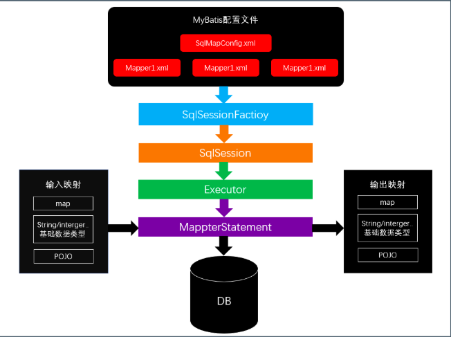
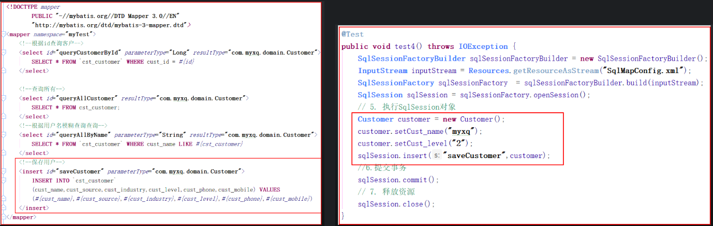
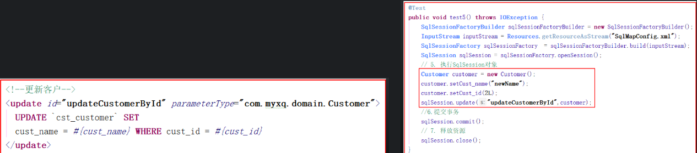
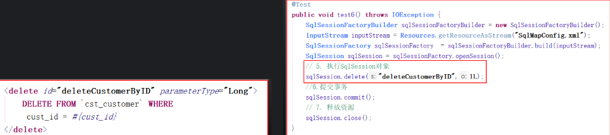
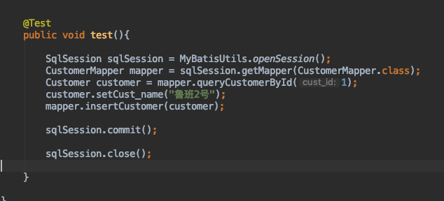

# MyBatis

## 01 MyBatis的基本使用
- 创建工程,引入MyBatis核心包及依赖包
- 创建数据表,建立与表对象的domain
- 创建MyBatis核心配置文件SqlMappingConfig.xml 
```xml
<?xml version="1.0" encoding="UTF-8" ?>
<!DOCTYPE configuration
        PUBLIC "-//mybatis.org//DTD Config 3.0//EN"
        "http://mybatis.org/dtd/mybatis-3-config.dtd">
<configuration>

    <!--配置sql的打印-->
    <settings>
        <setting name="logImpl" value="STDOUT_LOGGING"/>
    </settings>

    <!-- spring整合后 environments配置将废除 使用spring中的连接池 -->
    <environments default="development">
        <environment id="development">
            <!-- 使用jdbc事务管理 -->
            <transactionManager type="JDBC" />
            <!-- 数据库连接池 -->
            <dataSource type="POOLED">
                <property name="driver" value="com.mysql.jdbc.Driver" />
                <property name="url"
                          value="jdbc:mysql://localhost:3306/mybatis?characterEncoding=utf-8" />
                <property name="username" value="root" />
                <property name="password" value="1234" />
            </dataSource>
        </environment>
    </environments>
    <!--加载映射文件-->
    <mappers>
        <mapper resource="com/max/domain/Customer.xml"></mapper>
    </mappers>

</configuration>
```

- 创建与表对象的关系映射Mapping文件编写sql语句 
```xml
<?xml version="1.0" encoding="UTF-8" ?>
<!DOCTYPE mapper
        PUBLIC "-//mybatis.org//DTD Mapper 3.0//EN"
        "http://mybatis.org/dtd/mybatis-3-mapper.dtd">
<mapper namespace="com.max.mapper.CustomerMapper">
    <!--根据cust_id查询客户-->
    <select id="queryCustomerById" parameterType="Integer" resultType="com.max.domain.Customer">
	  SELECT * FROM `customer` WHERE cust_id  = #{cust_id}
	</select>

</mapper>

```

- 在`核心配置文件`当中引入Mapping   \<package name=“com.max.mapper“/\>    加载指定包mapper文件
- 创建工厂,执行sql语句 获取sqlSession  
获取sqlSession  
```java
@Test
    public void test() throws IOException {
        //1：加载配置文件
        SqlSessionFactoryBuilder sqlSessionFactoryBuilder = new SqlSessionFactoryBuilder();

        //2:读取配置文件 (import org.apache.ibatis.io.Resources;)
        InputStream resourceAsStream = Resources.getResourceAsStream("SqlMappingConfig.xml");

        //3：获取 session 工厂
        SqlSessionFactory build = sqlSessionFactoryBuilder.build(resourceAsStream);

        //4:获取session  JDBC 连接
        SqlSession sqlSession = build.openSession();

        //5：执行sql语句  
        Customer customer = sqlSession.selectOne("queryCustomerById", 2);
        System.out.println(customer);

        //6:关闭session
        sqlSession.close();


    }
```


**封装MyBatisUtils：**
```java
package com.max.utils;

import org.apache.ibatis.io.Resources;
import org.apache.ibatis.session.SqlSession;
import org.apache.ibatis.session.SqlSessionFactory;
import org.apache.ibatis.session.SqlSessionFactoryBuilder;

import java.io.IOException;
import java.io.InputStream;

public class MyBatisUtils {


    private static final  SqlSessionFactory build;

    static {
        //1：加载配置文件
        SqlSessionFactoryBuilder sqlSessionFactoryBuilder = new SqlSessionFactoryBuilder();

        //2:读取配置文件 (import org.apache.ibatis.io.Resources;)
        InputStream resourceAsStream = null;
        try {
            resourceAsStream = Resources.getResourceAsStream("SqlMappingConfig.xml");
        } catch (IOException e) {
            e.printStackTrace();
        }
        //3：获取 session 工厂
       build = sqlSessionFactoryBuilder.build(resourceAsStream);
    }

    public static SqlSession openSession(){
        return build.openSession();
    }

}

```
## 02 MyBatis核心API

### SqlSessionFactoryBuilder
1. SqlSessionFactoryBuilder用于创建SqlSessionFacoty
	2. SqlSessionFacoty一旦创建完成就不需要SqlSessionFactoryBuilder了
	3. 因为SqlSession是通过SqlSessionFactory创建的
	4. 所以可以将SqlSessionFactoryBuilder当成一个工具类使用，最佳使用范围是方法范围即方法体内局部变量。

### SqlSessionFactory
1. 创建sqlSession的工厂,是一个接口
	2. 接口中定义了openSession的不同重载方法
	3. SqlSessionFactory的最佳使用范围是整个应用运行期间，一旦创建后可以重复使用，通常以`单例`模式管理SqlSessionFactory。

### SqlSession
1. 连接到数据库的一个会话
	2. sqlSession中定义了数据库操作方法。
	3. 每个线程都应该有它自己的SqlSession实例
	4. SqlSession的实例不能共享使用，它也是线程不安全的。因此最佳的范围是请求或方法范围
	5. 绝对不能将SqlSession实例的引用放在一个类的静态字段或实例字段中。


		   

## 03 MyBatis-查询

### 根据用户名模糊查询客户
1. 在sql语句写 `'%${vales}%’`进行`占位符`拼接
	
2. 在输入条件时写上%
	

### \<select/\>标签一些属性 
1. parameterType  指定输入参数类型，mybatis通过ognl从输入对象中获取参数值拼接在sql中
2. resultType  指定输出结果类型，mybatis将sql查询结果的一行记录数据映射为resultType指定类型的对象。如果有多条数据，则`分别进行映射`，并把对象放到容器List中

### sqlSession 查询方法
   1. selectOne  查询一条记录   如果使用selectOne查询多条记录则抛出异常
   2. selectList   可以查询一条或多条记录


### `#{}`和`${}`区别
单个属性值
 `#{}`:
1. `(select * from customer where cust_name like ‘%?%' )`
1. 表示一个占位符号，通过\#可以实现preparedStatement向占位符中设置值
2. 自动进行`java类型和jdbc类型转换`
3. `#{}`可以有效防止`sql注入`
4. `#{}`可以接收简单类型值或pojo属性值
5. 如果parameterType传输单个简单类型值,\#括号中可以是value或`其它名称`

 `${}`:
1. `(select * from customer where cust_name like '%李%' ）`
1.  表示`拼接sql串`
2.  通过$可以将parameterType 传入的内容拼接在sql中且`不进行`jdbc类型转换
3.  $可以接收简单类型值或pojo属性值
4.  如果parameterType传输单个简单类型值，`${}`括号中`只能是value`


## 04 保存更新删除


返回添加过后`自增`的主键 获取自动增长的主键值






## 05 MyBatis开发DAO
Mapper动态代理方式
要求[Mybatis -\> MyBatis开发DAO 过程](#)


1.  namespace必须和Mapper接口类路径一致 
2.  id必须和Mapper接口方法名一致
3.  parameterType必须和接口方法参数类型一致
4.  resultType必须和接口方法返回值类型一致

### selectOne和selectList
1. 动态代理对象调用sqlSession.selectOne()和sqlSession.selectList()是根据mapper接口方法的返回值决定
2.  如果返回list则调用selectList方法，如果返回单个对象则调用selectOne方法。



## 06 参数传递
[Mybatis-\> 参数传递源码分析](#)

### 单个参数
1. 可以接受`基本类型`，`对象类型`，`集合类型的值`
2.  MyBatis可直接使用这个参数，不需要经过任何处理。

### 多个参数
1. 任意多个参数，都会被MyBatis重新包装成一个Map传入。
2. Map的key是param1，param2…，值就是参数的值。


### @param命名参数
为参数使用@Param起一个名字， MyBatis就会将这些参数封装进map中，key就是我们自己指定的名字


### POJO
当这些参数属于我们业务POJO时，我们直接传递POJO


### Map
  我们也可以封装多个参数为map，直接传递


## 07 MaBatis核心配置文件

### properties 定义属性及读取属性文件
 

### settings
这是 MyBatis 中极为重要的调整设置，它们会改变 MyBatis 的运行时行为


### typeAliases
类型别名是为 Java 类型设置一个短的名字
 定义单个别名

批量别名定义  如果当前包类与子包类重名,会有异常  可以在类上使用注解@Alias("别名")


### typeHandlers  类型处理器
[文档](%20http://www.mybatis.org/mybatis-3/zh/configuration.html#typeHandlers) 日期时间处理上


### Environments 
MyBatis可以配置多种环境，比如开发、测试和生产环境需要有不同的配置。   每种环境使用一个environment标签进行配置并指定唯一标识符。可以通过environments标签中的default属性指定一个环境的标识符来快速的切换环境

**Environment子标签：**
#### transactionManager事务管理  Type有以下取值：
1. JDBC   使用JDBC 的提交和回滚设置，依赖于从数据源得到的连接来管理事务范围
2. MANAGED   不提交或回滚一个连接、让容器来管理事务的整个生命周期  ManagedTransactionFactory  
3. 自定义   实现TransactionFactory接口  type=全类名/别名

#### dataSource数据源  type有以下取值：
1. UNPOOLED  不使用连接池UnpooledDataSourceFactory
2. POOLED    使用连接池PooledDataSourceFactory
3. JNDI   在EJB 或应用服务器这类容器中查找指定的数据源
4. 实现DataSourceFactory接口，定义数据源的获取方式
	  
- 实际开发中我们使用Spring管理数据源
- 并进行事务控制的配置来覆盖上述配置

### databaseIDProvider   
MyBatis 可以根据不同的数据库厂商执行不同的语句。
- 可以能过databaseIDProvider标签来进行设置
```java
<databaseIdProvider type="DB_VENDOR">
        <property name="MYSQL" value="mysql"/>
        <property name="DB2" value="db2"/>
        <property name="Oracle" value="oracle" />
        <property name="SQL Server" value="sqlserver"/>
     </databaseIdProvider>
```
 

### mappers 
1. `<mapper resource=" "/>`  使用相对于类路径的资源
2. `<mapper class=" " />`    使用mapper接口类路径  此种方法要求mapper接口名称和mapper映射文件名称相同，且放在同一个目录中
3. `<package name="”/>`  指定包下的所有mapper接口  此种方法要求mapper接口名称和mapper映射文件名称相同，且放在同一个目录中


## 08 输出类型

### 输出简单类型


### Map
-  key:是列名  value:是列名对应的值

- Map\<key,自定义对象\>    key为自己指定的我列


### resultMap
1.  之有在写输出时使用的都是resultType 
1. 但是resultType要求必须得要字段名称和数据库当中的名称一致时才能有值,否则为null
2. 如果sql查询字段名和pojo的属性名不一致，可以通过resultMap将字段名和属性名作一个对应关系


## 09 多表 ManyToOne

关系表


### 查询
#### 分步查询：
- 第一步 先查出所有的订单

- 第二步 根据id查出对应客户 （参数传递


#### 左连接查询
- 建立domain

- 建立Mapping映射  （左连接查询 需要手动映射字段）


##### 分步查询懒加载
- \<!--延迟加载的全局开关。当开启时，所有关联对象都会延迟加载。--\> `<setting name="lazyLoadingEnabled" value="true"/>`
- \<!--当开启时，任何方法的调用都会加载该对象的所有属性。否则，每个属性会按需加载--\> `<setting name="aggressiveLazyLoading" value="false"/>`
- \<!--指定哪个对象的方法触发一次延迟加载。--\> `<setting name="lazyLoadTriggerMethods" value="equals,clone,hashCode"/>`
- 


### 添加
  


## 10 多表 OneToMany
关系表


### 查询


### 保存数据

#### 维护关系

#### 管理关


### 删除 
删除时一定要先打破关系再做删除操作


## 11 多表 ManyToMany

关系表


### 分步查询
- 查询出指定的老师

- 根据老师id查询出所有学生


### 左边接查询


### 添加
 添加老师   添加学生   添加中间关系 [Mybatis 获取自动增长的主键值](#)
多对多实际是两边 的一对多
插入关系的时候 注意values() 字段的顺序        


## 12 动态sql

通过mybatis提供的各种标签方法实现动态拼接sql。  


### if标签：
参数满足设置的条件才会拼接对应的sql语句


### where标签：
能够自动生成或删除where 还能删除where后`第一个`and


### trim标签：
（在拼接好的sql语句中 去做下面的操作 `（where· and name = #{name} and pro = #{pro}）and）`
1. `prefixOverrides=“”`  条件前覆盖掉 （and）
2. `suffixOverrides=“”`  条件后覆盖掉 （and）
3. `prefix=“”`                  条件前加上 (where)
4. `suffix="” `                   条件后加上 

### choose标签：
`只满足一个条件执行 其他的都不执行`


### set标签：
主要用在update操作中   会自动拼接·set·  且会把最后一个条件的 ， 去掉（`逗号`）


### foreach标签: 
用于多个值拼接 ``（select * from `customer` where cust_id in (2,3,4,5)） ``

数组:

List集合：

对象


### bind标签：
取出传入的值 重新处理 赋值给另一个   `注意：传入的id 必须有get方法 或者 加上 @Param 注解`


### sql片段：
Sql中可将重复的sql提取出来，使用时用include引用即可，最终达到sql重用的目的。


## 13 缓存

缓存介绍:
1. MyBatis中使用缓存来提高其性能。
2. 当查询数据时, 会先从缓存中取出数据,如果缓存中没有,再到数据库当中查询
3. MyBatis中的缓存分为两种：一级缓存和二级缓存
4. 一级缓存是sqlSession级别的，二级缓存是mapper级别的

### 一级缓存:
- 本地缓存 (默认开启)
	- 在sqlSession没有关闭之前,再去查询时, 会从缓存当中取出数据,不会重新发送新的sql

 一级缓存失效
- 如果在查询之前,执行了增\\删\\改 缓存就会失效
	- 手动清空缓存
	- 如果两次的查询条件不一样,缓存也会失效
	- 如果两个查询在不同的sqlsession当中

### 二级缓存
- 全局作用域缓存 一个namespace对应一个缓存
	- 如果会话关闭,一级缓存的数据会被保存到二级缓存中
	- 不同namespace查出的数据 ,会放到自己对应的缓存中
	- 现在默认也是打开的

 二级缓存使用步骤:
- 1.确保在配置文件当中开启二级缓存

- 2.在对应的mapper中添加cache标签

- 3.POJO需要实现Serializable接口  (因为会利用序列化和反序列化复制一份给你)

### 注意事项
1. 查询的数据都会先放到一级缓存当中
2. 只有会话关闭,一级缓存中的数据才会转称到二级缓存中

缓存相关属性


缓存使用顺序:
1. 先到二级缓存当中查找
2. 如果二级缓存中没有,就去找一级缓存
3. 如果一级缓存中也没有就去到数据库当中查询


## 14 ResultMap

### 级联属性赋值 多对一


### 关联对象赋值 (`所以的属性都要手动去映射 否则会报空`)  一对多


### association分步查询 


### List的封装


## 15 分页插件

导入架包
配置分页插件

  

```java
package com.max.test;

import com.github.pagehelper.Page;
import com.github.pagehelper.PageHelper;
import com.github.pagehelper.PageInfo;
import com.max.domain.Customer;
import com.max.mapper.CustomerMapper;
import com.max.utils.MyBatisUtils;
import org.apache.ibatis.session.SqlSession;
import org.junit.Test;

import java.util.Arrays;
import java.util.List;

public class MyTest {

    @Test
    public void test(){
        SqlSession sqlSession = MyBatisUtils.openSession();
        CustomerMapper mapper = sqlSession.getMapper(CustomerMapper.class);

        //从数据库开始指定
        Page<Object> page = PageHelper.startPage(2, 5);

        List<Customer> customers = mapper.getAllCustomer();

        //查询之后指定
        PageInfo<Customer> pageInfo = new PageInfo<>(customers, 5);

        for (Customer customer : pageInfo.getList()) {
            System.out.println(customer);
        }

        System.out.println("当前页:"+pageInfo.getPageNum());
        System.out.println("每页显示记录数:"+pageInfo.getPageSize());
        System.out.println("总页数:"+pageInfo.getPages());
        System.out.println("总记录数:"+pageInfo.getTotal());
        System.out.println("是否有上一页:"+pageInfo.isHasPreviousPage());
        System.out.println("是否有下一页:"+pageInfo.isHasNextPage());
        System.out.println("导航页面:"+ Arrays.toString(pageInfo.getNavigatepageNums()));

        sqlSession.close();

    }
}

```

```java
<plugins>
        <plugin interceptor="com.github.pagehelper.PageInterceptor"></plugin>
    </plugins>
```
## 参数传递源码分析

- 会把参数给放到一个数组当中
- 如果一个参数, 内部处理时,会自动把该参数返回


- 如果是多个参数,内部会做判断
- 判断是否有@param注解
1. 如果没有   没有注解的话, 就直接使用arg0  arg1...为key  放到map中
2. 并且还会以param1和param2...为key放一份到map中

1. 如果有  如果有注解的话, 会使用注解当中的值,替换掉默认的arg0和arg1
2. 使用@param中的值,做为key 放到一个map当中

## 获取自动增长的主键值

 1-方式


2-方式 （常用）


## MyBatis开发DAO 过程


