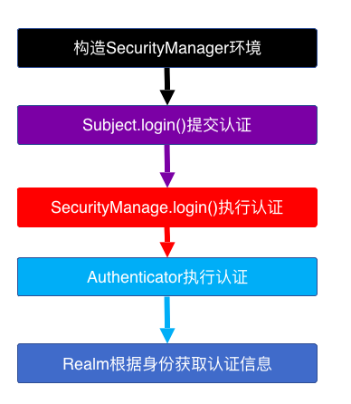

# Shiro
## 01 Shiro的基本使用

- 创建Java maven工程

- 在Maven中添加依赖  
```xml
    <!--Shiro-->
    <!-- https://mvnrepository.com/artifact/org.apache.shiro/shiro-core -->
    <dependency>
      <groupId>org.apache.shiro</groupId>
      <artifactId>shiro-core</artifactId>
      <version>1.4.0</version>
    </dependency>

    <!--日志-->
    <!-- https://mvnrepository.com/artifact/commons-logging/commons-logging -->
    <dependency>
      <groupId>commons-logging</groupId>
      <artifactId>commons-logging</artifactId>
      <version>1.2</version>
    </dependency>

    <!-- https://mvnrepository.com/artifact/org.slf4j/slf4j-nop -->
    <dependency>
      <groupId>org.slf4j</groupId>
      <artifactId>slf4j-nop</artifactId>
      <version>1.7.25</version>
      <scope>test</scope>
    </dependency>

```
- 创建Shiro.ini文件   首先准备一些用户身份/凭据（shiro.ini）
```ini
[users]  
max=1234
my=1234
```


### 认证 

```java
package com.max;

import org.apache.shiro.SecurityUtils;
import org.apache.shiro.authc.IncorrectCredentialsException;
import org.apache.shiro.authc.UnknownAccountException;
import org.apache.shiro.authc.UsernamePasswordToken;
import org.apache.shiro.config.IniSecurityManagerFactory;
import org.apache.shiro.mgt.SecurityManager;
import org.apache.shiro.subject.Subject;

/**
 * Hello world!
 *
 */
public class App
{
    public static void main( String[] args )
    {


//        1.构建securityManager工厂
        IniSecurityManagerFactory factory = new IniSecurityManagerFactory("classpath:shiro.ini");

//        2.通过工厂创建securityManager  (相当于SpringMVC中的前端控制器)
        SecurityManager securityManager = factory.getInstance();

//        3.将securityManager设置到运行环境中
        SecurityUtils.setSecurityManager(securityManager);

//        4.创建一个Subject实例
        Subject subject = SecurityUtils.getSubject();

//        5.创建token令牌
        UsernamePasswordToken token = new UsernamePasswordToken("itlike1", "1234");

//        6.用户登录
        try {
            subject.login(token);
        }catch (UnknownAccountException e){
            System.out.println("账号不正确");
            e.printStackTrace();
        }catch (IncorrectCredentialsException e){
            System.out.println("密码不正确");
            e.printStackTrace();
        }

        System.out.println("是否认证成功"+subject.isAuthenticated());

//        7.用户退出
        subject.logout();
        System.out.println("2是否认证成功"+subject.isAuthenticated());

    }
}

```
## 02 散列密码

```java
// md5 形式加密 ，参数（密码，盐，散列几次）
Md5Hash md5Hash = new Md5Hash("admin","123",2);
System.out.println(md5Hash);


SimpleHash simpleHash = new SimpleHash("md5", "admin", "123", 2);
System.out.println(simpleHash);
```


Shiro认证添加散列密码：
在ini文件当中进行散列 
```ini
[main]
#定义凭证匹配器
credentialsMatcher=org.apache.shiro.authc.credential.HashedCredentialsMatcher
#散列算法
credentialsMatcher.hashAlgorithmName=md5
#散列次数
credentialsMatcher.hashIterations=3

#指定realm
myRealm=com.max.MyRealm
#配置散列
myRealm.credentialsMatcher=$credentialsMatcher
#配置自定义散列
securityManager.realms=$myRealm
```

要保证数据库中的密码是经过散列之后的：


加的盐在认证器设置：


## 03 授权

- 使用ini形式配置权限信息
	- 在ini文件中用户、角色、权限的配置规则
	- 用户名=密码，角色1，角色2...
	- 首先根据用户名找角色，再根据角色找权限，角色是权限集合。


```java
[users]
#用户itlike的密码是1234，此用户具有role1和role2两个角色
max=maxPasswore,role1,role2
myxq=1234,role2
[roles]
#角色role1对资源user拥有create、update权限
role1=user:create,user:update
#角色role2对资源user拥有create、delete权限
role2=user:create,user:delete
#角色role3对资源user拥有create权限
role3=user:create
```


- 自定义Realm形式权限


## 04 Shiro整合web工程 认证

- 添加pom依赖
```xml
  <dependency>
      <groupId>commons-logging</groupId>
      <artifactId>commons-logging</artifactId>
      <version>1.2</version>
    </dependency>
    <dependency>
      <groupId>org.slf4j</groupId>
      <artifactId>slf4j-nop</artifactId>
      <version>1.7.24</version>
    </dependency>
    <dependency>
      <groupId>commons-collections</groupId>
      <artifactId>commons-collections</artifactId>
      <version>3.2.1</version>
    </dependency>
    <dependency>
      <groupId>org.apache.shiro</groupId>
      <artifactId>shiro-core</artifactId>
      <version>1.4.0</version>
    </dependency>
    <dependency>
      <groupId>org.apache.shiro</groupId>
      <artifactId>shiro-web</artifactId>
      <version>1.4.0</version>
    </dependency>
    <dependency>
      <groupId>org.apache.shiro</groupId>
      <artifactId>shiro-ehcache</artifactId>
      <version>1.4.0</version>
    </dependency>
    <dependency>
      <groupId>org.apache.shiro</groupId>
      <artifactId>shiro-spring</artifactId>
      <version>1.4.0</version>
    </dependency>
```

- 登录拦截,如果没有登录,跳转到登录页面
	- 在web.xml当中配置过滤器拦截所有请求,进行处理 `所有的请求都先经过Shiro过滤器，如果没有认证 跳转到你指定jsp页面` 
```xml
 <!-- 拦截到所有请求,使用spring一个bean来进行处理 -->
    <filter>
        <filter-name>shiroFilter</filter-name>
        <filter-class>org.springframework.web.filter.DelegatingFilterProxy</filter-class>
        <!-- 是否filter中的init和 destroy-->
        <init-param>
            <param-name>targetFilterLifecycle</param-name>
            <param-value>true</param-value>
        </init-param>
    </filter>
    <filter-mapping>
        <filter-name>shiroFilter</filter-name>
        <url-pattern>/*</url-pattern>
    </filter-mapping>
```
- 在spring当中配置shiro过滤器和安全管理器  
```xml
 <!-- 配置shiro过滤器 -->
    <bean id="shiroFilter" class="org.apache.shiro.spring.web.ShiroFilterFactoryBean">
        <property name="securityManager" ref="securityManager"></property>
        <!-- 配置shiro过滤器pattern -->
        <property name="filterChainDefinitions">
            <value>
                /static/** = anon   <!--不需要登录验证-->
                /login.jsp = anon   <!--不需要登录验证-->
                /**=authc     <!--除指定请求外,其它所有的请求都需要身份验证-->
            </value>
        </property>
    </bean>
    <!-- 配置shiro安全管理器 -->
    <bean id="securityManager" class="org.apache.shiro.web.mgt.DefaultWebSecurityManager"></bean>
```
- 进行测试 地址栏直接访问jsp页面是否可以跳转


### 登录认证
1. 表单发送请求

2. 指定登录认证路径  \<!-- 配置登录认证的路径 --\>    \<property name="loginUrl" value="/login" /\>
	- `注意`：
	- 其他请求 会判断当前有没有认证  默认情况：没有认证 会默认跳转到执行login地址 去执行该地址下方法
	- loginUrl：当发现 发送的请求是loginUrl的值时 会直接进行认证 就不会执行该地址下的方法 而是去做认证
	
	- login url下的方法 重定向 


- 进行认证 `Shiro自定义realm` `别忘了在安全管理器进行配置`
- 在 doGetAuthenticationInfo 方法打印输出 测试做认证时进入该方法里


###  获取身份信息


- 从数据库中查询 该用户身份信息 通过用户名  


### 监听登录认证结果 （响应给浏览器）
1. 创建一个 MyFormFilter 继承  `FormAuthenticationFilter`  覆盖
2. onLoginSuccess  onLoginFailure 两个方法 （认证成功 认证失败）
3. 配置到Shiro过滤器中
	1. 将MyFormFilter 交由Spring管理 

2. 配置表单过滤器

3. 测试认证成功or失败 是否进入到该方法


### 响应给浏览器
1. 认证成功
	2. `注意` 使用ajax是无法进行服务器的跳转的
	3. 需要响应成`Json字符串`给浏览器
	4. 因为引入了pom依赖
 
5. 采用

6. 跳转 
 

### 认证失败
1. UnknownAccountException  账号不存在
2. IncorrectCredentialsException  密码错误
	


- 用户名回显 采用Shiro标签库  `<%@taglib uri="[http://shiro.apache.org/tags]" prefix="shiro"%>`
	 
- 退出


## 05 Shiro整合web工程 授权

### 授权
doGetAuthorizationInfo 什么时候会调用


### 注解扫描 控制方法调用
在对应的控制器上面添加Shiro注解  参数权限名称


配置Shiro扫描器
```xml
<!--
    配置为true即使用cglib继承的方式,
    false为jdk的接口动态代理   控制器没有实现接口
    -->
    <aop:config proxy-target-class="true" />
    <!-- 使用第三方去扫描shiro的注解 -->
    <bean class="org.apache.shiro.spring.security.interceptor.AuthorizationAttributeSourceAdvisor ">
        <property name="securityManager" ref="securityManager"/>
    </bean>

```

在doGetAuthorizationInfo打印   测试


数据库查询有没有该权限


`关键`


 没有权限结果处理


### Shiro 标签控制


- 散列密码加密
	- 在保存用户时, 给用户密码进行加密处理

- 在认证当中添加密码处理

- 添加凭证匹配器


### 缓存
- 进入页面时, 页面当中写了Shiro的标签,每一个标签都要去到授权当中进行一次授权查询
- 授权查询只使用一次即可, 所以使用缓存,把对应的内容缓存起来,下次再去, 直接从缓存当中进行查询

 使用步骤:
 - 添加缓存pom依赖
```xml
<dependency>
     <groupId>org.apache.shiro</groupId>
     <artifactId>shiro-ehcache</artifactId>
     <version>1.2.2</version>
</dependency>
```
- 添加shiro缓存配置
```xml
添加shiro-ehcache.xml 
<ehcache xmlns:xsi="http://www.w3.org/2001/XMLSchema-instance"
	xsi:noNamespaceSchemaLocation="http://ehcache.org/ehcache.xsd">
	<defaultCache 
		maxElementsInMemory="1000" 
		maxElementsOnDisk="10000000"
		eternal="false" 
		overflowToDisk="false" 
		diskPersistent="false"
		timeToIdleSeconds="120"
		timeToLiveSeconds="120" 
		diskExpiryThreadIntervalSeconds="120"
		memoryStoreEvictionPolicy="LRU">
	</defaultCache>
</ehcache>
```

-  application-shiro中配置缓存管理器
 - 把缓存管理器添加到安全管理器当中


    


### 获取菜单时, 检查权限
  


