## 01 Spring基本使用

1.  创建配置文件 通常名称起为applicationContext.xml

2.  添加dtd约束

   ```xml
   <?xml version="1.0" encoding="UTF-8"?>
   <beans xmlns="http://www.springframework.org/schema/beans"
          xmlns:xsi="http://www.w3.org/2001/XMLSchema-instance"
          xsi:schemaLocation="http://www.springframework.org/schema/beans
           http://www.springframework.org/schema/beans/spring-beans.xsd">
   
       <bean id="person" class="com.max.dome2.Person" init-method="init" destroy-method="destroy"
             scope="prototype">
           <property name="name" value="二次注入的值"/>
       </bean>
   </beans>
   ```
3. 添加bean

   ```xml
    <bean id="userDao" class="com.max.dome1.UserDaoOracleImpl"></bean>
   ```

4.  测试使用

   ```Java
    ApplicationContext applicationContext = new ClassPathXmlApplicationContext("applicationContext.xml");
           Student student = (Student) applicationContext.getBean("student");
           System.out.println(student.name +"--"+ student.age);
   ```

 **Spring的工厂类：**

> 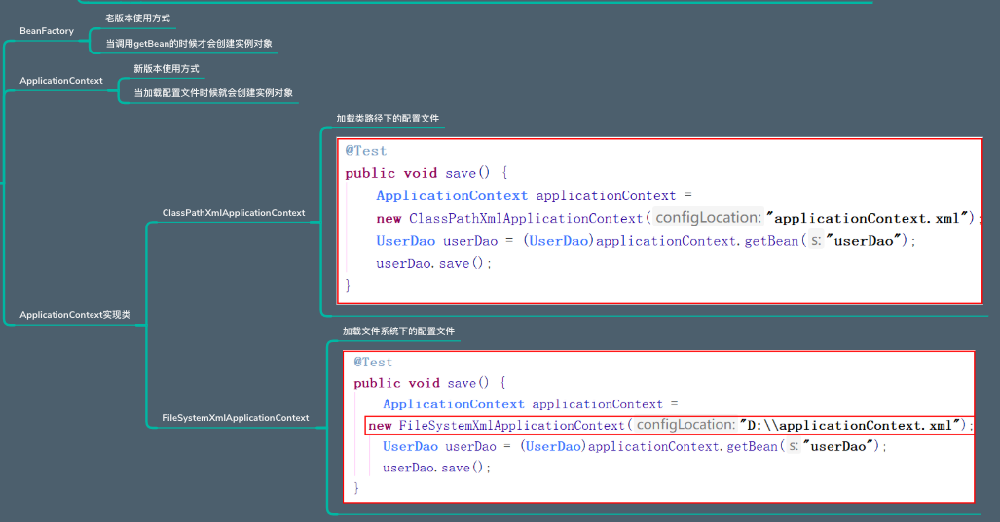

## 02 Bean相关配置 （IOC）

 **名称与标识：**

> 1.   id   使用了约束中的唯一约束。里面不能出现特殊字符的  **（一般使用这个）** 
> 2.   name  没有使用约束中的唯一约束。里面可以出现特殊字符。 

 **设置对象的生命周期方法  scope：**

> 1. singleton  默认的，Spring会采用单例模式创建这个对象。 
> 2. prototype  多例模式。（**Struts 中Action类bean 使用）** 
> 3. request  应用在web项目中，Spring创建这个类以后，将这个对象存入到request范围中。 
> 4. session  应用在web项目中，Spring创建这个类以后，将这个对象存入到session范围中 
> 5. globalsession  应用在web项目中，必须在porlet(基于Java的Web组件，子域名)环境下使用。但是如果没有这种环境，相对于session。 

 **工厂实例化的方式：**

> 1. 无参构造-默认 ： 
> 2. 静态工厂实例化：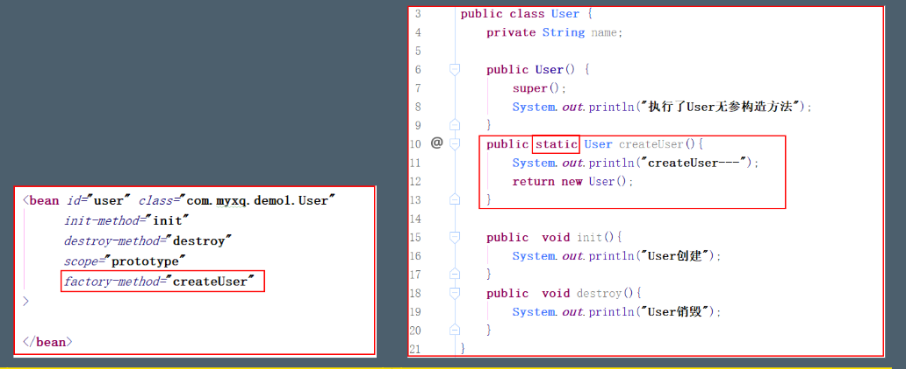
> 3. 实例工厂实例化 : 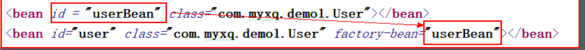
>
> - init-method 对象创建时调用的方法 
> - destroy -method 对象销毁时调用的方法 

## 03 分模块配置

*  在加载时，添加多个配置文件名称：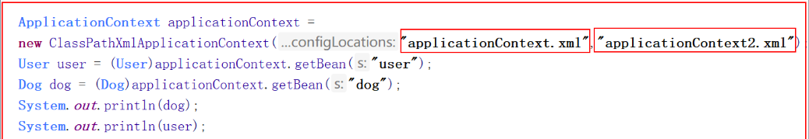
*  在一个配置文件当中引入另一个配置文件：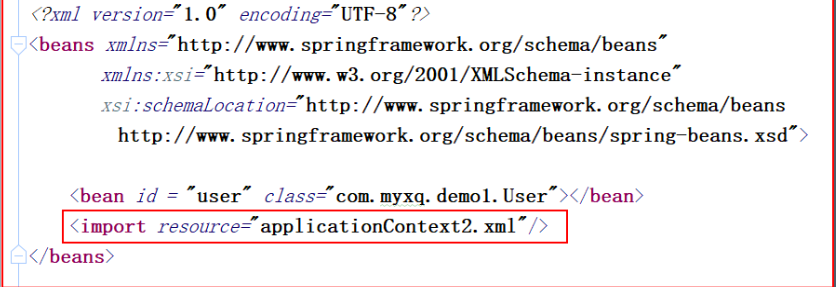

## 04 Spring属性注入

 **构造方法的方式的属性注入：**

> 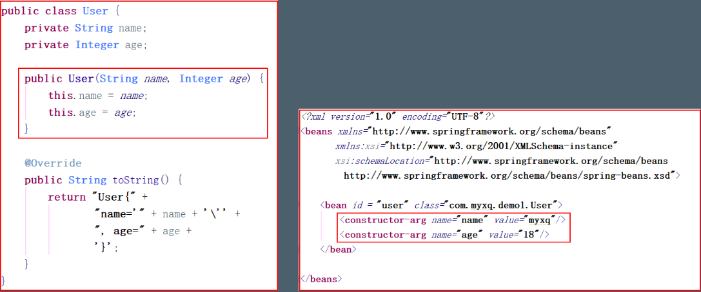

 **Set方法的属性注入：**

> 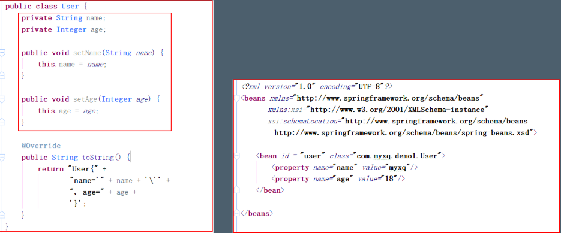

 **Set方法设置对象类型的属性：**

> 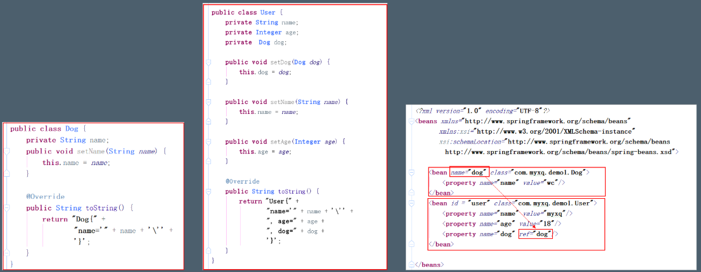

**P名称空间的属性注入：** 

> 使用p名称空间，就不需要写那那么多的property  dtd约束（xmlns:p="http://www.springframework.org/schema/p”）  只能注入普通属性 带参的构造方法无法注入 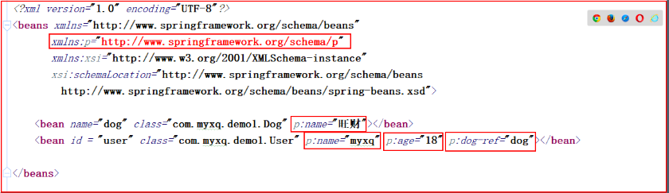

 **spEL表达式的属性注入：**

> 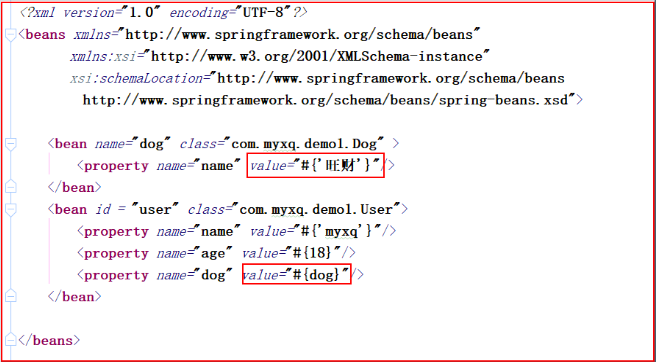

 **引用类型注入:**

> 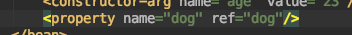

 **集合类型属性注入：**

>  **数组：**
>
> > ​	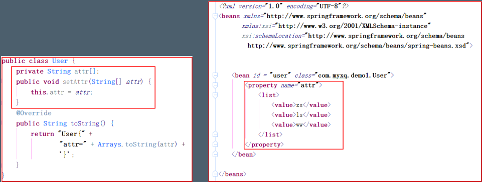
>
> **List:**
>
> > 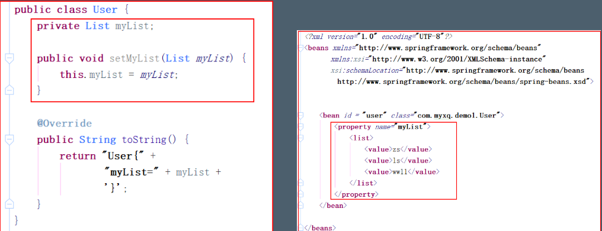
>
>  **Set：**
>
> > 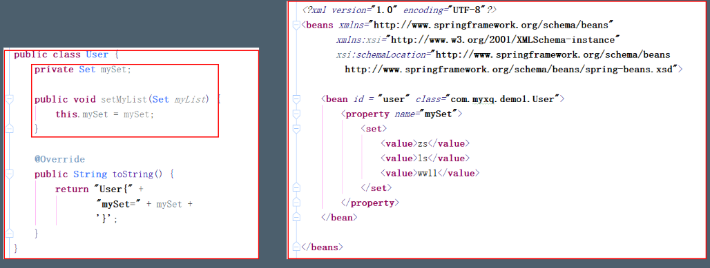
>
>  **Map：**
>
> > 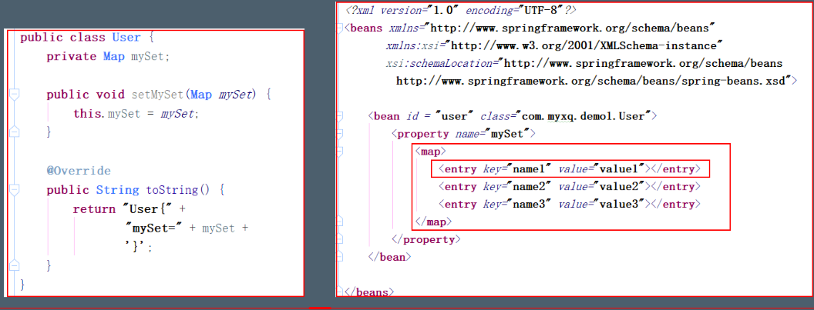

## 05 IOC注解

>  在spring4之后，想要使用注解形式，必须得要引入aop的包
>  在配置文件当中，还得要引入一个context约束   配置组件扫描 ：
>
>  ```xml
>  <?xml version="1.0" encoding="UTF-8"?>
>  <beans xmlns="http://www.springframework.org/schema/beans"
>         xmlns:xsi="http://www.w3.org/2001/XMLSchema-instance"
>         xmlns:context="http://www.springframework.org/schema/context"
>         xsi:schemaLocation="http://www.springframework.org/schema/beans
>          http://www.springframework.org/schema/beans/spring-beans.xsd
>          http://www.springframework.org/schema/context
>          http://www.springframework.org/schema/context/spring-context.xsd">
>  <context:component-scan base-package="com.max.demo1"/>
>  </beans>
>  ```

**注解：**

>  在没有扫描的情况下， 使用属性注解@Resource @Value @Autowired @Qulifier

- **@Component ：**修改一个类，将这个类交给Spring管理 相当于在配置文件当中配置 <bean id="" class=""> 	@Component三个衍生注解： 为了更好的进行分层，Spring可以使用其它三个注解，功能类似  目前使用哪一个功能都一样， 后期可能会添加一些属于各自的属性 
  - **@Controller**  web层 
  - **@Service** service层 
  - **@Repository** dao层 

*  **@Value**  
  * 设置普通属性值  可以不用提供set方法，直接在直接名上添加@value("值”)
  *  如果提供了set方法，在set方法上添加@value("值");

*  **@Autowired**  设置对象类型的属性值  
  *  直接使用这种方式，是按照类型完全属性注入
  *  当一个接口实现由两个实现类时 必须让**@Autowired**注解与**@Qualifier**一起使用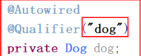

* **@Resource**
  *  按照bean 名称注入 必须指明是ID 还是name名称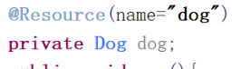

* **@PostConstruct** 对象创建时调用的方法   **@PreDestroy** 对象销毁时调用的方法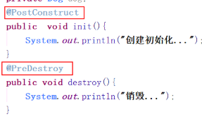

*   **@scope** 作用范围作用范围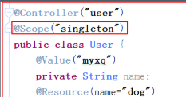

## 06 Spring单元测试

> ```java
> @RunWith(SpringJUnit4ClassRunner.class)
> @ContextConfiguration("classpath:applicationContext.xml")
> 
> ```

## 07 AOP相关术语

> - **Joinpoint:连接** 
>   1. 可以被拦截到的方法 
>   2. 能够被增强的方法，这些方法就可以称为是连接点 
> -  **Pointcut:切入点** 真正被拦截的方法  （真正被增加的方法）
> -  **Advice：通知**  增加的内容，通常都是封装成一个方法， 这个方法我们就称为通知
> -  **Introduction:引介**
>   1. 类层面的增加
>   2. 给原有的类添加一些新的属性方法
>   3. 在开发中通常都是给方法进行增加
> -  **Target:被增加的对象**
> -  **Weaving:织入**  将通知应用到目标对象的过程
> -  **Proxy:代理对象** 
> -  **Aspect:切面** 多个通知和多个切入点的集合

## 08 AOP使用

>  1. 引入aop开发的相关jar包
>
>  2. 配置文件中引入aop约束
>
>  ```xml
>   <?xml version="1.0" encoding="UTF-8"?>
>   <beans xmlns="http://www.springframework.org/schema/beans"
>          xmlns:xsi="http://www.w3.org/2001/XMLSchema-instance"
>          xmlns:aop="http://www.springframework.org/schema/aop"
>          xsi:schemaLocation="http://www.springframework.org/schema/beans
>           http://www.springframework.org/schema/beans/spring-beans.xsd
>           http://www.springframework.org/schema/aop
>           http://www.springframework.org/schema/aop/spring-aop.xsd">
>   </beans>
>  ```
>
>   3. 编写一个切面类 （ 例如权限校验)
>
>   4.  将切面交给spring
>
>   5.  配置AOP完成对目标产生代理
>
>      ```xml
>      <?xml version="1.0" encoding="UTF-8"?>
>      <beans xmlns="http://www.springframework.org/schema/beans"
>             xmlns:xsi="http://www.w3.org/2001/XMLSchema-instance"
>             xmlns:aop="http://www.springframework.org/schema/aop"
>             xsi:schemaLocation="http://www.springframework.org/schema/beans
>              http://www.springframework.org/schema/beans/spring-beans.xsd
>              http://www.springframework.org/schema/aop
>              http://www.springframework.org/schema/aop/spring-aop.xsd">
>      
>      
>          <bean id="goodsDao" class="com.max.demo1.GoodsDaoImpl"/>
>          <bean id="myaspect" class="com.max.demo2.Myaspect"/>
>      
>          <!--配置Aop-->
>          <aop:config>
>              <!--配置切点：给哪个方法增强-->
>              <aop:pointcut id="savepoint" expression="execution(* com.max.demo1.GoodsDaoImpl.save(..))"/>
>              <!--配置切面：增强的功能是什么-->
>              <aop:aspect ref="myaspect">
>                  
>                  <aop:before method="check" pointcut-ref="savepoint"/>
>              </aop:aspect>
>              
>          </aop:config>
>      
>      </beans>
>      ```

## 09 AOP通知类型

> ```xml
> <!--前置通知   在目标方法执行之前进行操作 -->
> <aop:before method="check" pointcut-ref="savepoint”/>
>                                       
> <!--后置通知  在目标方法执行之后 进行操作 -->
> <aop:after-returning method="log" pointcut-ref="updatepoint" returning="obj”/>
> 
> <!--环绕通知   在目标方法执行之前 和之后进行操作 环绕通知 -->
> <aop:around method="around" pointcut-ref="deletepoint”/>
>                                        
> <!--异常通知  在程序出现异常时进行操作  异常通知  -->
> <aop:after-throwing method="exceptionM" pointcut-ref="findpoint" throwing="ex”/>
> 
> <!--最终通知  无论代码是否有异常，都会执行 -->
> <aop:after method="after" pointcut-ref="findpoint"/>
> ```
>
> **环绕通知：**
>
> ```Java
> public Object around(ProceedingJoinPoint joinPoint) throws Throwable {
>  System.out.println("开启事务");
>  Object proceed = joinPoint.proceed();  /* 执行原有的方法 返回该方法的返回值 */
>  System.out.println("提交事务");
>  return proceed;
> }
> 
> ```
>
> **异常通知：**
>
> ```Java
> public void exceptionM(Throwable ex){
>      System.out.println("发现异常 --- "+ex.getMessage());
> 
>  }
> ```
>
> **配置：**
>
> ```xml
> <?xml version="1.0" encoding="UTF-8"?>
> <beans xmlns="http://www.springframework.org/schema/beans"
>        xmlns:xsi="http://www.w3.org/2001/XMLSchema-instance"
>        xmlns:aop="http://www.springframework.org/schema/aop"
>        xsi:schemaLocation="http://www.springframework.org/schema/beans
>         http://www.springframework.org/schema/beans/spring-beans.xsd
>         http://www.springframework.org/schema/aop
>         http://www.springframework.org/schema/aop/spring-aop.xsd">
> 
> 
>     <bean id="goodsDao" class="com.max.demo1.GoodsDaoImpl"/>
>     <bean id="myaspect" class="com.max.demo2.Myaspect"/>
> 
>     <!--配置Aop-->
>     <aop:config>
>         <!--配置切点：给哪个方法增强-->
>         <aop:pointcut id="savepoint" expression="execution(* com.max.demo1.GoodsDaoImpl.save(..))"/>
>         <aop:pointcut id="updatepoint" expression="execution(* com.max.demo1.GoodsDaoImpl.update(..))"/>
>         <aop:pointcut id="deletepoint" expression="execution(* com.max.demo1.GoodsDaoImpl.delete(..))"/>
>         <aop:pointcut id="findpoint" expression="execution(* com.max.demo1.GoodsDaoImpl.find(..))"/>
>         <!--配置切面：增强的功能是什么-->
>         <aop:aspect ref="myaspect">
>             <!--前置通知-->
>             <aop:before method="check" pointcut-ref="savepoint"/>
>             <!--后置通知-->
>             <aop:after-returning method="log" pointcut-ref="updatepoint" returning="obj"/>
>             <!--环绕通知-->
>             <aop:around method="around" pointcut-ref="deletepoint"/>
>             <!--异常通知-->
>             <aop:after-throwing method="exceptionM" pointcut-ref="findpoint" throwing="ex"/>
>             <!--最终通知-->
>             <aop:after method="after" pointcut-ref="findpoint"/>
>         </aop:aspect>
>         
>     </aop:config>
> 
> </beans>
> ```
>
> 

## 10  AOP切入点表达式

>  基于execution函数完成语法 ：
>
> 【访问修饰符】 方法返回值 包名.类名.方法名（参数） 
>
> -   public com.myxq.demo2.GoodsDaoImpl.save(..)    参数为任意参数 
> -   \* com.myxq.demo2.GoodsDaoImpl.save(..)         * 任意类型 
> -   \* com.myxq.demo2.GoodsDaoImpl+.save(..)       + 当前类和子类 
> -   \* com.myxq..*.*(..)    com.myxq包以及子包下面所有类的所有方法 
>
> 
>
> 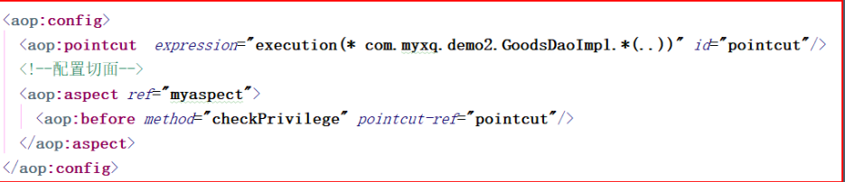

## 11 AOP注解方式ApsectJ开发

> * 引入Jar包 
> * 引入配置文件
> * 切面类交由Spring管理
> *  <!--aop注解的开启-->   <aop:aspectj-autoproxy/>
> ```xml
> <?xml version="1.0" encoding="UTF-8"?>
> <beans xmlns="http://www.springframework.org/schema/beans"
>     xmlns:xsi="http://www.w3.org/2001/XMLSchema-instance"
>     xmlns:aop="http://www.springframework.org/schema/aop"
>     xsi:schemaLocation="http://www.springframework.org/schema/beans
>      http://www.springframework.org/schema/beans/spring-beans.xsd
>      http://www.springframework.org/schema/aop
>      http://www.springframework.org/schema/aop/spring-aop.xsd">
> 
> 
>  <!--aop注解的开启-->
>  <aop:aspectj-autoproxy/>
>  <bean id="goodsDao" class="com.max.demo1.GoodsDaoImpl"/>
>  <bean id="goodsAspect" class="com.max.demo1.GoodsDaoAspect"/>
> 
> </beans>
> ```
>
> * 在切面类上添加注解  **@Aspect** 
>
> *  在方法上 注解AOP通知类型
>
>   * @Before前置通知 
>
>   * @AfterReturning后置通知 
>
>   * @Around环绕通知 
>
>   * @AfterThrowing异常抛出通知
>
>   * @After最终通知 
>
>     ```java
>     package com.max.demo1;
>     
>     
>     import org.aspectj.lang.ProceedingJoinPoint;
>     import org.aspectj.lang.annotation.*;
>     
>     @Aspect
>     public class GoodsDaoAspect {
>         @Before(value = "execution(* com.max.demo1.GoodsDaoImpl.save(..))")
>         public void log(){
>             System.out.println("日志保存");
>         }
>     
>         @AfterReturning(value = ("execution(* com.max.demo1.GoodsDaoImpl.update(..)))"),returning = "obj")
>         public void afterRun(Object obj){
>             System.out.println("后置通知" + obj);
>         }
>     
>         @Around(value = "execution(* com.max.demo1.GoodsDaoImpl.delete(..))")
>         public Object around(ProceedingJoinPoint joinPoint) throws Throwable {
>             System.out.println("环绕通知 -- 前");
>             Object proceed = joinPoint.proceed();
>             System.out.println("环绕通知 -- 后");
>             return proceed;
>     
>         }
>     
>         @AfterThrowing(value = "execution(* com.max.demo1.GoodsDaoImpl.find(..))",throwing = "ex")
>         public void exceptionM( Throwable ex){
>             System.out.println("有异常" + ex.getMessage());
>         }
>     
>         @After(value = "execution(* com.max.demo1.GoodsDaoImpl.find(..))")
>         public void after(){
>             System.out.println("最终通知 --- ");
>         }
>     
>     }
>     
>     ```

## 12 JDBC模板使用的入门

> 导入架包：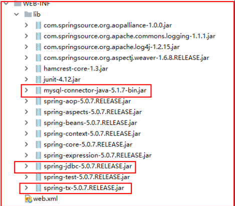
>
>  使用JDBC的模板：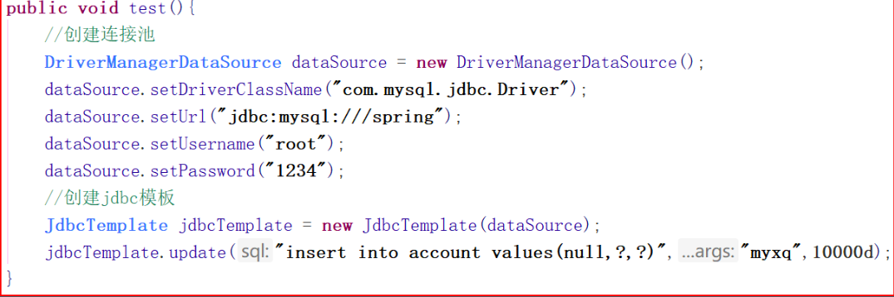
>
>  将连接池和模板交给Spring管理：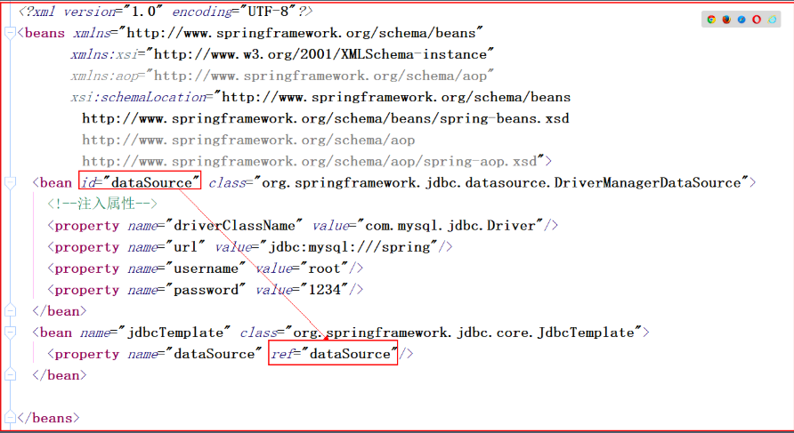
>
>  使用jdbcTemplate注解插入数据：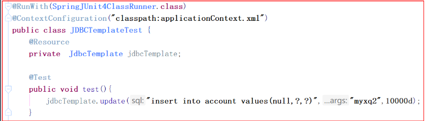

## 13 配置开源连接池

```xml
<?xml version="1.0" encoding="UTF-8"?>
<beans xmlns="http://www.springframework.org/schema/beans"
       xmlns:xsi="http://www.w3.org/2001/XMLSchema-instance"
       xmlns:aop="http://www.springframework.org/schema/aop"
       xsi:schemaLocation="http://www.springframework.org/schema/beans
        http://www.springframework.org/schema/beans/spring-beans.xsd
        http://www.springframework.org/schema/aop
        http://www.springframework.org/schema/aop/spring-aop.xsd">

    <!--spring连接池-->
    <bean id="datasource" class="org.springframework.jdbc.datasource.DriverManagerDataSource">
        <property name="driverClassName" value="com.mysql.jdbc.Driver"/>
        <property name="url" value="jdbc:mysql:///spring"/>
        <property name="username" value="root"/>
        <property name="password" value="li767787498"/>
    </bean>

    <!--dacp连接池-->
    <bean id="dbcp" class="org.apache.commons.dbcp.BasicDataSource">
        <property name="driverClassName" value="com.mysql.jdbc.Driver"/>
        <property name="url" value="jdbc:mysql:///spring"/>
        <property name="username" value="root"/>
        <property name="password" value="li767787498"/>
    </bean>

    <!--c3p0连接池-->
    <bean id="c3p0" class="com.mchange.v2.c3p0.ComboPooledDataSource">
        <property name="driverClass" value="com.mysql.jdbc.Driver"/>
        <property name="jdbcUrl" value="jdbc:mysql:///spring"/>
        <property name="user" value="root"/>
        <property name="password" value="li767787498"/>
    </bean>

    <!--druid连接池-->
    <bean id="druid" class="com.alibaba.druid.pool.DruidDataSource">
        <property name="driverClassName" value="com.mysql.jdbc.Driver"/>
        <property name="url" value="jdbc:mysql:///spring"/>
        <property name="username" value="root"/>
        <property name="password" value="li767787498"/>
    </bean>

    <bean id="jdbcTemplate" class="org.springframework.jdbc.core.JdbcTemplate">
        <constructor-arg ref="datasource"/>
    </bean>

    <bean id="accountDao" class="com.max.demo2.AccountDaoImpl">
        <property name="dataSource" ref="datasource"/>
    </bean>

    <bean id="accountService" class="com.max.demo2.AccountServiceImpl"/>

    <!--配置事务管理器-->
    <bean id="transactionManager"
          class="org.springframework.jdbc.datasource.DataSourceTransactionManager">
        <property name="dataSource" ref="datasource"/>
    </bean>

    <!--配置事务管理模板-->
    <bean id="transactionTemplate"
          class="org.springframework.transaction.support.TransactionTemplate">
        <property name="transactionManager" ref="transactionManager"/>
    </bean>

</beans>
```

## 14 读取属性配置文件

>  **属性文件名称不能与name名称一样**

*  **<bean>方式 ：**
  * 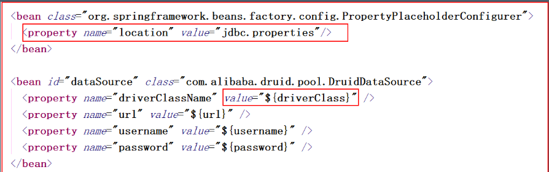

*  **<context/>方式：dtd:** 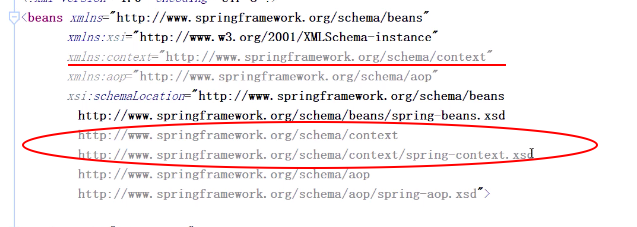
* 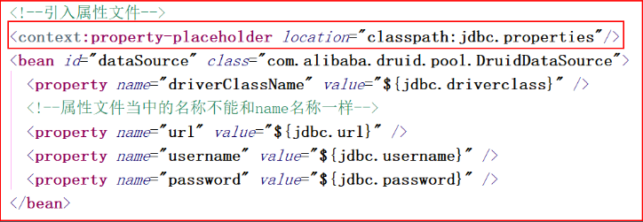

## 15 JDBC模板CRUD操作

> 注入数据最好指定name名 
> @Resource(name = "jdbcTemplate") 
> JdbcTemplate jdbcTemplate; 

*  插入操作：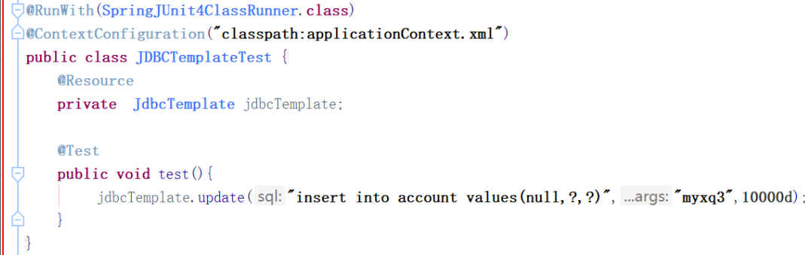

*  删除操作：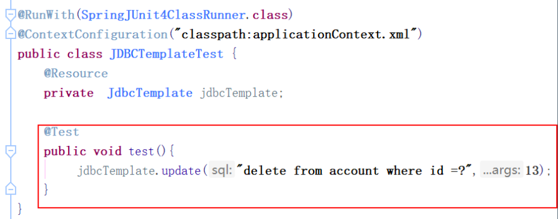
*  更新操作：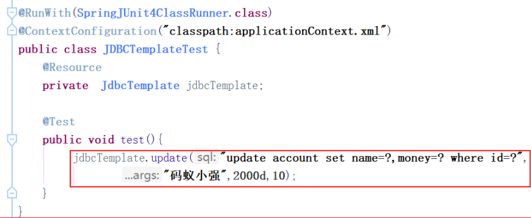

*  查询操作：

  *  查询某一个字段：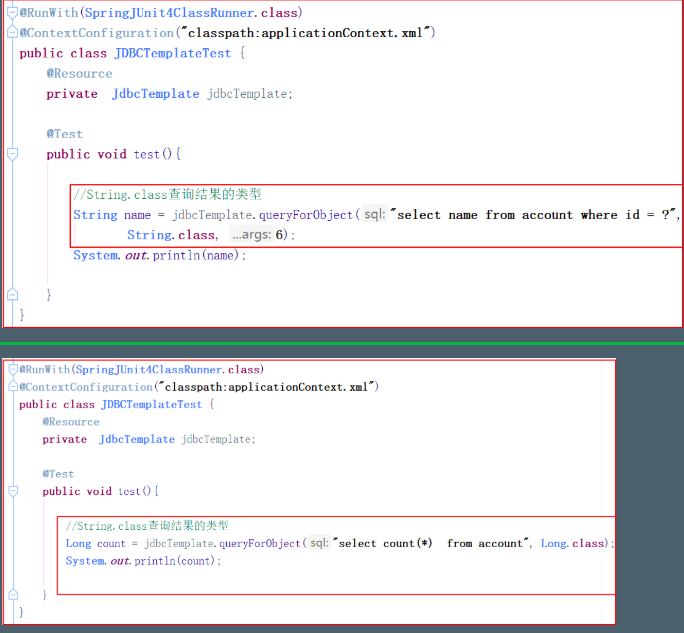

  *  查询返回对象的集合（类型DBUtlis的封装 采用内省方式） 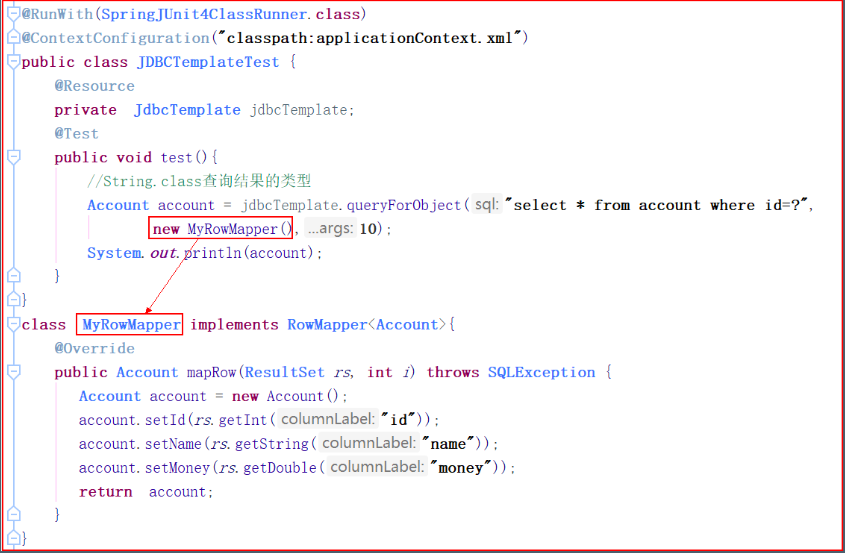

  *  对象集合：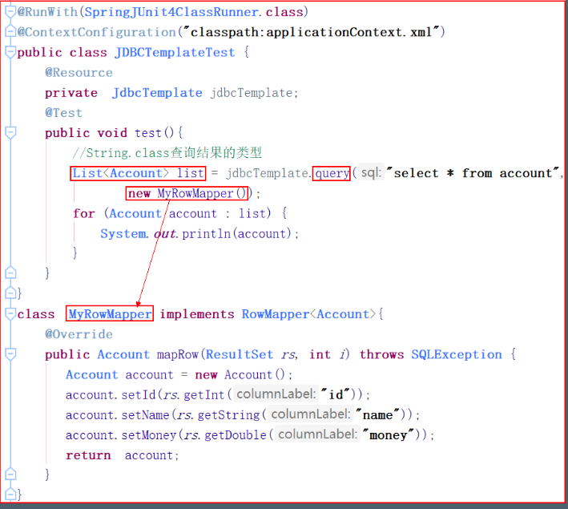

    

## 16 Spring事务相关

 **Spring的事务管理的API**：

* **PlatformTransactionManager**  平台事务管理器 是一个接口,下面有两个实现类

  * DataSourceTransactionManager  底层使用JDBC管理事务
  * HibernateTransactionManager   底层使用Hibernate管理事务
* **TransactionDefinition** 事务定义信息:用于定义事务的相关的信息，隔离级别、超时信息、传播行为、是否只读
* **TransactionStatus**  事务状态：用于记录在事务管理过程中，事务的状态的对象。
> 事务管理的API的关系
>
> 	Spring进行事务管理的时候，首先平台事务管理器根据事务定义信息进行事务的管理，
> 	在事务管理过程中，产生各种状态，将这些状态的信息记录到事务状态的对象中。

 **Spring的事务的传播行为:**

>  什么是传播行为： 一个业务方法当中,调用另一个业务的方法

* 保证多个操作在同一个事务中
  * **PROPAGATION_REQUIRED**   默认值，如果A中有事务，使用A中的事务，如果A没有，创建一个新的事务，将操作包含进来
  * **PROPAGATION_SUPPORTS**    支持事务，如果A中有事务，使用A中的事务。如果A没有事务，不使用事务。
  * **PROPAGATION_MANDATORY**    如果A中有事务，使用A中的事务。如果A没有事务，抛出异常。

* 保证多个操作不在同一个事务中
  * **PROPAGATION_REQUIRES_NEW**  如果A中有事务，将A的事务挂起（暂停），创建新事务，只包含自身操作。如果A中没有事务，创建一个新事务，包含自身操作。
  * **PROPAGATION_NOT_SUPPORTED**	如果A中有事务，将A的事务挂起。不使用事务管理。
  * **PROPAGATION_NEVER**	  如果A中有事务，报异常。

* 嵌套式事务
  * **PROPAGATION_NESTED**  嵌套事务，如果A中有事务，按照A的事务执行，执行完成后，设置一个保存点     执行B中的操作，如果没有异常，执行通过，如果有异常，可以选择回滚到最初始位置，也可以回滚到保存点

## 17 事务使用

* 声明式事务

  * 配置事务管理器

    ```xml
    <!--开启注解事务:配置事务管理器）-->
    <bean id="transactionManager"
          class="org.springframework.jdbc.datasource.DataSourceTransactionManager">
        <property name="dataSource" ref="datasource"/>
    </bean>
    <!--注解开启 （事务增强）-->
    <tx:annotation-driven transaction-manager="transactionManager"/>
    ```
    

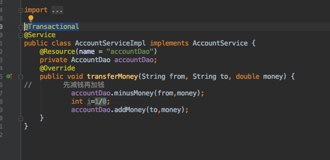

* 编程式事务

  * ```xml
    <!--配置事务管理器-->
    <bean id="transactionManager"
          class="org.springframework.jdbc.datasource.DataSourceTransactionManager">
        <property name="dataSource" ref="datasource"/>
    </bean>
    <!--配置事务管理模板-->
    <bean id="transactionTemplate"
          class="org.springframework.transaction.support.TransactionTemplate">
        <property name="transactionManager" ref="transactionManager"/>
    </bean>
    ```

    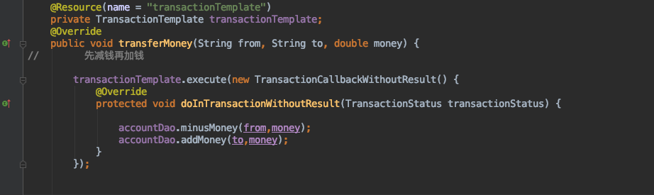