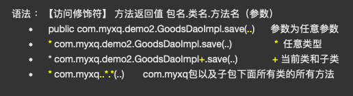

## 01 项目搭建

### 创建配置文件

通常名称起为`applicationContext.xml`

添加dtd约束

```xml
<?xml version="1.0" encoding="UTF-8"?>
<beans xmlns="http://www.springframework.org/schema/beans"
       xmlns:xsi="http://www.w3.org/2001/XMLSchema-instance"
       xsi:schemaLocation="http://www.springframework.org/schema/beans
        http://www.springframework.org/schema/beans/spring-beans.xsd">

    <bean id="person" class="com.max.dome2.Person" init-method="init" destroy-method="destroy"
          scope="prototype">
        <property name="name" value="二次注入的值"/>
    </bean>
</beans>
```

### 添加bean

```xml
 <bean id="userDao" class="com.max.dome1.UserDaoOracleImpl"></bean>
```

### 测试使用

```java
 ApplicationContext applicationContext = new ClassPathXmlApplicationContext("applicationContext.xml");
        Student student = (Student) applicationContext.getBean("student");
        System.out.println(student.name +"--"+ student.age);
```


## 02 Spring的工厂类

| 类                         | 描述                                                         |
| -------------------------- | ------------------------------------------------------------ |
| `BeanFactory`              | 老版本使用方式<br />当调用getBean的时候才会创建实例对象      |
| `ApplicationContext`       | 新版本使用方式<br />当加载配置文件时候就会创建实例对象       |
| `ApplicationContext实现类` | `ClassPathXmlApplicationContext` :  加载类路径下的配置文件<br />`FileSystemXmlApplicationContext` :  加载文件系统下的配置文件 |


## 03 Bean相关配置 （IOC）

### 名称与标识：

`id  ` 使用了约束中的唯一约束。里面不能出现特殊字符的  **（一般使用这个）** 

`name  `没有使用约束中的唯一约束。里面可以出现特殊字符。 

### Bean的作用范围 ：

采用`scope`  属性

- `singleton`  默认的，Spring会采用单例模式创建这个对象。 
- `prototype`  多例模式。（**Struts 中Action类bean 使用）** 
- `request`  应用在web项目中，Spring创建这个类以后，将这个对象存入到request范围中。 
- `session`  应用在web项目中，Spring创建这个类以后，将这个对象存入到session范围中 
- `globalsession`  应用在web项目中，必须在porlet(基于Java的Web组件，子域名)环境下使用。但是如果没有这种环境，相对于session。 

###  工厂实例化的方式：

#### 无参构造-默认 ： 

#### 静态工厂实例化：

使用`factory-method`属性

```java
// 类
public class User {
    public static User createUser(){
        return new User();
    }
}
```

```java
// 文件配置
<bean id="user" class="com.max.demo1.User" factory-method="createUser"></bean>
```


#### 实例工厂实例化 : 

```xml
<bean id="userBean" class="com.max.demo1.User"></bean>
<bean id="user" class="com.max.demo1.User" factory-bean="userBean"></bean>
```


### 对象生命周期方法：

  1. `init-method `对象创建时调用的方法 
  2. `destroy -method `对象销毁时调用的方法 


## 03 分模块配置

**在加载时，添加多个配置文件名称：**

```java
 @Test
    public void test1(){

       ApplicationContext applicationContext = new ClassPathXmlApplicationContext("applicationContext.xml","applicationContext2.xml");

        User obj = (User) applicationContext.getBean("user");
        User dog = (User) applicationContext.getBean("dog");

    }
```

**在一个配置文件当中引入另一个配置文件：**

```xml
<?xml version="1.0" encoding="UTF-8"?>
<beans xmlns="http://www.springframework.org/schema/beans"
       xmlns:xsi="http://www.w3.org/2001/XMLSchema-instance"
       xmlns:context="http://www.springframework.org/schema/context"
       xsi:schemaLocation="http://www.springframework.org/schema/beans
        http://www.springframework.org/schema/beans/spring-beans.xsd
        http://www.springframework.org/schema/context
        http://www.springframework.org/schema/context/spring-context.xsd">

		<import resource="applicationContext2.xml"/>

</beans>
```


## 04 Spring属性注入

###  构造方法

` <constructor-arg name="" value=""/>`

```java
// 类
package com.max.model;

public class User {
    private String name;
    private Integer age;

    public User(String name, Integer age) {
        this.name = name;
        this.age = age;
    }

    @Override
    public String toString() {
        return "User{" +
                "name='" + name + '\'' +
                ", age=" + age +
                '}';
    }
}

```

```xml
// 文件配置
<?xml version="1.0" encoding="UTF-8"?>
<beans xmlns="http://www.springframework.org/schema/beans"
       xmlns:xsi="http://www.w3.org/2001/XMLSchema-instance"
       xmlns:context="http://www.springframework.org/schema/context"
       xsi:schemaLocation="http://www.springframework.org/schema/beans
        http://www.springframework.org/schema/beans/spring-beans.xsd
        http://www.springframework.org/schema/context
        http://www.springframework.org/schema/context/spring-context.xsd">

    <bean id="user" class="com.max.model.User">
        <constructor-arg name="name" value="max"/>
        <constructor-arg name="age" value="23"/>
    </bean>

</beans>
```


###  Set方法

` <property name="" value=""/>`

```java
// 类
package com.max.model;

public class User {
    private String name;
    private Integer age;

    public void setName(String name) {
        this.name = name;
    }

    public void setAge(Integer age) {
        this.age = age;
    }

    @Override
    public String toString() {
        return "User{" +
                "name='" + name + '\'' +
                ", age=" + age +
                '}';
    }
}

```

```xml
// 文件配置
<?xml version="1.0" encoding="UTF-8"?>
<beans xmlns="http://www.springframework.org/schema/beans"
       xmlns:xsi="http://www.w3.org/2001/XMLSchema-instance"
       xmlns:context="http://www.springframework.org/schema/context"
       xsi:schemaLocation="http://www.springframework.org/schema/beans
        http://www.springframework.org/schema/beans/spring-beans.xsd
        http://www.springframework.org/schema/context
        http://www.springframework.org/schema/context/spring-context.xsd">

    <bean id="user" class="com.max.model.User">
        <property name="name" value="max"/>
        <property name="age" value="23"/>
    </bean>

</beans>
```


###  对象属性的注入

`<property name="" ref=""/>`

```java
// 类
package com.max.model;
import com.max.demo1.Dog;
public class User {
    private String name;
    private Integer age;
    private Dog dog;

    public void setName(String name) {
        this.name = name;
    }

    public void setAge(Integer age) {
        this.age = age;
    }

    public void setDog(Dog dog) {
        this.dog = dog;
    }

    @Override
    public String toString() {
        return "User{" +
                "name='" + name + '\'' +
                ", age=" + age +
                ", dog=" + dog +
                '}';
    }
}

package com.max.demo1;

public class Dog {
    public String name;

}


```

```xml
// 文件配置
<?xml version="1.0" encoding="UTF-8"?>
<beans xmlns="http://www.springframework.org/schema/beans"
       xmlns:xsi="http://www.w3.org/2001/XMLSchema-instance"
       xmlns:context="http://www.springframework.org/schema/context"
       xsi:schemaLocation="http://www.springframework.org/schema/beans
        http://www.springframework.org/schema/beans/spring-beans.xsd
        http://www.springframework.org/schema/context
        http://www.springframework.org/schema/context/spring-context.xsd">

    <bean id="dog" class="com.max.demo1.Dog"/>

    <bean id="user" class="com.max.model.User">
        <property name="name" value="max"/>
        <property name="age" value="23"/>
        <property name="dog" ref="dog"/>
    </bean>

</beans>

```


### P名称空间： 

使用p名称空间，就不需要写那那么多的property  dtd约束`xmlns:p="http://www.springframework.org/schema/p"`  只能注入普通属性 带参的构造方法无法注入 

```xml
<?xml version="1.0" encoding="UTF-8"?>
<beans xmlns="http://www.springframework.org/schema/beans"
       xmlns:xsi="http://www.w3.org/2001/XMLSchema-instance"
       xmlns:context="http://www.springframework.org/schema/context"
       xmlns:p="http://www.springframework.org/schema/p"
       xsi:schemaLocation="http://www.springframework.org/schema/beans
        http://www.springframework.org/schema/beans/spring-beans.xsd
        http://www.springframework.org/schema/context
        http://www.springframework.org/schema/context/spring-context.xsd">
    
    <bean id="dog2" class="com.max.demo1.Dog"/>

    <bean id="user" class="com.max.model.User" p:name="max" p:age="23" p:dog-ref="dog2"/>

</beans>
```


###  spEL表达式：

` <property name="" value="#{''}"/>`

```xml
<?xml version="1.0" encoding="UTF-8"?>
<beans xmlns="http://www.springframework.org/schema/beans"
       xmlns:xsi="http://www.w3.org/2001/XMLSchema-instance"
       xmlns:context="http://www.springframework.org/schema/context"
       xmlns:p="http://www.springframework.org/schema/p"
       xsi:schemaLocation="http://www.springframework.org/schema/beans
        http://www.springframework.org/schema/beans/spring-beans.xsd
        http://www.springframework.org/schema/context
        http://www.springframework.org/schema/context/spring-context.xsd">

    <bean id="dog" class="com.max.demo1.Dog">
        <property name="name" value="#{'旺财'}"/>
    </bean>

    <bean id="user" class="com.max.model.User" >
        <property name="name" value="#{'max'}"/>
        <property name="age" value="#{'23'}"/>
        <property name="dog" value="#{'dog'}"/>
    </bean>

</beans>
```


### 集合类型属性注入：

#### 数组：

```java
//类
package com.max.model;
public class User {
    private String attr[];

    public void setAttr(String[] attr) {
        this.attr = attr;
    }
}
```

```xml
// 文件配置
<?xml version="1.0" encoding="UTF-8"?>
<beans xmlns="http://www.springframework.org/schema/beans"
       xmlns:xsi="http://www.w3.org/2001/XMLSchema-instance"
       xmlns:context="http://www.springframework.org/schema/context"
       xsi:schemaLocation="http://www.springframework.org/schema/beans
        http://www.springframework.org/schema/beans/spring-beans.xsd
        http://www.springframework.org/schema/context
        http://www.springframework.org/schema/context/spring-context.xsd">

    <bean id="user" class="com.max.model.User">
        <property name="attr">
            <list>
                <value>zs</value>
                <value>ls</value>
                <value>ww</value>
            </list>
        </property>

    </bean>

</beans>
```


#### List:

```java
// 类
package com.max.model;

import java.util.List;

public class User {
    private List myList;

    public void setMyList(List myList) {
        this.myList = myList;
    }
}
```

```xml
// 文件配置
<?xml version="1.0" encoding="UTF-8"?>
<beans xmlns="http://www.springframework.org/schema/beans"
       xmlns:xsi="http://www.w3.org/2001/XMLSchema-instance"
       xmlns:context="http://www.springframework.org/schema/context"
       xsi:schemaLocation="http://www.springframework.org/schema/beans
        http://www.springframework.org/schema/beans/spring-beans.xsd
        http://www.springframework.org/schema/context
        http://www.springframework.org/schema/context/spring-context.xsd">
        
    <bean id="user" class="com.max.model.User">
        <property name="myList">
            <list>
                <value>zs</value>
                <value>ls</value>
                <value>ww</value>
            </list>
        </property>

    </bean>

</beans>
```


#### Set：

```java
// 类
package com.max.model;

import java.util.Set;

public class User {
    private Set mySet;

    public void setMySet(Set mySet) {
        this.mySet = mySet;
    }
}


```

```xml
// 文件配置
<?xml version="1.0" encoding="UTF-8"?>
<beans xmlns="http://www.springframework.org/schema/beans"
       xmlns:xsi="http://www.w3.org/2001/XMLSchema-instance"
       xmlns:context="http://www.springframework.org/schema/context"
       xsi:schemaLocation="http://www.springframework.org/schema/beans
        http://www.springframework.org/schema/beans/spring-beans.xsd
        http://www.springframework.org/schema/context
        http://www.springframework.org/schema/context/spring-context.xsd">

    <bean id="user" class="com.max.model.User">
        <property name="mySet">
            <list>
                <value>zs</value>
                <value>ls</value>
                <value>ww</value>
            </list>
        </property>

    </bean>

</beans>
```


#### Map：

```java
package com.max.model;

import java.util.Map;

public class User {
    private Map myMap;

    public void setMyMap(Map myMap) {
        this.myMap = myMap;
    }
}

```

```xml
<?xml version="1.0" encoding="UTF-8"?>
<beans xmlns="http://www.springframework.org/schema/beans"
       xmlns:xsi="http://www.w3.org/2001/XMLSchema-instance"
       xmlns:context="http://www.springframework.org/schema/context"
       xsi:schemaLocation="http://www.springframework.org/schema/beans
        http://www.springframework.org/schema/beans/spring-beans.xsd
        http://www.springframework.org/schema/context
        http://www.springframework.org/schema/context/spring-context.xsd">


    <bean id="user" class="com.max.model.User">
        <property name="myMap">
            <map>
                <entry key="name1" value="value1"/>
                <entry key="name2" value="value2"/>
                <entry key="name3" value="value3"/>
                <entry key="name4" value="value4"/>
            </map>
        </property>

    </bean>


</beans>
```


## 05 IOC注解

在spring4之后，想要使用注解形式，必须得要引入aop的包
在配置文件当中，还得要引入一个context约束   配置组件扫描 ：

```xml
<?xml version="1.0" encoding="UTF-8"?>
<beans xmlns="http://www.springframework.org/schema/beans"
     xmlns:xsi="http://www.w3.org/2001/XMLSchema-instance"
     xmlns:context="http://www.springframework.org/schema/context"
     xsi:schemaLocation="http://www.springframework.org/schema/beans
      http://www.springframework.org/schema/beans/spring-beans.xsd
      http://www.springframework.org/schema/context
      http://www.springframework.org/schema/context/spring-context.xsd">
  
		<context:component-scan base-package="com.max.demo1"/>
  
</beans>
```

**注解：**

在没有扫描的情况下， 使用属性注解`@Resource` ` @Value`  `@Autowired`  `@Qulifier`

`@Component ：`修改一个类，将这个类交给Spring管理 相当于在配置文件当中配置 `<bean id="" class=""> 	`  ` 

三个衍生注解： 为了更好的进行分层，Spring可以使用其它三个注解，功能类似  目前使用哪一个功能都一样， 后期可能会添加一些属于各自的属性 

- `@Controller`  web层 
- `@Service` service层 
- `@Repository` dao层 

### @Value

* 设置普通属性值  可以不用提供set方法，直接在直接名上添加`@value("值”)`
*  如果提供了set方法，在set方法上添加`@value("值");`


### @Autowired

 设置对象类型的属性值  

*  直接使用这种方式，是按照类型完全属性注入
*  当一个接口实现由两个实现类时 必须让`@Autowired`注解与`@Qualifier`一起使用

```java
@Autowired
@Qualifier("dog")
private Dog dog;
```


### @Resource

*  按照bean 名称注入 必须指明是ID 还是name名称

```java
@Resource(name="dog")
private Dog dog;
```


### @PostConstruct   @PreDestroy

*  `@PostConstruct` 对象创建时调用的方法  ` @PreDestroy` 对象销毁时调用的方法

```java
 @PostConstruct
    public void init(){
        System.out.println("init ---- 初始化");
    }
    @PreDestroy
    public void destroy(){
        System.out.println("destroy --- 销毁");
    }

```


### @Scope

*   `@Scope` 作用范围作用范围

```java
@Component("user")
@Scope("prototype")
public class User {
    public String name;

}

```


## 06 Spring单元测试

```java
@RunWith(SpringJUnit4ClassRunner.class)
@ContextConfiguration("classpath:applicationContext.xml")
```

## 07 AOP相关术语


|         名称         |                             作用                             |
| :------------------: | :----------------------------------------------------------: |
|   `Joinpoint`:连接   | 可以被拦截到的方法、  能够被增强的方法，这些方法就可以称为是连接点 。 |
|  `Pointcut`: 切入点  |            真正被拦截的方法  （真正被增加的方法）            |
|   `Advice` : 通知    | 增加的内容，通常都是封装成一个方法， 这个方法我们就称为通知  |
| `Introduction`：引介 | 类层面的增加、给原有的类添加一些新的属性方法、在开发中通常都是给方法进行增加 |
|       `Target`       |                         被增加的对象                         |
|   `Weaving`：织入    |                  将通知应用到目标对象的过程                  |
|       `Proxy`        |                           代理对象                           |
|    `Aspect`：切面    |                  多个通知和多个切入点的集合                  |


## 08 AOP使用

1. 引入aop开发的相关jar包

2. 配置文件中引入aop约束

```xml
<?xml version="1.0" encoding="UTF-8"?>
<beans xmlns="http://www.springframework.org/schema/beans"
      xmlns:xsi="http://www.w3.org/2001/XMLSchema-instance"
      xmlns:aop="http://www.springframework.org/schema/aop"
      xsi:schemaLocation="http://www.springframework.org/schema/beans
       http://www.springframework.org/schema/beans/spring-beans.xsd
       http://www.springframework.org/schema/aop
       http://www.springframework.org/schema/aop/spring-aop.xsd">
</beans>
```

 3. 编写一个切面类 （ 例如权限校验)

 4.  将切面交给spring

 5.  配置AOP完成对目标产生代理

```xml
  <?xml version="1.0" encoding="UTF-8"?>
  <beans xmlns="http://www.springframework.org/schema/beans"
         xmlns:xsi="http://www.w3.org/2001/XMLSchema-instance"
         xmlns:aop="http://www.springframework.org/schema/aop"
         xsi:schemaLocation="http://www.springframework.org/schema/beans
          http://www.springframework.org/schema/beans/spring-beans.xsd
          http://www.springframework.org/schema/aop
          http://www.springframework.org/schema/aop/spring-aop.xsd">
  
  
      <bean id="goodsDao" class="com.max.demo1.GoodsDaoImpl"/>
      <bean id="myaspect" class="com.max.demo2.Myaspect"/>
  
      <!--配置Aop-->
      <aop:config>
          <!--配置切点：给哪个方法增强-->
          <aop:pointcut id="savepoint" expression="execution(* com.max.demo1.GoodsDaoImpl.save(..))"/>
          <!--配置切面：增强的功能是什么-->
          <aop:aspect ref="myaspect">
              
              <aop:before method="check" pointcut-ref="savepoint"/>
          </aop:aspect>
          
      </aop:config>
  
  </beans>
```


## 09 AOP通知类型

```xml
<!--前置通知   在目标方法执行之前进行操作 -->
<aop:before method="check" pointcut-ref="savepoint”/>
                                   
<!--后置通知  在目标方法执行之后 进行操作 -->
<aop:after-returning method="log" pointcut-ref="updatepoint" returning="obj”/>

<!--环绕通知   在目标方法执行之前 和之后进行操作 环绕通知 -->
<aop:around method="around" pointcut-ref="deletepoint”/>
                                    
<!--异常通知  在程序出现异常时进行操作  异常通知  -->
<aop:after-throwing method="exceptionM" pointcut-ref="findpoint" throwing="ex”/>

<!--最终通知  无论代码是否有异常，都会执行 -->
<aop:after method="after" pointcut-ref="findpoint"/>
```

**环绕通知：**

```java
public Object around(ProceedingJoinPoint joinPoint) throws Throwable {
System.out.println("开启事务");
Object proceed = joinPoint.proceed();  /* 执行原有的方法 返回该方法的返回值 */
System.out.println("提交事务");
return proceed;
}

```

**异常通知：**

```java
public void exceptionM(Throwable ex){
  System.out.println("发现异常 --- "+ex.getMessage());

}
```

**配置：**

```xml
<?xml version="1.0" encoding="UTF-8"?>
<beans xmlns="http://www.springframework.org/schema/beans"
    xmlns:xsi="http://www.w3.org/2001/XMLSchema-instance"
    xmlns:aop="http://www.springframework.org/schema/aop"
    xsi:schemaLocation="http://www.springframework.org/schema/beans
     http://www.springframework.org/schema/beans/spring-beans.xsd
     http://www.springframework.org/schema/aop
     http://www.springframework.org/schema/aop/spring-aop.xsd">


 <bean id="goodsDao" class="com.max.demo1.GoodsDaoImpl"/>
 <bean id="myaspect" class="com.max.demo2.Myaspect"/>

 <!--配置Aop-->
 <aop:config>
     <!--配置切点：给哪个方法增强-->
     <aop:pointcut id="savepoint" expression="execution(* com.max.demo1.GoodsDaoImpl.save(..))"/>
     <aop:pointcut id="updatepoint" expression="execution(* com.max.demo1.GoodsDaoImpl.update(..))"/>
     <aop:pointcut id="deletepoint" expression="execution(* com.max.demo1.GoodsDaoImpl.delete(..))"/>
     <aop:pointcut id="findpoint" expression="execution(* com.max.demo1.GoodsDaoImpl.find(..))"/>
     <!--配置切面：增强的功能是什么-->
     <aop:aspect ref="myaspect">
         <!--前置通知-->
         <aop:before method="check" pointcut-ref="savepoint"/>
         <!--后置通知-->
         <aop:after-returning method="log" pointcut-ref="updatepoint" returning="obj"/>
         <!--环绕通知-->
         <aop:around method="around" pointcut-ref="deletepoint"/>
         <!--异常通知-->
         <aop:after-throwing method="exceptionM" pointcut-ref="findpoint" throwing="ex"/>
         <!--最终通知-->
         <aop:after method="after" pointcut-ref="findpoint"/>
     </aop:aspect>
     
 </aop:config>

</beans>
```


## 10  AOP切入点表达式

基于execution函数完成语法 ：

【访问修饰符】 方法返回值 包名.类名.方法名（参数） 

-    `com.myxq.demo2.GoodsDaoImpl.save(..)`    参数为任意参数 
-   `*com.myxq.demo2.GoodsDaoImpl.save(..)   `     ` *` 任意类型 
-   `*com.myxq.demo2.GoodsDaoImpl+.save(..)  `     `+ `当前类和子类 
-   `*com.myxq..*.*(..)`    com.myxq包以及子包下面所有类的所有方法 



```xml

    <aop:config>
        <aop:pointcut id="pointcut" expression="execution(* com.max.demo1.GoodsDaoImpl.save(..))"/>
        <!--配置切面：增强的功能是什么-->
        <aop:aspect ref="myaspect">
            <aop:before method="check" pointcut-ref="pointcut"/>
        </aop:aspect>
    </aop:config>

```


## 11 AOP注解方式ApsectJ开发

* 引入Jar包 
* 引入配置文件
* 切面类交由Spring管理
* aop注解的开启 `  <aop:aspectj-autoproxy/>`


```xml
<?xml version="1.0" encoding="UTF-8"?>
<beans xmlns="http://www.springframework.org/schema/beans"
 xmlns:xsi="http://www.w3.org/2001/XMLSchema-instance"
 xmlns:aop="http://www.springframework.org/schema/aop"
 xsi:schemaLocation="http://www.springframework.org/schema/beans
  http://www.springframework.org/schema/beans/spring-beans.xsd
  http://www.springframework.org/schema/aop
  http://www.springframework.org/schema/aop/spring-aop.xsd">

    <!--aop注解的开启-->
    <aop:aspectj-autoproxy/>
    <bean id="goodsDao" class="com.max.demo1.GoodsDaoImpl"/>
    <bean id="goodsAspect" class="com.max.demo1.GoodsDaoAspect"/>

</beans>
```


* 在切面类上添加注解  `@Aspect `
*  在方法上 注解AOP通知类型

  * `@Before`前置通知 

  * `@AfterReturning`后置通知 

  * `@Around`环绕通知 

  * `@AfterThrowing`异常抛出通知

  * `@After`最终通知 

```java
 package com.max.demo1;
 
 
 import org.aspectj.lang.ProceedingJoinPoint;
 import org.aspectj.lang.annotation.*;
 
 @Aspect
 public class GoodsDaoAspect {
     @Before(value = "execution(* com.max.demo1.GoodsDaoImpl.save(..))")
     public void log(){
         System.out.println("日志保存");
     }
 
     @AfterReturning(value = ("execution(* com.max.demo1.GoodsDaoImpl.update(..)))"),returning = "obj")
     public void afterRun(Object obj){
         System.out.println("后置通知" + obj);
     }
 
     @Around(value = "execution(* com.max.demo1.GoodsDaoImpl.delete(..))")
     public Object around(ProceedingJoinPoint joinPoint) throws Throwable {
         System.out.println("环绕通知 -- 前");
         Object proceed = joinPoint.proceed();
         System.out.println("环绕通知 -- 后");
         return proceed;
 
     }
 
     @AfterThrowing(value = "execution(* com.max.demo1.GoodsDaoImpl.find(..))",throwing = "ex")
     public void exceptionM( Throwable ex){
         System.out.println("有异常" + ex.getMessage());
     }
 
     @After(value = "execution(* com.max.demo1.GoodsDaoImpl.find(..))")
     public void after(){
         System.out.println("最终通知 --- ");
     }
 
 }
 
```

## 12 JDBC模板使用的入门

导入架包：

使用JDBC的模板：

```java
 @Test
    public void test(){

        //1.创建连接池（数据库的相关信息）
        DriverManagerDataSource dataSource = new DriverManagerDataSource();
        dataSource.setDriverClassName("com.mysql.jdbc.Driver");
        dataSource.setUrl("jdbc:mysql:///spring");
        dataSource.setUsername("root");
        dataSource.setPassword("123");

        //2.创建jdbc模版
        JdbcTemplate jdbcTemplate = new JdbcTemplate(dataSource);
        jdbcTemplate.update("insert into account values(null ,?,?)","max",3444d);

    }
```


将连接池和模板交给Spring管理：

```xml
<?xml version="1.0" encoding="UTF-8"?>
<beans xmlns="http://www.springframework.org/schema/beans"
       xmlns:xsi="http://www.w3.org/2001/XMLSchema-instance"
       xmlns:aop="http://www.springframework.org/schema/aop"
       xsi:schemaLocation="http://www.springframework.org/schema/beans
        http://www.springframework.org/schema/beans/spring-beans.xsd
        http://www.springframework.org/schema/aop
        http://www.springframework.org/schema/aop/spring-aop.xsd">

    <!--spring连接池-->
    <bean id="datasource" class="org.springframework.jdbc.datasource.DriverManagerDataSource">
        <property name="driverClassName" value="com.mysql.jdbc.Driver"/>
        <property name="url" value="jdbc:mysql:///spring"/>
        <property name="username" value="root"/>
        <property name="password" value="123"/>
    </bean>

    <bean id="jdbcTemplate" class="org.springframework.jdbc.core.JdbcTemplate">
        <constructor-arg ref="datasource"/>
    </bean>
  

</beans>
```


使用jdbcTemplate注解插入数据：

```java
package com.max.demo1;

import org.junit.Test;
import org.junit.runner.RunWith;
import org.springframework.jdbc.core.JdbcTemplate;
import org.springframework.test.context.ContextConfiguration;
import org.springframework.test.context.junit4.SpringJUnit4ClassRunner;

import javax.annotation.Resource;

@RunWith(SpringJUnit4ClassRunner.class)
@ContextConfiguration("classpath:applicationContext.xml")
public class SpringJdbcTest2 {

    @Resource(name = "jdbcTemplate")
    JdbcTemplate jdbcTemplate;

    @Test
    public void insert(){
        this.jdbcTemplate.update("insert into account values(null,?,?)","max001",1000d);

    }

}

```


## 13 配置开源连接池

```xml
<?xml version="1.0" encoding="UTF-8"?>
<beans xmlns="http://www.springframework.org/schema/beans"
       xmlns:xsi="http://www.w3.org/2001/XMLSchema-instance"
       xmlns:aop="http://www.springframework.org/schema/aop"
       xsi:schemaLocation="http://www.springframework.org/schema/beans
        http://www.springframework.org/schema/beans/spring-beans.xsd
        http://www.springframework.org/schema/aop
        http://www.springframework.org/schema/aop/spring-aop.xsd">

    <!--spring连接池-->
    <bean id="datasource" class="org.springframework.jdbc.datasource.DriverManagerDataSource">
        <property name="driverClassName" value="com.mysql.jdbc.Driver"/>
        <property name="url" value="jdbc:mysql:///spring"/>
        <property name="username" value="root"/>
        <property name="password" value="li767787498"/>
    </bean>

    <!--dacp连接池-->
    <bean id="dbcp" class="org.apache.commons.dbcp.BasicDataSource">
        <property name="driverClassName" value="com.mysql.jdbc.Driver"/>
        <property name="url" value="jdbc:mysql:///spring"/>
        <property name="username" value="root"/>
        <property name="password" value="li767787498"/>
    </bean>

    <!--c3p0连接池-->
    <bean id="c3p0" class="com.mchange.v2.c3p0.ComboPooledDataSource">
        <property name="driverClass" value="com.mysql.jdbc.Driver"/>
        <property name="jdbcUrl" value="jdbc:mysql:///spring"/>
        <property name="user" value="root"/>
        <property name="password" value="li767787498"/>
    </bean>

    <!--druid连接池-->
    <bean id="druid" class="com.alibaba.druid.pool.DruidDataSource">
        <property name="driverClassName" value="com.mysql.jdbc.Driver"/>
        <property name="url" value="jdbc:mysql:///spring"/>
        <property name="username" value="root"/>
        <property name="password" value="li767787498"/>
    </bean>

    <bean id="jdbcTemplate" class="org.springframework.jdbc.core.JdbcTemplate">
        <constructor-arg ref="datasource"/>
    </bean>

    <bean id="accountDao" class="com.max.demo2.AccountDaoImpl">
        <property name="dataSource" ref="datasource"/>
    </bean>

    <bean id="accountService" class="com.max.demo2.AccountServiceImpl"/>

    <!--配置事务管理器-->
    <bean id="transactionManager"
          class="org.springframework.jdbc.datasource.DataSourceTransactionManager">
        <property name="dataSource" ref="datasource"/>
    </bean>

    <!--配置事务管理模板-->
    <bean id="transactionTemplate"
          class="org.springframework.transaction.support.TransactionTemplate">
        <property name="transactionManager" ref="transactionManager"/>
    </bean>

</beans>
```


## 14 读取属性配置文件

>  **注意：属性文件名称不能与name名称一样**


### bean方式 

```xml
<?xml version="1.0" encoding="UTF-8"?>
<beans xmlns="http://www.springframework.org/schema/beans"
       xmlns:xsi="http://www.w3.org/2001/XMLSchema-instance"
       xmlns:aop="http://www.springframework.org/schema/aop"
       xmlns:tx="http://www.springframework.org/schema/tx"
       xsi:schemaLocation="http://www.springframework.org/schema/beans
        http://www.springframework.org/schema/beans/spring-beans.xsd
        http://www.springframework.org/schema/aop
        http://www.springframework.org/schema/aop/spring-aop.xsd
         http://www.springframework.org/schema/tx
        http://www.springframework.org/schema/tx/spring-tx.xsd
">

    <bean class="org.springframework.beans.factory.config.PropertyPlaceholderConfigurer">
        <property name="location" value="jdbc.properties"/>

    </bean>

    <!--数据源-->
    <bean id="datasource" class="org.apache.commons.dbcp.BasicDataSource">
        <property name="driverClassName" value="${jdbc.driverClass}"/>
        <property name="url" value="${jdbc.url}"/>
        <property name="username" value="${jdbc.username}"/>
        <property name="password" value="${jdbc.password}"/>
    </bean>

</beans>
```


### context方式：

dtd

```xml
<?xml version="1.0" encoding="UTF-8"?>
<beans xmlns="http://www.springframework.org/schema/beans"
       xmlns:context="http://www.springframework.org/schema/context"
       xsi:schemaLocation="http://www.springframework.org/schema/beans
       
        http://www.springframework.org/schema/context
    	  http://www.springframework.org/schema/context/spring-context.xsd
">

</beans>
```

配置

```xml

<!--引入属性文件-->
<context:property-placeholder location="classpath:jdbc.properties"/>

    <!--数据源-->
    <bean id="datasource" class="org.apache.commons.dbcp.BasicDataSource">
      <!--属性文件名称不能与name名称一样-->
        <property name="driverClassName" value="${jdbc.driverClass}"/>
        <property name="url" value="${jdbc.url}"/>
        <property name="username" value="${jdbc.username}"/>
        <property name="password" value="${jdbc.password}"/>
    </bean>

```


## 15 JDBC模板CRUD操作

> 注入数据最好指定name名 
> @Resource(name = "jdbcTemplate") 
> JdbcTemplate jdbcTemplate; 

### 插入操作：

```java
package com.max.demo1;

import org.junit.Test;
import org.junit.runner.RunWith;
import org.springframework.jdbc.core.JdbcTemplate;
import org.springframework.test.context.ContextConfiguration;
import org.springframework.test.context.junit4.SpringJUnit4ClassRunner;

import javax.annotation.Resource;

@RunWith(SpringJUnit4ClassRunner.class)
@ContextConfiguration("classpath:applicationContext.xml")
public class SpringJdbcTest2 {

    @Resource(name = "jdbcTemplate")
    JdbcTemplate jdbcTemplate;

    @Test
    public void insert(){
        this.jdbcTemplate.update("insert into account values(null,?,?)","max001",1000d);

    }

}

```


### 删除操作：

```java
@Test
    public void delete(){
        this.jdbcTemplate.update("delete from account where id = ? ",6);
    }
```


### 更新操作：

```java
  @Test
    public void update(){
        this.jdbcTemplate.update("update account set name=? where id = ?","max666",1);
    }

```


### 查询操作：

```java
  @Test
    public void quer(){
        String s = this.jdbcTemplate.queryForObject("select name from account where id=?", String.class, 1);
        System.out.println(s);
    }
```

```java
@Test
    public void querCount(){
        Long s = this.jdbcTemplate.queryForObject("select count(*) from account ",Long.class);
        System.out.println(s);
    }
```


查询返回对象的集合（类型DBUtlis的封装 采用内省方式） 

```java
@Test
    public void querObj() {
        Account account = this.jdbcTemplate.queryForObject("select * from account where id = ?", new MyRowMapper(), 10);
        System.out.println(account);
    }

    class MyRowMapper implements RowMapper<Account> {

        @Override
        public Account mapRow(ResultSet resultSet, int i) throws SQLException {

            Account account = new Account();
            account.setId(resultSet.getLong("id"));
            account.setName(resultSet.getString("name"));
            account.setMoney(resultSet.getDouble("money"));

            return account;
        }
    }
```


对象集合

```java
@Test
    public void querObj() {
        List<Account> list = this.jdbcTemplate.query("select * from account where id = ?", new MyRowMapper() );
        System.out.println(list);
    }

    class MyRowMapper implements RowMapper<Account> {

        @Override
        public Account mapRow(ResultSet resultSet, int i) throws SQLException {

            Account account = new Account();
            account.setId(resultSet.getLong("id"));
            account.setName(resultSet.getString("name"));
            account.setMoney(resultSet.getDouble("money"));


            return account;
        }
    }
```


## 16 Spring事务相关

 **Spring的事务管理的API**：

* `PlatformTransactionManager` 平台事务管理器 是一个接口,下面有两个实现类
* `DataSourceTransactionManager`  底层使用JDBC管理事务
  * `HibernateTransactionManager`   底层使用Hibernate管理事务
* `TransactionDefinition` 事务定义信息:用于定义事务的相关的信息，隔离级别、超时信息、传播行为、是否只读
* `TransactionStatus`  事务状态：用于记录在事务管理过程中，事务的状态的对象。


事务管理的API的关系

```
Spring进行事务管理的时候，首先平台事务管理器根据事务定义信息进行事务的管理，
在事务管理过程中，产生各种状态，将这些状态的信息记录到事务状态的对象中。
```


 **Spring的事务的传播行为:**

```
什么是传播行为： 一个业务方法当中,调用另一个业务的方法
```


* **保证多个操作在同一个事务中**
  * `PROPAGATION_REQUIRED`   默认值，如果A中有事务，使用A中的事务，如果A没有，创建一个新的事务，将操作包含进来
  * `PROPAGATION_SUPPORTS `   支持事务，如果A中有事务，使用A中的事务。如果A没有事务，不使用事务。
  * `PROPAGATION_MANDATORY`    如果A中有事务，使用A中的事务。如果A没有事务，抛出异常。


* **保证多个操作不在同一个事务中**
  * `PROPAGATION_REQUIRES_NEW`  如果A中有事务，将A的事务挂起（暂停），创建新事务，只包含自身操作。如果A中没有事务，创建一个新事务，包含自身操作。
  * `PROPAGATION_NOT_SUPPORTED`	如果A中有事务，将A的事务挂起。不使用事务管理。
  * `PROPAGATION_NEVER`	  如果A中有事务，报异常。


* **嵌套式事务**
  * `PROPAGATION_NESTED`嵌套事务，如果A中有事务，按照A的事务执行，执行完成后，设置一个保存点     执行B中的操作，如果没有异常，执行通过，如果有异常，可以选择回滚到最初始位置，也可以回滚到保存点


## 17 事务使用

### 声明式事务

配置事务管理器

```xml
<!--开启注解事务:配置事务管理器）-->
<bean id="transactionManager"
      class="org.springframework.jdbc.datasource.DataSourceTransactionManager">
    <property name="dataSource" ref="datasource"/>
</bean>
<!--注解开启 （事务增强）-->
<tx:annotation-driven transaction-manager="transactionManager"/>
```

```java
package com.max.demo4;


import org.springframework.stereotype.Service;
import org.springframework.transaction.annotation.Transactional;

import javax.annotation.Resource;

@Transactional
@Service
public class AccountServiceImpl implements AccountService {
    @Resource(name = "accountDao")
    private AccountDao accountDao;
    @Override
    public void transferMoney(String from, String to, double money) {
//        先减钱再加钱
            accountDao.minusMoney(from,money);
            int i=1/0;
            accountDao.addMoney(to,money);
    }
}

```


### 编程式事务

 ```xml
  <!--配置事务管理器-->
  <bean id="transactionManager"
        class="org.springframework.jdbc.datasource.DataSourceTransactionManager">
      <property name="dataSource" ref="datasource"/>
  </bean>
  <!--配置事务管理模板-->
  <bean id="transactionTemplate"
        class="org.springframework.transaction.support.TransactionTemplate">
      <property name="transactionManager" ref="transactionManager"/>
  </bean>
 ```


```java
package com.max.demo3;


import org.springframework.stereotype.Service;
import org.springframework.transaction.TransactionStatus;
import org.springframework.transaction.support.TransactionCallbackWithoutResult;
import org.springframework.transaction.support.TransactionTemplate;

import javax.annotation.Resource;

@Service
public class AccountServiceImpl implements AccountService {
    @Resource(name = "accountDao")
    private AccountDao accountDao;
    @Override
    public void transferMoney(String from, String to, double money) {
//        先减钱再加钱
            accountDao.minusMoney(from,money);
            accountDao.addMoney(to,money);
    }
}

```

