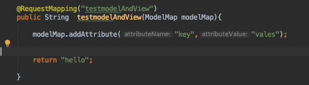
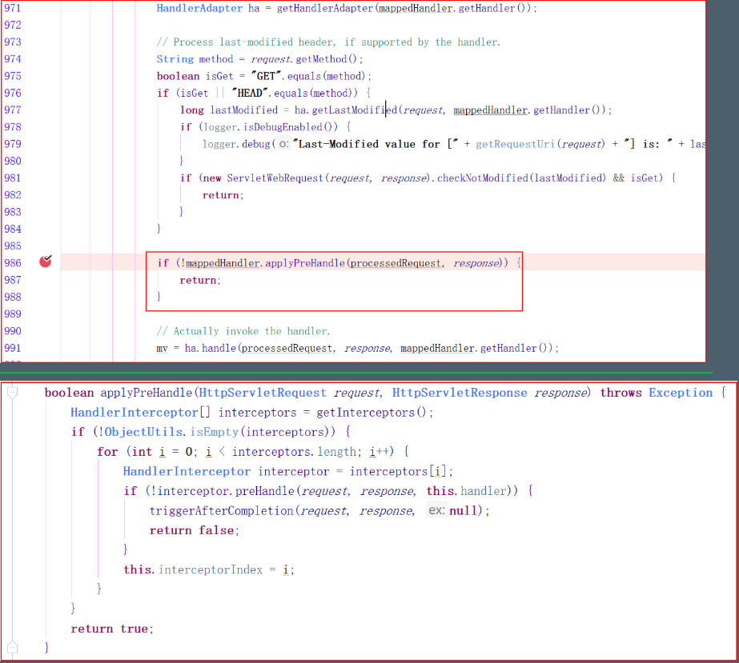

# SpringMVC

## 01 SpringMVC基本使用

- 导入springMVC相关jar包,在spring的基础上添加一个mvc的包
- 添加配置文件
	```xml
	<?xml version="1.0" encoding="UTF-8"?>
	<beans xmlns="http://www.springframework.org/schema/beans"
	       xmlns:xsi="http://www.w3.org/2001/XMLSchema-instance"
	       xmlns:context="http://www.springframework.org/schema/context"
	       xmlns:mvc="http://www.springframework.org/schema/mvc"
	       xmlns:aop="http://www.springframework.org/schema/aop"
	       xmlns:tx="http://www.springframework.org/schema/tx"
	       xsi:schemaLocation="http://www.springframework.org/schema/beans
		http://www.springframework.org/schema/beans/spring-beans.xsd
		http://www.springframework.org/schema/context
		http://www.springframework.org/schema/context/spring-context.xsd
		http://www.springframework.org/schema/aop
		http://www.springframework.org/schema/aop/spring-aop.xsd
		http://www.springframework.org/schema/mvc
	    	http://www.springframework.org/schema/mvc/spring-mvc-4.0.xsd
		http://www.springframework.org/schema/tx
		http://www.springframework.org/schema/tx/spring-tx.xsd">
		<!--在springMVC核心配置文件当中添加控制器扫描范围-->
	    <context:component-scan base-package="com.max"/>
	  
	</beans>
	```

- 在web.xml当中配置前端控制器
```xml
<!-- 配置SpringMVC前端控制器 -->
    <servlet>
        <servlet-name>mySpringMVC</servlet-name>
        <servlet-class>org.springframework.web.servlet.DispatcherServlet</servlet-class>
        <!-- 指定SpringMVC配置文件 -->
        <!-- SpringMVC的配置文件的默认路径是/WEB-INF/${servlet-name}-servlet.xml -->
        <init-param>
            <param-name>contextConfigLocation</param-name>
            <param-value>classpath:springmvc.xml</param-value>
        </init-param>
        <!--启动服务器就加载SpringMVC控制器-->
        <load-on-startup>1</load-on-startup>

    </servlet>

    <servlet-mapping>
        <servlet-name>mySpringMVC</servlet-name>
        <!-- 设置所有以action结尾的请求进入SpringMVC -->
        <url-pattern>*.action</url-pattern>
    </servlet-mapping>
```


**springMVC中url-patten取值:**
-  `/*`   (拦截所有  jsp js png .css 真的全拦截.不建议使用)
- `*.action`   `*.do`   (拦截以do action 结尾的请求)
-  `/`    (拦截所有,不包括jsp,包含.js .png.css   建议使用)
---- 

-  创建控制器类   类加上`@Controller` 注解  （相当于类交由Spring管理） 
- 方法上写上url映射路径  `@RequestMapping("/MyTest.action")`
- 方法返回值 ModelAndView 对象!


```xml
   <!--在springMVC核心配置文件当中添加控制器扫描范围-->
   <context:component-scan base-package="com.max"/>
```
- 结果页取出存放的数据!
 
 
- 测试


## 02 SpringMVC详细执行流程

架构流程
用户发送请求至前端控制器DispatcherServlet
DispatcherServlet收到请求调用HandlerMapping处理器映射器。
处理器映射器根据请求url找到具体的处理器，生成处理器对象及处理器拦截器(如果有则生成)一并返回给DispatcherServlet。
DispatcherServlet通过HandlerAdapter处理器适配器调用处理器
执行处理器(Controller，也叫后端控制器)。
Controller执行完成返回ModelAndView
HandlerAdapter将controller执行结果ModelAndView返回给DispatcherServlet
DispatcherServlet将ModelAndView传给ViewReslover视图解析器
ViewReslover解析后返回具体View
DispatcherServlet对View进行渲染视图（即将模型数据填充至视图中）。
DispatcherServlet响应用户


组件说明:


总结：


## 03 配置视图解析器

视图解析器使用SpringMVC框架默认的`InternalResourceViewResolver`
[ 视图解析器源码分析 ](#)

```sql
<!--配置视图解析器-->
<bean class="org.springframework.web.servlet.view.InternalResourceViewResolver">
    <property name="prefix" value="WEB-INF/max"/> <!-- 前缀-->
    <property name="suffix" value=".jsp"/> <!-- 后缀-->
</bean>
```


## 04 请求转发 or 重定向

重定向和请求转发区别：
- 请求转发：向服务器请求一次 地址栏不发生变化
- 重定向：向服务器可以请求多次 地址栏发生变化


### 请求转发:


### 重定向:


## 05 SpringMVC 接收参数

### 使用传统request对象接收参数 


- 当请求的参数名称和处理器形参名称一致时会将请求参数与形参进行绑定。


请求参数与形参不一致采用@RequestParam


- defaultValue 默认值 表示如果请求中没有同名参数时的默认值


### 接受Javabean对象 （表单name值与bean对象属性名保持一致）


### 接受数组（当发送的name值相同时）


### 包装类接受参数（请求参数 为包装类.包装类属性）


### List集合接受数据


## 06 自定义参数绑定 Date对象

把发布`时间格式`字符串 转换成`Date对象`来接收

- 创建转换器 实现`Converter<S,T>`接口里的方法 `S:`页面传过来的数据类型  `T:`转换过后的类型 

```java
package com.max.web.converter;

import org.springframework.core.convert.converter.Converter;

import java.text.ParseException;
import java.text.SimpleDateFormat;
import java.util.Date;

public class DataConverter implements Converter<String,Date> {

    @Override
    public Date convert(String s) {
        if(s != null){
            SimpleDateFormat sd = new SimpleDateFormat("yyyy-MM-dd");
            try {
                return sd.parse(s);
            } catch (ParseException e) {
                e.printStackTrace();
            }
        }
        return null;
    }
}
```

- 在springMVC核心配置文件当中自定义转换器 


## 07 post请求中文参数乱码
在web.xml当中添加一个过滤器
```java
   <!-- 解决post乱码问题 -->
    <filter>
        <filter-name>encoding</filter-name>
        <filter-class>org.springframework.web.filter.CharacterEncodingFilter</filter-class>
        <!-- 设置编码参是UTF8 -->
        <init-param>
            <param-name>encoding</param-name>
            <param-value>UTF-8</param-value>
        </init-param>
    </filter>
    <filter-mapping>
        <filter-name>encoding</filter-name>
        <url-pattern>/*</url-pattern>
    </filter-mapping>

```
## 08 @RequestMapping Url地址映射 @注解

### Value属性：
1. 用来设置请求路径
2. 值是一个`字符串数组`
3. 可以设置多个路径共同访问对应方法


### method属性:
用来设置映射的请求方式
1. 值是`RequestMethod类型的数组`
2. 如果没有写,则没有限制,post与get都可以请求到对应的方法
3. 如果指定了请求类型,则必须得是相应的请求才能访问到对应的方法


### params属性: 
必须设置对应的请求参数和请求值才能访问到对应的内容


### headers属性:
发送的请求头必须要与设置的请求相同时,才能够访问到对应的方法


### ant风格地址：
请求路径的一种匹配方法
1. 一个`?`匹配一个字符
2. `*`匹配任意字符
3. `**`匹配多重路径


## 09 @PathVariable  获取的是请求路径中参数的值 @注解
### rest风格
   1. 资源定位及资源操作的风格
   2. 不是协议,可以遵循,也可以不遵循


### 使用@PathVariable接收RestFul风格参数


### 发送put与delete请求
   1. 默认情况下Form表单是不支持PUT请求和DELETE请求的
   2. spring3.0添加了一个过滤器HiddenHttpMethodFilter
   3. 可以将post请求转换为PUT或DELETE请求

-  配置过滤器： 
```java
<!--配置过滤器 将post请求转化成PUT和DELETE请求 -->
    <filter>
        <filter-name>HiddenHttpMethodFilter</filter-name>
        <filter-class>org.springframework.web.filter.HiddenHttpMethodFilter</filter-class>
    </filter>
    <filter-mapping>
        <filter-name>HiddenHttpMethodFilter</filter-name>
        <url-pattern>/*</url-pattern>
    </filter-mapping>
```


- 发送请求 定义一个隐藏 input 标签 name值必须为 `_method  value`为请求方式 


- 服务器接收处理


 ⚠️注意事项:
   1. 从tomcat8开始,如果直接返回jsp页面,会报405错误  JSPs only permit GET POST or HEAD
   2. 使用重定向的形式跳转到对应jsp
   3. 或者是直接把对应jsp的 isErrorPage="true"


### 过滤器HiddenHttpMethodFilter源码分析


## 10 @RequestHeader  or @CookieValue @注解

### @RequestHeader   获取请求头当中的信息


### @CookieValue  用来接收浏览发送过来的cookes值


## 11 页面传值方式 1

### ModelMap (父类)
   1. ModelMap对象主要用于传递控制方法处理数据到结果页面
   2. 也就是说我们把结果页面上需要的数据放到ModelMap对象中即可
   3. request对象的setAttribute方法的作用: 用来在一个请求过程中传递处理的数据。 
   4. 使用方法与model一样


### ModelAndView or  Model两者区别： 
1. ModelAndView：需要手动创建，返回类型必须时该对象 
2.  Model：接受请求的jsp页面的对象，返回类型任意
3. 相同点：`都是存在request域中的`

### Model
1. Model 和 ModelMap 的实例都是spirng mvc框架来自动创建并作为控制器方法参数传入，用户无需自己创建
1. 可以简单地将model的实现类理解成一个Map
2. `Request`级别的模型数据
3. Model 是一个接口， 其实现类为ExtendedModelMap，继承了ModelMap类
4. Model 里方法[ SpringMVC -\>Model 里方法 ](#)

### ModelAndView
1. 需要自己创建
	2. 既包含模型也包含视图


### Map传值到页面


## 12 页面传值方式 2 @注解

### @SessionAttributes
 @SessionAttribute`s`注解  将模型中的某个属性暂存到 HttpSession 中，以便多个请求之间可以共享这个属性
1. value  通过指定key将model数据放到session域当中
	
2. type  把指定类型的模型数据放到session域当中
	 
	 

### @SessionAttribute
 @SessionAttribute来访问预先存在的全局会话属性  `如果没有则会报错`

 


### @ModelAttribute
方法参数的值 放进Model对象里 Key为参数类型


ModelAttribute（value = “”）  修改Key名  原有的key值覆盖掉 而不是整个对象进行覆盖
 

1. 在方法定义上使用 @ModelAttribute 注解,Spring MVC 在调用目标处理方法前，
2. 会先逐个调用在方法级上标注了@ModelAttribute 的方法。


## 13 mvc标签

### `mvc:view-controller`：
1. 当我们发送一个请求时,如果没有找到对应的mapping
2. 则会对配置文件当中匹配mvc:view-controller
3. 注意点:使用时要添加后面的内容  `<mvc:annotation-driven/>`  （如果没有 RequestMappingHandlerMapping这个类就不会加载）


### `<mvc:annotation-driven/>` :
会自动注册三个Bean
1. RequestMappingHandlerMapping、
2. RequestMappingHandlerAdapter 
3. ExceptionHandlerExceptionResolver
4. 并提供了：
- 数据绑定支持，
- @NumberFormatannotation支持，
- @DateTimeFormat支持，
- @Valid支持，读写XML的支持（JAXB），
- 读写JSON的支持（Jackson）。

## 14 SpringMVC form标签
标签库：
```java
<%@ taglib prefix="fm" uri="http://www.springframework.org/tags/form" %>
```

### form标签：
注意：
1. 没有写form提交的路径 则会默认提交到`原来`的路径
2. 要写出从那个key名中取 不写的会从 key名为`command`来找    找不到会报错

作用：
 1. 第一是它会自动的绑定来自Model中的一个属性值到当前form对应的实体对象
 2. 第二是它支持我们在提交表单的时候使用除GET和POST之外的其他方法进行提交，包括DELETE和PUT等
 3. 15 服务器表单校验 

使用场景:
1. 当编辑时, 跳转到form表单页,传统模式要在跳转前先到数据库查询数据,然后进行表单数据回显
	2. 使用form之前一定要保证有对应的bean,没有对应的bean时, 会自动以command为key到request域中查询,当找不到的时候, 会报异常


### select标签：
 `注意：展示时 要给出要判断的属性是哪个`


## 15 服务器表单校验

- 使用Hibernate-Validator导入jar包

### JSR 
 1. JSR 303 是 Java 为 Bean 数据合法性校验提供的标准框架，它已经包含在 JavaEE 6.0 中 
 2. JSR 303 通过在 Bean 属性上标注类似于 @NotNull、@Max 等标准的注解
 3. 指定校验规则，并通过标准的验证接口对 Bean 进行验证


### Hibernate Validator
1. 是 JSR 303 的一个参考实现，
2. 除支持所有标准的校验注解外，它还支持以下的扩展注解

### Bean Validation 中内置的约束
1.  @Null   被注释的元素必须为 null       
 2. @NotNull    被注释的元素必须不为 null       
 3.  @AssertTrue     被注释的元素必须为 true       
 4. @AssertFalse    被注释的元素必须为 false       
 5. @Min(value)     被注释的元素必须是一个数字，其值必须大于等于指定的最小值       
 6.  @Max(value)     被注释的元素必须是一个数字，其值必须小于等于指定的最大值       
 7. @DecimalMin(value)  被注释的元素必须是一个数字，其值必须大于等于指定的最小值       
 8. @DecimalMax(value)  被注释的元素必须是一个数字，其值必须小于等于指定的最大值       
 9. @Size(max=, min=)   被注释的元素的大小必须在指定的范围内       
 10. @Digits (integer, fraction)     被注释的元素必须是一个数字，其值必须在可接受的范围内       
 11. @Past   被注释的元素必须是一个过去的日期       
 12. @Future     被注释的元素必须是一个将来的日期       
 13. @Pattern(regex=,flag=)  被注释的元素必须符合指定的正则表达式   

### Hibernate Validator 附加的约束
1. @NotBlank(message =)   验证字符串非null，且长度必须大于0       
2. @Email  被注释的元素必须是电子邮箱地址       
3. @Length(min=,max=)  被注释的字符串的大小必须在指定的范围内       
4. @NotEmpty   被注释的字符串的必须非空       
5. @Range(min=,max=,message=)  被注释的元素必须在合适的范围内 

### 使用：
- 确保在配置文件上写上了`<mvc:annotation-driven/>`
- 在模型当中添加对应的校验规则

- 在处理器方法的入参标记`@valid`注解即可 

### 错误信息页面回显
- 使用原始表单错误信息写到Model中


- 使用form标签 ：\<fm:error path="username"\>\</fm:error\>


## 16 访问静态资源


### url-pattern为/时访问静态资源
1. 方式1- `<mvc:default-servlet-handler/>`
2. 方式2- 采用spring自带`<mvc:resources>`方法  建议使用 速度比较快）
配置
```java
 <mvc:annotation-driven />
 <mvc:resources location="/img/" mapping="/img/**"/>   
 <mvc:resources location="/js/" mapping="/js/**"/>    
 <mvc:resources location="/css/" mapping="/css/**"/>  
```

描述:
- location元素表示webapp目录下的static包下的所有文件；
- mapping元素表示以/static开头的所有请求路径，如/static/a 或者/static/a/b；
- 该配置的作用是：DispatcherServlet不会拦截以/static开头的所有请求路径，并当作静态资源
- 交由Servlet处理。

## 17 Json处理

概述:
1. 当前端使用Ajax发送请求时,服务器要以JSON的数据格式响应给浏览器

### @ResponseBody 
@ResponseBody `响应`给浏览器以Json格式
使用方式:
1. `@ResponseBody`来实现；注解方式
	- 添加json处理相关`jar`包
	- 在配置文件当中`写上`\<mvc:annotation-driven/\>
	- 设置映射方法的返回值为@ResponseBody

`注意`:   @ResponseBody注解作用：返回时只能是bean对象 或 map集合(String不会被转成JSON数据）
- 可以直接返回一个对象
- 可以返回一个List集合
- 可以返回一个Map集合


### @RequestBody
`@RequestBody`  `接收`浏览器Json数据
作用:
1. 默认情况下我们发送的都是Content-Type: 不是`application/x-www-form-urlencoded`
2. 直接使用`@RequestParam`接收参数
3. 如果不是Content-Type: 不是`application/x-www-form-urlencoded`编码的内容，例如`application/json,` `application/xml`等；
4. 使用`@RequestBody`接收 
`注意`： 接受的JSON数据要想被封装成对象要加上 @RequestBody注解

### 接受二进制文件 form表单上传

打印文件的信息：
 


表单序列化


```js
<script>
    $(function () {


      //表单序列化
      (function($){
        $.fn.serializeJson=function(){
          var serializeObj={};
          var array=this.serializeArray();
          var str=this.serialize();
          $(array).each(function(){
            if(serializeObj[this.name]){
              if($.isArray(serializeObj[this.name])){
                serializeObj[this.name].push(this.value);
              }else{
                serializeObj[this.name]=[serializeObj[this.name],this.value];
              }
            }else{
              serializeObj[this.name]=this.value;
            }
          });
          return serializeObj;
        };
      })(jQuery);


      $("#formbtn").click(function () {
        var  serialize = $("#myform").serializeJson();

        if(typeof serialize.hobby == "string"){
          serialize.hobby = new Array(serialize.hobby);
        }

        $.ajax({
          type:"post",
          url:"${pageContext.request.contextPath}/formJson",
          data:JSON.stringify(serialize),
          dataType:'json',
          contentType:'application/json',
          success:function (data) {
            alert("成功");
            console.log(data);
          },
          error:function (data) {
            alert("失败");
            console.log(data);
          }
        });

      });


      $("#btn").click(function () {
        $.post("${pageContext.request.contextPath}/getJson",function (data) {
          console.log(data);
        },"json")

      });


    });


  </script>

```


```java
@RequestMapping("getJson")
    @ResponseBody
    public User getJson(){
        User user = new User();
        user.setName("JSONname");
        user.setAge(23);
        return user;
    }


    @RequestMapping("formJson")
    @ResponseBody
    public User formJson(@RequestBody User user){

        System.out.println(user);

        return user;
    }
```


## 18 文件下载
[ 09 @PathVariable 获取的是请求路径中参数的值 @注解 ](#)


```java
 @RequestMapping("download/{filename:.+}")
    public ResponseEntity download(@PathVariable String filename, HttpSession session) throws Exception {

//        1.获取文件路径
        String realPath = session.getServletContext().getRealPath("/images/"+filename);

        //2.将文件读取到程序中
        InputStream io = new FileInputStream(realPath);

        byte[] body = new byte[io.available()];
        io.read(body);

        //3.创建响应头
        HttpHeaders httpHeaders = new HttpHeaders();
        filename =  URLEncoder.encode(filename,"UTF-8"); //重新编码
        httpHeaders.add("Content-Disposition","attachment;filename="+filename);

        ResponseEntity<byte[]> responseEntity = new ResponseEntity<>(body, httpHeaders, HttpStatus.OK);

        return responseEntity;

    }
```
## 19 文件上传
概述:
1. Spring MVC 为文件上传提供了直接的支持
2. 是通过即插即用的 `MultipartResolver` 实现的
3. MultipartResolver是一个接口
4. Spring MVC 上下文中默认没有装配 MultipartResovler
5. 如果想使用 Spring 的文件上传功能
6. 就必须得要自己下载相关jar包
7. 自己到配置文件当中装配到springMVC当中

前端:
 确保表单`enctype="multipart/form-data" method="post"`


### 上传步骤
- 导入相关jar包

- 在springmvc配置文件当中装配`MultipartResovler`


- 实现上传代码
```java
 <!--文件上传-->
    <bean id="multipartResolver" class="org.springframework.web.multipart.commons.CommonsMultipartResolver">
        <!--文件编码-->
        <property name="defaultEncoding" value="UTF-8"/>
        <!--上传文件大小-->
        <property name="maxUploadSize" value="1024000"/>
    </bean>


 @RequestMapping("upload")
    public String upload(@RequestParam("file") CommonsMultipartFile file,HttpSession session) throws IOException {

         System.out.println("文件类型："+file.getContentType());
         System.out.println("文件名称："+file.getOriginalFilename());
         System.out.println("文件大小："+file.getSize());
         System.out.println("文件名称（form表单中的name）："+file.getName());


         //1.获取项目名称
         ServletContext servletContext = session.getServletContext();
         String realPath = servletContext.getRealPath("/upload");
         //2.变成文件路径
         File uploadPath = new File(realPath);
         if(!uploadPath.exists()){ //判断是否存在该文件夹
             uploadPath.mkdirs();
         }

         //3.确定最终路径 /项目名称/upload/文件名称
         String filename = file.getOriginalFilename();
         uploadPath =  new File(uploadPath+"/"+filename);

         //4.开始上传
         file.transferTo(uploadPath);

         return "success";
     }
```
## 20 异常
概述:
1. Spring MVC 通过 `HandlerExceptionResolver`  处理程序的异常，包括 Handler 映射、数据绑定以及目标方法执行时发生的异常。
2. SpringMVC 提供的 HandlerExceptionResolver 的实现类

使用方法：
1. 处理 Handler 中用 @ExceptionHandler 注解定义的方法。


@ExceptionHandler优先级  根据继承关系  找继承关系比较近的那一个


---- 
@ControllerAdvice  如果单使用@ExceptionHandler，只能在当前Controller中处理异常。但当配合@ControllerAdvice一起使用的时候，就可以摆脱那个限制了
1. 如果在当前类中没有找到@ExceptionHanler
2. 则会到@ControllerAdvice 中的@ExceptionHandler 注解方法


## 21 国际化
概述:
1. SpringMVC  根据 Accept-Language 参数判断客户端的本地化类型
2. 当接受到请求时，SpringMVC 会在上下文中查找一个本地化解析器（`LocalResolver`），
3. 找到后使用它获取请求所对应的本地化类型信息。

### 默认实现过程：
- 要先创建国际化的资源文件
```propertie
language.cn= China
language.en= English
welcome = welcome
introduce= This is I18N Demo 
```

- 添加配置文件 `注意`id为messageSource

- 添加JSTL  jar包  
- 在页面当中编写标签


### 原理：  
1. 如果没有显式定义本地化解析器    SpringMVC 会使用 `AcceptHeaderLocaleResolver：`根据 HTTP 请求头的 Accept-Language 参数确定本地化类型
 


### 切换中英文切换
- 概述
1. 默认情况是通过`AccepHeaderLocaleResolver`来从浏览器当中获取语言信息
2. 可以从请求参数中获取本次请求对应的本地化类型。
3. 获取到本地类型后, 给写入到session当中

#### 实现：


## 22 拦截器

概述:
1. Java 里的拦截器是动态拦截 action 调用的对象。
2. 可以Controller中的方法执行之前与执行之后, 及页面显示完毕后, 执行指定的方法
3. 自定义的拦截器必须实现HandlerInterceptor接口

方法介绍 :
1. preHandle()    在业务处理器处理请求之前被调用
2. postHandle()   在业务处理器处理完请求后
3. afterCompletion()   在 DispatcherServlet 完全处理完请求后被调用

SpringMVC拦截器使用:
1. 创建一个类实现HandlerInterceptor接口
2. 配置文件当中添加拦截器





配置多个拦截器执行顺序 源码


第2个返回false


## Model 里方法
方法： （放到request域）

### Model addAttribute(String attributeName, Object attributeValue); 
`Model addAttribute(String attributeName, Object attributeValue);`   添加键值属性对

### Map\<String, Object\> asMap(); 
`Map<String, Object> asMap();`   将当前的model转换成Map 


### Model addAttribute(Object attributeValue);
`Model addAttribute(Object attributeValue);` 以`属性的类型`为`键`添加属性  


   
### Model addAllAttributes(Map\<String, ?\> attributes);  
`Model addAllAttributes(Map<String, ?> attributes);`   将attributes中的内容复制到当前的model中   （如果当前model存在`相同内容`，会被`覆盖`）


以集合中数据的类型做为key，
将所提供的Collection中的所有属性复制到这个Map中,
`Model addAllAttributes(Collection<?> attributeValues);` 如果有`同类型`会存在`覆盖`现象   


### Model mergeAttributes(Map\<String, ?\> attributes); 
将attributes中的内容复制到当前的model中
如果当前model存在`相同内容`，不会被覆盖 ` 不会被覆盖 还是取原来的内容`
`Model mergeAttributes(Map<String, ?> attributes);  合并 复制`


### boolean containsAttribute(String attributeName);
`boolean containsAttribute(String attributeName);` 判断有没有当前Key 

## 视图解析器源码分析

### 视图解析器:
1.  请求处理方法执行完成后，最终返回一个 ModelAndView 对象
2.  对于那些返回 String，View 或 ModeMap 等类型的处理方法   Spring MVC `也会`在内部将它们装配成一个 ModelAndView 对象
3. 它包含了逻辑名和模型对象的视图
4.  Spring MVC 借助视图解析器（ViewResolver）得到最终的视图对象（View），最终的视图`可以是 JSP`


### 视图：
- 视图的作用是渲染模型数据，将模型里的数据以某种形式呈现给客户
- 视图对象由视图解析器负责实例化
- 在·`org.springframework.web.servlet`包中定义了一个高度抽象的 View 接口 

- 常见实现类
- InternalResourceView 
	- 将JSP或其它资源封装成一个视图
	- 是`InternalResourceViewResoler`默认使用的实现类 [SpringMVC -\> 03 配置视图解析器](#)

### 源码分析：

#### 获取mapping映射:


#### 获取适配器:


### 调用处理器,执行映射方法,返回MV


### 处理转发页面


### 在方法内部渲染页面


### 创建视图对象


### 调用View对象渲染页面


### 在render内部解析数据


### 转发到配置静态页面（jsp、Thymeleaf、Freemarker）


## SpringMVC执行流程

