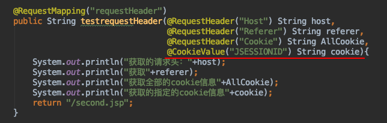

## 01 SpringMVC基本使用

1. 导入springMVC相关jar包,在spring的基础上添加一个mvc的包
2. 添加配置文件

```xml
<?xml version="1.0" encoding="UTF-8"?>
<beans xmlns="http://www.springframework.org/schema/beans"
       xmlns:xsi="http://www.w3.org/2001/XMLSchema-instance"
       xmlns:context="http://www.springframework.org/schema/context"
       xmlns:mvc="http://www.springframework.org/schema/mvc"
       xmlns:aop="http://www.springframework.org/schema/aop"
       xmlns:tx="http://www.springframework.org/schema/tx"
       xsi:schemaLocation="http://www.springframework.org/schema/beans
	http://www.springframework.org/schema/beans/spring-beans.xsd
	http://www.springframework.org/schema/context
	http://www.springframework.org/schema/context/spring-context.xsd
	http://www.springframework.org/schema/aop
	http://www.springframework.org/schema/aop/spring-aop.xsd
	http://www.springframework.org/schema/mvc
    	http://www.springframework.org/schema/mvc/spring-mvc-4.0.xsd
	http://www.springframework.org/schema/tx
	http://www.springframework.org/schema/tx/spring-tx.xsd">
	<!--在springMVC核心配置文件当中添加控制器扫描范围-->
    <context:component-scan base-package="com.max"/>
    
</beans>
```

3. 在web.xml当中配置前端控制器

>  springMVC中url-patten取值
>
>  *  /*   (拦截所有  jsp js png .css 真的全拦截.不建议使用)
>
>  * *.action   *.do    (拦截以do action 结尾的请求)
>  *  /    (拦截所有,不包括jsp,包含.js .png.css   建议使用)
>
>  ```xml
>  <!-- 配置SpringMVC前端控制器 -->
>      <servlet>
>          <servlet-name>mySpringMVC</servlet-name>
>          <servlet-class>org.springframework.web.servlet.DispatcherServlet</servlet-class>
>          <!-- 指定SpringMVC配置文件 -->
>          <!-- SpringMVC的配置文件的默认路径是/WEB-INF/${servlet-name}-servlet.xml -->
>          <init-param>
>              <param-name>contextConfigLocation</param-name>
>              <param-value>classpath:springmvc.xml</param-value>
>          </init-param>
>          <!--启动服务器就加载SpringMVC控制器-->
>          <load-on-startup>1</load-on-startup>
>  
>      </servlet>
>  
>      <servlet-mapping>
>          <servlet-name>mySpringMVC</servlet-name>
>          <!-- 设置所有以action结尾的请求进入SpringMVC -->
>          <url-pattern>*.action</url-pattern>
>      </servlet-mapping>
>  ```

4. 创建控制器类   类加上**@Controller** 注解  （相当于类交由Spring管理） 

5. 方法上写上url映射路径  @RequestMapping("/MyTest.action")

6.  方法返回值 ModelAndView 对象

7.  

   ```xml
   <!--在springMVC核心配置文件当中添加控制器扫描范围-->
   <context:component-scan base-package="com.max"/>
   ```
   
8.  结果页取出存放的数据
  
9. 测试

## 02 SpringMVC详细执行流程

**架构流程 :**

> 
>   用户发送请求至前端控制器DispatcherServlet 
>   DispatcherServlet收到请求调用HandlerMapping处理器映射器。 
>   处理器映射器根据请求url找到具体的处理器，生成处理器对象及处理器拦截器(如果有则生成)一并返回给DispatcherServlet。 
>   DispatcherServlet通过HandlerAdapter处理器适配器调用处理器 
>   执行处理器(Controller，也叫后端控制器)。 
>   Controller执行完成返回ModelAndView 
>   HandlerAdapter将controller执行结果ModelAndView返回给DispatcherServlet 
>   DispatcherServlet将ModelAndView传给ViewReslover视图解析器 
>   ViewReslover解析后返回具体View 
>   DispatcherServlet对View进行渲染视图（即将模型数据填充至视图中）。 
>   DispatcherServlet响应用户 


 **组件说明:**

##  03 配置视图解析器

>  视图解析器使用SpringMVC框架默认的InternalResourceViewResolver

```xml
<!--配置视图解析器-->
<bean class="org.springframework.web.servlet.view.InternalResourceViewResolver">
    <property name="prefix" value="WEB-INF/max"/> <!-- 前缀-->
    <property name="suffix" value=".jsp"/> <!-- 后缀-->
</bean>
```

* 可以在返回地址上添加前缀和后缀

* 

  

## 04 源码分析

> * 
>
>   * 视图解析器
>
>   	1.  请求处理方法执行完成后，最终返回一个 ModelAndView 对象 
>   	2.  对于那些返回 String，View 或 ModeMap 等类型的处理方法  Spring MVC 也会在内部将它们装配成一个 ModelAndView 对象 
>   	3. 它包含了逻辑名和模型对象的视图 
>   	4.  Spring MVC 借助视图解析器（ViewResolver）得到最终的视图对象（View），最终的视图可以是 JSP 
>   * 视图
>
>   	1.   视图的作用是渲染模型数据，将模型里的数据以某种形式呈现给客户 
>   	2.   视图对象由视图解析器负责实例化 
>   	3.   在org.springframework.web.servlet 包中定义了一个高度抽象的 View 接口 
>   	4.    常见实现类
>   	     1.    InternalResourceView 
>   	          1. 将JSP或其它资源封装成一个视图 
>   	          2. 是InternalResourceViewResoler默认使用的实现类 

> 1. **获取mapping映射**
>
> 2.  **获取适配器**
>
> 3.  **调用处理器,执行映射方法,返回MV**
>
> 4.  **处理转发页面**
>
> 5.  **在方法内部渲染页面**
>
> 6.  **创建视图对象**
>
> 7. **调用View对象渲染页面**
>
> 8.  **在render内部解析数据**
>
>  
>
> 9. **转发到jsp页面**

## 05 请求转发 or 重定向

> 重定向和请求转发区别： 
> * 请求转发：向服务器请求一次 地址栏不发生变化 
> * 重定向：向服务器可以请求多次 地址栏发生变化 
>
>  **请求转发**
>
> 1.  存放到ModeAndView中
> 2.  返回值 转发地址
>
>  **重定向**
>
> 

## 06 接收参数

**使用传统request对象接收参数** 

>  

 **当请求的参数名称和处理器形参名称一致时会将请求参数与形参进行绑定。**

> 

 **请求参数与形参不一致采用@RequestParam**

> 1.  value   请求参数名字
>
> 2.  required  是否必须  默认是true  表示请求中一定要有相应的参数，否则将报错   
>
>  defaultValue 默认值 表示如果请求中没有同名参数时的默认值
>

 **接受Javabean对象 （表单name值与bean对象属性名保持一致）**

> 
>
> 

 **接受数组（当发送的name值相同时）**

> 

 **List集合接受数据**

> 

## 07 自定义参数绑定 Date对象

> 把发布时间格式字符串 转换成Date对象来接收 

* 创建转换器 实现**Converter<S,T>**接口里的方法  S:页面传过来的数据类型  T:转换过后的类型 

  * ```java
    package com.max.web.converter;
    
    import org.springframework.core.convert.converter.Converter;
    
    import java.text.ParseException;
    import java.text.SimpleDateFormat;
    import java.util.Date;
    
    public class DataConverter implements Converter<String,Date> {
    
        @Override
        public Date convert(String s) {
            if(s != null){
                SimpleDateFormat sd = new SimpleDateFormat("yyyy-MM-dd");
                try {
                    return sd.parse(s);
                } catch (ParseException e) {
                    e.printStackTrace();
                }
            }
    
            return null;
        }
    }
    ```

* 在springMVC核心配置文件当中自定义转换器    

  

##  08 post请求中文参数乱码

>  在web.xml当中添加一个过滤器
>
> ```xml
>    <!-- 解决post乱码问题 -->
>     <filter>
>         <filter-name>encoding</filter-name>
>         <filter-class>org.springframework.web.filter.CharacterEncodingFilter</filter-class>
>         <!-- 设置编码参是UTF8 -->
>         <init-param>
>             <param-name>encoding</param-name>
>             <param-value>UTF-8</param-value>
>         </init-param>
>     </filter>
>     <filter-mapping>
>         <filter-name>encoding</filter-name>
>         <url-pattern>/*</url-pattern>
>     </filter-mapping>
> 
> ```

## 09 @RequestMapping

> Url地址映射

*  **Value属性：**
  1. 用来设置请求路径 
  2. 值是一个字符串数组 
  3. 可以设置多个路径共同访问对应方法 

*  **method属性** :  用来设置映射的请求方式
  1. 值是**RequestMethod**类型的数组 
  2. 如果没有写,则没有限制,post与get都可以请求到对应的方法 
  3. 如果指定了请求类型,则必须得是相应的请求才能访问到对应的方法 

*  **params属性**:  必须设置对应的请求参数和请求值才能访问到对应的内容
*  **headers属性:**   发送的请求头必须要与设置的请求相同时,才能够访问到对应的方法
*  **ant风格地址：**请求路径的一种匹配方法
  1. 一个?匹配一个字符 
  2. \* 匹配任意字符 
  3. ** 匹配多重路径 

## 10 @PathVariable

> 获取的是请求路径中参数的值

> * rest风格:
>   * 资源定位及资源操作的风格
>   * 不是协议,可以遵循,也可以不遵循
> * REST风格请求
>   * REST 即 Representational State Transfer （资源）表现层状态转化
>   * 用URL定位资源,用HTTP描述操作
>   * 是目前最流行的一种互联网软件架构
>   * 它结构清晰、符合标准、易于理解、扩展方便，所以正得到越来越多网站的采用
>   * 使用POST, DELETE, PUT, GET 分别对应 CRUD
>   * Spring3.0 开始支持 REST 风格的请求
> * 传统的操作资源
>   	http://localhost:8080/get.action?id=10  	        查询 get
>   	http://localhost:8080/add.action                        新增 post
>   	http://localhost:8080/update.action                   修改 post
>   	http://localhost:8080/delete.action?id=10          删除 post
> * restful操作资源
>   	http://localhost:8080/goods/1		查询GET
>   	http://localhost:8080/goods		   新增POST
>   	http://localhost:8080/goods		   更新PUT
>   	http://localhost:8080/goods/1		删除DELETE

*  使用@PathVariable接收RestFul风格参数

  

* 发送put与delete请求 
	1. 默认情况下Form表单是不支持PUT请求和DELETE请求的 
	2. spring3.0添加了一个过滤器HiddenHttpMethodFilter 
	3. 可以将post请求转换为PUT或DELETE请求 
	
*  配置过滤器 将post请求转化成PUT和DELETE请求

*  > ```xml
   > <!--配置过滤器 将post请求转化成PUT和DELETE请求 -->
   >     <filter>
   >         <filter-name>HiddenHttpMethodFilter</filter-name>
   >         <filter-class>org.springframework.web.filter.HiddenHttpMethodFilter</filter-class>
   >     </filter>
   >     <filter-mapping>
   >         <filter-name>HiddenHttpMethodFilter</filter-name>
   >         <url-pattern>/*</url-pattern>
   >     </filter-mapping>
   > ```

* 发送请求 定义一个隐藏 input 标签 name值必须为 _method  value为请求方式 
*  服务器接收处理
*  ⚠️注入事项
  *  从tomcat8开始,如果直接返回jsp页面,会报405错误 JSPs only permit GET POST or HEAD 
  *   使用重定向的形式跳转到对应jsp 
  *   或者是直接把对应jsp的 isErrorPage="true" 
*  过滤器HiddenHttpMethodFilter源码分析
* 

## @RequestHeader  和 @CookieValue

* **@RequestHeader**  获取请求头当中的信息

  * 

*  **@CookieValue**  用来接收浏览发送过来的cookes值

  * 

    

