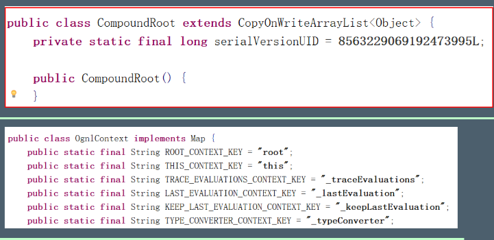

## 01 Struts2基本使用

1.  在工程当中创建一个jsp 发送一个Action 请求  (后缀.action)

2. 编写Action类  在src当中创建一个普通的类  在类当中提供一个方法， 方法名称是固定的  public String execute(){ }   (底层会使用反射执行此方法) 

3.  创建一个 strust.xml 资源文件  配置Struts.xml  

   ```xml
   <?xml version="1.0" encoding="UTF-8" ?>
   
   <!DOCTYPE struts PUBLIC
           "-//Apache Software Foundation//DTD Struts Configuration 2.5//EN"
           "http://struts.apache.org/dtds/struts-2.5.dtd">
   <struts>
   
       <package name="struts" extends="struts-default">
           <action name="hello" class="com.max.struts2.HelloAction">
               <result name="success">/max.jsp</result>
           </action>
   
           <action name="hello2" class="com.max.struts2.HelloAction2">
               <result name="success">/max.jsp</result>
           </action>
   
           <action name="hello3" class="com.max.struts2.HelloAction3">
               <result name="success">/max.jsp</result>
           </action>
   
       </package>
   </struts>
   ```
   
4.  创建一个 strust.xml 资源文件  配置Struts.xml  

5.  配置前端控制器  （它是有一个过滤器来实现的  所以要到web.xml当中配置核心过滤器）

   ```xml
   <?xml version="1.0" encoding="UTF-8"?>
   <web-app xmlns="http://java.sun.com/xml/ns/javaee"
              xmlns:xsi="http://www.w3.org/2001/XMLSchema-instance"
              xsi:schemaLocation="http://java.sun.com/xml/ns/javaee
   		  http://java.sun.com/xml/ns/javaee/web-app_4_0.xsd"
              version="4.0">
   
       <filter>
           <filter-name>action2</filter-name>
           <filter-class>org.apache.struts2.dispatcher.filter.StrutsPrepareAndExecuteFilter</filter-class>
       </filter>
   
       <filter-mapping>
           <filter-name>action2</filter-name>
           <url-pattern>/*</url-pattern>
       </filter-mapping>
   
   </web-app>
   ```

6.  在Action当中excute中返回一个Success
7.  改写strust.xml,配置页面跳转

 **Struts2执行流程：**

> 

## 02 配置文件加载顺序

>  **后配置的常量的值会覆盖先配置的常量的值**

## 03 Struts2配置 （struts.xml）

 Package:

 action:

**常量配置:**  后面的会覆盖前面的内容

> 

> 

> 

 **include:**

> 

## 04 Action类的创建

>  * Action类继承ActionSupport类  （Actionsupport当中提供了很多功能，数据校验，国际化等一系列操作方法）
>
>  * 返回的常量：
>
>    * ```java
>      String SUCCESS = "success";  // 成功
>      String NONE = "none";  // 没有跳转
>      String ERROR = "error"; // 失败
>      String INPUT = "input"; // 表单校验时出错
>      String LOGIN = "login"; // 登录出错页面跳转
>      ```

## 05 Action方法

**Method访问:**

> 
>
>  **弊端：**要写多个action标签

 **通配符:** 访问路径当中要包含执行的方法

> ```xml
> 使用通配符调用方法时，内部会验证是否允许访问该方法，所以要在Action中加上
> <allowed-methods>delete,update,insert,select</allowed-methods>
> goods_*        method="{1}"    其中1为第一个*的内容
> *_*    class="com.myxq.struts.{1}"  method={2}
> 
> ```
>
> 
>
> 
>
>  **推荐使用**

 **动态方法访问：**访问路径直接包含执行的方法 name名 ! 方法

> ```xml
> 默认是关闭状态，要想使用的话，必须得要通过修改常量来打开
> <!-- Method动态方法调用-->
> <constant name="struts.enable.DynamicMethodInvocation" value="true”/>
> 
> ```
>
> 

> 
>
> 
>
> 
>
>  **弊端：**不安全

## 06  获得到servlet中的API 的三种方式

> 1.  **完全解耦合的方式  ：** 使用ActionContext来进行获取
>
>    1.    注意 
>
>    2.   此方法只能从域中取数据和保存数据 
>
>    3.   不能获取其它的方法 
>
>       ```java
>       package com.max.myform;
>       
>       import com.opensymphony.xwork2.ActionContext;
>       import com.opensymphony.xwork2.ActionSupport;
>       import org.apache.struts2.dispatcher.HttpParameters;
>       import org.apache.struts2.dispatcher.Parameter;
>       
>       import java.util.Arrays;
>       import java.util.Map;
>       import java.util.Set;
>       
>       public class MyFormAction extends ActionSupport {
>       
>           @Override
>           public String execute() throws Exception {
>       
>               ActionContext context = ActionContext.getContext();
>               HttpParameters parameters = context.getParameters();
>       
>               //获取一个参数
>               String username = parameters.get("username").getValue();
>       //        System.out.println(username);
>       
>               //获取多个参数
>               String[] hobbies = parameters.get("hobby").getMultipleValues();
>       //        System.out.println(Arrays.toString(hobbies));
>       
>               //获取全部参数 map形式
>               Set<Map.Entry<String, Parameter>> entries = parameters.entrySet();
>               for (Map.Entry<String, Parameter> entry : entries) {
>                   //获取key
>                   System.out.println(entry.getKey());
>                   //获取值
>                   System.out.println(Arrays.toString(entry.getValue().getMultipleValues()));
>               }
>               //request域
>               context.put("request","requestValue");
>               //session域
>               context.getSession().put("session","sessionValue");
>               //Application域
>               context.getApplication().put("Application","ApplicationValue");
>       
>               System.out.println("接受到参数");
>               return SUCCESS;
>           }
>       }
>       ```


2. **使用Servlet的API的原生方式 ：** 使用servletActionContext

>  这种方式可以操作域对象的数据，同时也可以获得对象的方法。

3.  **接口注入的方式 :**  

>  1. 封装两个 HttpServletRequest  ServletContext 属性对象 
>  2. 实现 ServletRequestAware, ServletContextAware 接口 
>  3. 实现两个接口中的方法  为属性对象赋值 

## 07 结果页配置

> **注意点:**全局和局部名称相同时，会优先找局部


 **全局配置**

* 全局结果页面：全局结果页面指的是，在包中配置一次，其他的在这个包中的所有的action只要返回了这个值，都可以跳转到这个页面。 
* 使用场景：：有些功能需要用户例如才能使用，只要没有登录，就让它返回到登录页面，很多地方都要返回到登录，所以可以把登录页做为一个全局的 
*  使用方式：

 **局部配置**

*  局部结果页面：局部结果页面指的是，只能在当前的action中的配置有效

* 使用方式：

**重定向 和 内部跳转**

* 重定向

* 内部跳转

## 08 接收参数

>  当发送一个请求时，除了使用requestApi来接收参数之外，Struts2内部提供了3种 接收参数的方式

1.  **提供属性set方法的方式：**在Action当中提供对应属性的set方法，会自动接收参数，并且会自动做类型转换

   >  缺点：接收少量数据可以，如果大量数据，还得要自己手动封装成对象


2.  **页面中提供表达式方式**: 
   1. 创建一个接收参数的domain模型 
   2. 在Action当中提供一个对象属性，并要提供该对象属性的get/set方法 
   3. 在jsp页面当中发送参数时要带上Action当中的对象属性名称 

3.  **采用模型驱动方式：**
   1. 创建一个接收参数的domain模型 
   2. 在Action当中实现ModelDriven<T>接口 
   3. 实现接口方法getModel() 
   4. 创建一个模型对象，在接口方法中返回 


**扩展：**

**接收复杂类型封装到List集合:**

> 
>
> 

​	 **接收复杂类型封装到Map集合：key值为自己取的一个值**

> 

## 09  接收参数错误处理

>  在开发时，可以配置一个input逻辑视图，错误时，可以在跳转到自己指定的页面， 在页面中可以显示错误信息


1. 只要任何一个拦截器在执行的过程当中，都会向错误信息中去添加错误消息。 

2. 最后workflow会检查错误信息当中是否有错误的消息 

3. 如果没有，就直接到目标action 

4. 如果有，就会跳转到input逻辑视图： 

   

   

   

## 10 OGNL （了解）

>  OGNL 是值栈的核心 OGNL核心OgnlContext,本质就是一个map 
>  OGNL使用要素：
>
>  1. 表达式 （取） 
>  2. 根对象 （存）
>  3. Context对象(非根对象) （存） 

> OGNL功能: 
>
>   支持运算符（如+-*/） 
>
>   支持对象方法调用，如xxx.doSomeSpecial()； 
>
>   支持类静态的方法调用和值访问 
>
>   支持赋值操作和表达式串联 
>
>   访问OGNL上下文 
>
>   操作集合对象 
>
>   可以直接new一个对象 

> ```java
> package com.max.ognl;
> 
> 
> import com.max.domain.User;
> import ognl.Ognl;
> import ognl.OgnlContext;
> import ognl.OgnlException;
> import org.junit.Test;
> 
> public class OgnlTest {
> 
>     @Test
>     public void test(){
> 
>         OgnlContext ognlContext = new OgnlContext();
>         User user = new User();
>         user.setUsername("张三");
>         user.setAge(23);
> 
>         //存数据
>         ognlContext.setRoot(user);
> 
>         //取数据
> 
>         Object root = ognlContext.getRoot();
>         System.out.println(root);
> 
>     }
> 
>     @Test
>     public void test2() throws OgnlException {
> 
>         OgnlContext ognlContext = new OgnlContext();
>         User user = new User();
>         user.setUsername("李四");
>         user.setAge(23);
> 
>         //存数据 根对象
>         ognlContext.setRoot(user);
>         
>         //取数据 某个字段数据
>         Object root = ognlContext.getRoot();
> 
>         //1 要取的字段
>         //2 ognlContext
>         //3 root （ ognlContext.getRoot(); ）
>         Object obj = Ognl.getValue("username",ognlContext,root);
>         System.out.println(obj);
> 
>     }
> 
>     @Test
>     public void test3() throws OgnlException {
> 
>         OgnlContext ognlContext = new OgnlContext();
>         User user = new User();
>         user.setUsername("李四");
>         user.setAge(23);
> 
>         //存数据 非根对象  存入实际是个map
>         ognlContext.put("user",user);
> 
>         //取数据 某个字段数据
>         Object root = ognlContext.getRoot();
> 
>         //取数据时 不能取某个字段的值   取数据时在字段名前面加上#
>         User obj = (User) Ognl.getValue("#user",ognlContext,root);
>         System.out.println(obj);
> 
>     }
> 
> }
> ```
>
> 

**使用：**


 静态资源的访问：  struts.ognl.allowStaticEmthodAccess


## 11 值栈 (了解)

>  ValueStack实际上就是一个容器。是一个接口,实现类为OgnlValueStack
>
> - 当用户每次访问action对象的业务方法时, 会先创建ActionContext对象  ——> OgnlValueStack对象 —— >Action对象 
> - 它由Struts框架创建，当前端页面如jsp发送一个请求时， Struts的默认拦截器会将请求中的数据进行封装，并入ValueStack的栈顶。 
>
> - Struts框架中的数据就都保存到了ValueStack中，不存到域当中了 
> -   存到域当中只能在页面中把它取出来 
>
> -  存到值栈当中可以在任何地方取出数据 
> - ​    页面中取出 
> - ​    action中取出 
> - ​    在配置文件当中取出 
>
> - ValueStack贯穿整个action的生命周期 
>
> ​         action一旦创建，就会创建一个valuestack对象 

> 
>
> 
>
> 

 **值栈与ActionContext的关系**

> 
>
> 

## 12 值栈的使用

> //根区：存放当前action相关的数据 
>
> //非根区：整个程序的相关数据 （三大域） 

 **存入数据 ：**

```java
package com.max.web;

import com.max.domain.Goods;
import com.opensymphony.xwork2.ActionContext;
import com.opensymphony.xwork2.ActionSupport;
import com.opensymphony.xwork2.ModelDriven;
import com.opensymphony.xwork2.util.ValueStack;

public class HelloAction extends ActionSupport implements ModelDriven<Goods> {

    private Goods goods=new Goods();

    @Override
    public Goods getModel() {
        return goods;
    }

    @Override
    public String execute() throws Exception {

        //获取值栈
        //根区：存放当前action相关的数据
        //非根区：整个程序的相关数据 （三大域）
        ValueStack valueStack = ActionContext.getContext().getValueStack();

        Goods goods = new Goods();
        goods.setName("商铺333");
        goods.setPrice(30.0);
        //往根区存入数据

        //入栈
        valueStack.push(goods);

        //出栈
//        valueStack.pop();


        //往非根区存入数据
        //req域
        ActionContext.getContext().put("reqName","reqValue");

        //session域
        ActionContext.getContext().getSession().put("sessionName","sessionValue");

        //Application域
        ActionContext.getContext().getApplication().put("Application","ApplicationValue");

        System.out.println(this.goods);

        return SUCCESS;
    }


}
```

**值栈 jsp页面取出数据**:

```html
<%@ page contentType="text/html;charset=UTF-8" language="java" %>
<%@ taglib uri="/struts-tags" prefix="s"%>
<html>
<head>
    <title>Title</title>
</head>
<body>

<s:debug/>
<%--取根区的数据 只能取栈顶的元素 ognl表达式--%>
<s:property value="name"/>

<%--取非根区的元素 加上# 来取 ognl表达式--%>
<s:property value="#reqName"/>
<s:property value="#session.sessionName"/>
<s:property value="#application.Application"/>


<h3>success</h3>

</body>
</html>
```


