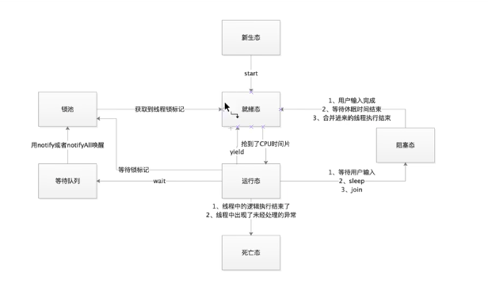

# 


## 1. 串行与并发

## 2. 进程与线程

区别: 进程资源之间是不共享的 而线程之间却可以共享
进程包含线程  线程最大 进程较小
进程中最少拥有一个线程，当唯一的线程挂了，那么该进程也随之挂了


## 3. 线程的生命周期

1. `新生态(New)：`一个线程对象被实例化完成，但是还没有做任何的操作
2. `就绪态(Ready)：`一个线程已经被开启(线程实例调用了start()方法)，已经开始争抢CPU时间片
3. `运行态(Run)：`一个线程抢到了CPU时间片，开始执行这个线程中的逻辑
4. `阻塞态(Interrupt)：`一个线程在运行的过程中，受到某些操作的影响，放弃了已经获取的CPU时间片，并日不再参与CPU时间片的争抢，此时线程处于挂起状态
5. `死亡态(Dead)：`一个线程对象需要被销毁




## 4. 线程的开辟方式


### 1. 通过继承Thread类

```java
class MyThread extends Thread {

    @Override
    public void run() {
        for (int i = 0; i < 10; i++) {
            System.out.println("线程1被开启:" + i);
        }
    }
}

 public static void main(String[] args) {
     		/**
         * 注意:
         * 调用start方法，会使线程启动。
         * start方法会开启一个新的线程，来执行run方法中的逻辑
         * 如果直接执行run方法，则t1 不会进入就绪状态
         */
        MyThread t1 = new MyThread();
        t1.start();
    }

```


### 2. 通过实现Runnable接口

```java
public static void main(String[] args) {
  	Runnable r1 = () -> {
            for (int i = 0; i < 10; i++) {
                System.out.println("线程2被开启:" + i);
            }
        };
  	Thread t2 = new Thread(r1);
  	t2.start();
  
  // lambda表达式
    /*Thread t2 = new Thread(() -> {
             System.out.println("线程3开始");
    });
        t2.start();*/
  
}
```


## 5. 线程的命名


### 1. 通过实例后的对象设置

```java
Thread t1 = new Thread(() -> {});
t1.setName("custom");
```


### 2. 通过线程构造方法设置

```java
Thread t1 = new Thread(() -> {},"custom");
```


### 3. 通过自定义类 提供线程命名的构造方法

```java
public static void main(String[] args) {
		MyThread2 t1 = new MyThread2("custom");
}

class MyThread2 extends Thread {
    
    public MyThread2(String name) {
        // super(name);  // 调用父类
        this.setName(name); 
    }

    @Override
    public void run() {
    }
}
```


## 6. 线程的休眠

**方法:** Thread.sleep(1000);   // 毫秒为单位

```java
@Override
public void run() {
        for (int i = 0; i < 10; i++) {
            System.out.println(i);
            try {
                Thread.sleep(1000);  // 毫秒为单位
            } catch (InterruptedException e) {
                e.printStackTrace();
            }
        }
    }
```


## 7. 线程的优先级

**方法：**.setPriority(10);
设置线程的优先级，只是修改这个线程抢到CPU时间片的概率
并不是优先级高的就一定抢到时间片
优先级的设置 [0,10] 默认是5

```java
 public static void ThreadPriority() {
        Runnable r1 = () -> {
            for (int i = 0; i < 100; i++) {
                System.out.println(Thread.currentThread().getName() + ": " + i);
            }
        };
        Thread t1 = new Thread(r1, "Thread-1");
        Thread t2 = new Thread(r1, "Thread-2");

        t1.setPriority(10);
        t2.setPriority(1);

        t1.start();
        t2.start();

    }
```


## 8. 线程的礼让

**方法：**Thread.yield();
线程礼让是指 让当前线程释放自己CPU资源，由运行状态 回到就绪状态

```java
public static void ThreadYield() {

        //  线程礼让是指 让当前线程释放自己CPU资源，由运行状态 回到就绪状态
        Runnable r1 = () -> {
            for (int i = 0; i < 10; i++) {
                System.out.println(Thread.currentThread().getName() + ": " + i);
                if (i == 3) {
                    Thread.yield();  // 礼让
                }
            }
        };

        Thread t1 = new Thread(r1, "thread-1");
        Thread t2 = new Thread(r1, "thread-2");
        t1.start();
        t2.start();
    }
```


## 9. 临界资源解决方案

### 1. 同步代码段

**synchronized () {}**     参数：对象锁、类锁、
但必须保证一点，多个线程看到的锁必须是同一把锁

```java
public static void main(String[] args) {

        // 演示：四个售票员在同时卖票
        Runnable r1 = () -> {
            while (TicketCenter.reseConunt > 0) {
                // 参数：对象锁、类锁、但必须保证一点，多个线程看到的锁必须是同一把锁
                synchronized ("") {
                    if (TicketCenter.reseConunt <= 0) {
                        return;
                    }
                    System.out.println(Thread.currentThread().getName() + "卖出了一张票🎫,还剩下" + --TicketCenter.reseConunt);
                }
            }
        };

        Thread t1 = new Thread(r1, "thread - 1");
        Thread t2 = new Thread(r1, "thread - 2");
        Thread t3 = new Thread(r1, "thread - 3");
        Thread t4 = new Thread(r1, "thread - 4");

        t1.start();
        t2.start();
        t3.start();
        t4.start();

    }
```

### 2. 同步方法

使用`synchronized`修饰方法

静态方法：同步锁就是 类锁 `当前类.class`
非静态方法：同步锁就是` this`

```java
public static void main(String[] args) {
        // 演示：四个售票员在同时卖票
        Runnable r1 = () -> {

            while (TicketCenter.reseConunt > 0) {
                soldTicket();
            }
        };

        Thread t1 = new Thread(r1, "thread - 1");
        Thread t2 = new Thread(r1, "thread - 2");
        Thread t3 = new Thread(r1, "thread - 3");
        Thread t4 = new Thread(r1, "thread - 4");

        t1.start();
        t2.start();
        t3.start();
        t4.start();

    }

    public synchronized static void soldTicket() {
        if (TicketCenter.reseConunt <= 0) {
            return;
        }
        System.out.println(Thread.currentThread().getName() + "卖出了一张票🎫,还剩下" + --TicketCenter.reseConunt);

    }
```

### 3. 显式锁 ReentrantLock

**对象：**`ReentrantLock`

**方法:** 

* `.lock(); ` 锁住临界资源
* `.unlock(); ` 释放临界资源

```java
 public static void main(String[] args) {

        /**
         * 实例锁对象
         */
        ReentrantLock lock = new ReentrantLock();

        Runnable r1 = () -> {

            while (TicketCenter.reseConunt > 0) {

                // 锁住临界资源
                lock.lock();
                if (TicketCenter.reseConunt <= 0) {
                    System.exit(0);
                    return;
                }
                System.out.println(Thread.currentThread().getName() + "卖出了一张票🎫,还剩下" + --TicketCenter.reseConunt);

                // 释放临界资源
                lock.unlock();

            }
        };

        Thread t1 = new Thread(r1, "thread - 1");
        Thread t2 = new Thread(r1, "thread - 2");
        Thread t3 = new Thread(r1, "thread - 3");
        Thread t4 = new Thread(r1, "thread - 4");

        t1.start();
        t2.start();
        t3.start();
        t4.start();

    }
```


## 10. 死锁

多个线程彼此持有对方所需要的锁对象，而不释放自己的锁

```java
 public static void main(String[] args) {

        // 死锁 ：多个线程彼此持有对方所需要的锁对象，而不释放自己的锁

        Runnable r1 = () -> {

            synchronized ("A") {
                System.out.println("A线程有了A锁 在等待B锁");
                synchronized ("B") {
                    System.out.println("A线程同时拥有类A锁和B锁");

                }
            }
        };

        Runnable r2 = () -> {
            synchronized ("B") {
                System.out.println("B线程有了B锁 在等待A锁");

                synchronized ("A") {

                    System.out.println("B线程同时拥有类B锁和A锁");
                }
            }
        };

        Thread t1 = new Thread(r1);
        Thread t2 = new Thread(r2);

        t1.start();
        t2.start();


    }
```


## 11. wait notify notifyAll

**wait:** 等待，是Object类中方法，作用是释放当前锁标记，让出CPU资源，使当前线程进入等待队列中
**notify:** 通知，也是object类中的方法，唤醒等待队列的一个线程，使这个线程进入锁池
**notifyAll:** 通知，也是object类中的方法，唤起等待队列中所有的线程，并使得这些线程进入锁池

**死锁解决方法**

```java
Runnable r1 = () -> {

            synchronized ("A") {
                System.out.println("A线程有了A锁 在等待B锁");

                try {
                    "A".wait();  // 释放当前已经持有的A锁标记，并进入等待队列(使得线程进入等待状态，并释放当前锁标记)
                } catch (InterruptedException e) {
                    e.printStackTrace();
                }

                synchronized ("B") {
                    System.out.println("A线程同时拥有类A锁和B锁");

                }
            }
        };

        Runnable r2 = () -> {
            synchronized ("B") {
                System.out.println("B线程有了B锁 在等待A锁");

                synchronized ("A") {

                    System.out.println("B线程同时拥有类B锁和A锁");

                     "A".notifyAll();  // 通知 唤醒（"A".wait(); ）这块
                }
            }
        };

        Thread t1 = new Thread(r1);
        Thread t2 = new Thread(r2);

        t1.start();
        t2.start();

    }
```


## 12: 生产者与消费者


**Producer类**

```java
package com.max.producer_and_customer;
@Data
public class Producer {
    private String name;
}
```


**ProducerPool类**

```java
package com.max.producer_and_customer;

import java.util.LinkedList;
import java.util.List;

public class ProducerPool {

    //商品库
    private List<Producer> producers;

    // 仓库最大商品数
    private Integer maxSize = 0;


    public ProducerPool(Integer maxSize) {
        this.producers = new LinkedList<>(); // 仓库实例化
        this.maxSize = maxSize; // 限定产品最大数量
    }


    /**
     * 将商品放入仓库
     *
     * @param producer
     */
    public synchronized void push(Producer producer) {

        if (this.producers.size() == maxSize) { // 判断是否需要继续生产商品了
            try {
                this.wait(); // 停止生产商品
            } catch (InterruptedException e) {
                e.printStackTrace();
            }
        }

        this.producers.add(producer); // 生产商品

        this.notifyAll(); // 通知其他人来消费（唤醒）

    }

    /**
     * 消费商品
     *
     * @return
     */
    public synchronized Producer pop() {

        if (producers.size() == 0) {  // 判断仓库是否还有商品
            try {
                this.wait();  // 停止消费产品
            } catch (InterruptedException e) {
                e.printStackTrace();
            }
        }

        Producer delProducer = producers.remove(0);
        this.notifyAll(); // 通知其他人消费了一件商品 (唤醒生产者)
        return delProducer;

    }
}

```


**Program类**

```java
package com.max.producer_and_customer;

public class Program {

    public static void main(String[] args) {

        ProducerPool producerPool = new ProducerPool(15);

        new Thread(() -> {

            while (true) {
                Producer producer = new Producer((int)(Math.random() * 100) + "号商品");
                producerPool.push(producer);
                System.out.println("生产了一件商品:" + producer.getName());
            }

        }).start();


        new Thread(() -> {

            while (true) {

                Producer producer = producerPool.pop();
                System.out.println("消费了一件商品:" + producer.getName());
            }
        }).start();

    }

}

```

